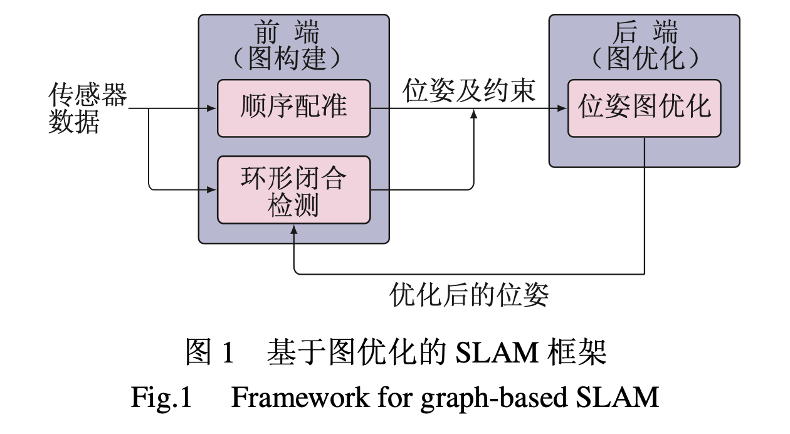

>论文标题：基于图优化的同时定位与地图创建综述  
发表时间：2013  
研究组织：华南理工大学  
本文标签：SLAM、图优化、中文核心  

# 速读概览：
## 主要内容
基于图优化的SLAM综述

## 0.摘要
本文从帧间配准、环形闭合检测以及优化技术 3 个主要方面对基于图优化的同时定位与地图创建进行综述。

## 1.引言
* 同时定位与地图创建（SLAM）将机器人自主建图和自主定位相结合，其主要思想是:一方面，依靠已创建的地图信息进行自定位;另一方面，根据定位结果对地图进行更新。SLAM本质上是一个状态估计问题，其求解方法可大致分为基于滤波器的方法和基于平滑的方法。
* 基于滤波器的方法主要是利用递归贝叶斯估计原理，在假定从 0 到 t 时刻的观测信息以及控制信息已知的条件下，对系统状态(包括机器人当前位姿以及所有地图特征位置)的后验概率进行估计。根据后验概率表示方式的不同，存在多种基于滤波器的方法。常用的包括扩展卡尔曼滤波(EKF)方法、 扩展信息滤波(EIF)方法、以及粒子滤波(PF)方法等。为强调其增量式特性，基于滤波的 SLAM 方法通常也被称为在线 SLAM。此类存在线性化及更新效率等问题，难以应用于大规模环境的地图创建。
* 与滤波方法中每一步只考虑机器人当前位姿不同，基于平滑的方法通过所有的观测信息估计机器人完整的运动轨迹及地图，因而也被称为完全 SLAM 方法。由于地图特征可以通过边缘化方法转化为位姿间的约束，从而简化为对位姿序列的估计。这类方法可以用图的方式作直观描述，所得的图被称作位姿图。图中的节点对应机器人在不同时刻的位置和姿态，而边则描述了位姿与位姿间的空间约束关系。这种约束可以通过里程计或观测信息的配准得到。在图构造好后，对图中节点所处的位置(在姿态空间中)进行优化，使其最好地满足边所表示的约束关系，优化的结果即对应机器人的运动轨迹。由于平滑方法的这种直观特性，又常被称为基于图优化的方法。

## 2.基于图优化的SLAM框架
* 基于图优化的 SLAM 方法最早以基于激光传感器的平面地图创建为例，通过保留所有的观测数据帧以及帧间的空间约束关系，并将约束看作是随机观测，然后采用最大似然方法估计机器人的位姿。这种思想可以通过图的方式形象地表现出来。用图节点表示待求解的机器人位姿，用节点间的边来描述位姿间的空间约束关系，则对位姿序列的估计可以转化为图的优化问题，即通过调整图中节点的位置使其最好地满足边的约束关系。在此基础上提出了高效的环形闭合检测及图构建方法，从而形成了基于图优化的增量式 SLAM 算法框架，其主要包括顺序配准、环形闭合检测以及图优化 3 大部分。其关系参考图1。

* 