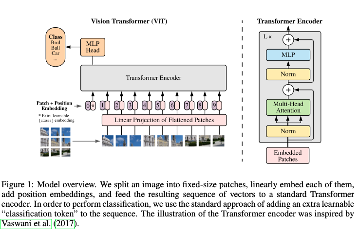

>论文标题：An Image is Worth 16X16 Words: Transformer for Image Recognition at Scale  
发表时间：2021  
研究组织：Google Research  
本文标签：Transformer、图像目标检测、ICLR  
论文讲解：https://www.bilibili.com/video/BV15P4y137jb?spm_id_from=333.999.0.0

# 速读概览：
## 1.针对什么问题？ 
    Transformer 架构在计算机视觉中的应用非常有限，卷积结构依然占据主导地位，但是CV领域对CNN的依赖并不是必须的。
## 2.采用什么方法？  
    将纯transformer直接应用在图像块序列
## 3.达到什么效果？  
    当对大量数据进行预训练并迁移到多个中型或小型图像识别基准时，与最先进的卷积网络相比，Vision Transformer 在大大减少训练的计算资源的同时获得了出色的结果。
## 4.存在什么不足？
    只做了分类。

# 论文精读
## 0.摘要
* 虽然 Transformer 架构已成为自然语言处理任务的业界标准，但其在计算机视觉中的应用仍然有限。在视觉上，注意力机制要么与卷积网络结合使用，要么用于替换卷积网络的某些组件，同时保持其整体结构不变。我们展示了这种对于CNN的依赖并不是必须的，将纯transformer直接应用在图像块序列也能在图像分类任务上表现的很好。当对大量数据进行预训练并迁移到多个中型或小型（此处中型指的是ImageNet，CIFAR-100等）图像识别基准时，与最先进的卷积网络相比，Vision Transformer 在大大减少训练的计算资源的同时获得了出色的结果。

## 1.Introduction
* 基于自注意力的架构，特别是Transformer，已经成为NLP领域的首选模型。默认的方法就是在大量语料库上预训练，然后在针对特定任务的小型数据集上微调。 由于transformer的高效计算和可扩展性，训练参数超过100B的规模空前的模型已经成为可能。随着模型和数据集的增长，仍然没有饱和性能的迹象。
* 在计算机视觉领域，卷积结构依然占据主导地位。受到NLP的成功启发，许多工作开始尝试将自注意力机制与类CNN结构结合，一些甚至完全替代了卷积。后一种模型虽然理论上有效，但由于使用了专门的注意力模式，尚未在现代硬件加速器上有效地扩展。因此，在大规模的图像识别上，传统的类ResNet架构依然是最先进的。
* 受 NLP 中 Transformer 可扩展性成功的启发，我们尝试将标准 Transformer 直接应用于图像，并尽可能减少修改。为此，我们将图像分割成块，并提供这些块的线性嵌入序列作为Transformer的输入。图像块采用和NLP应用中的words一样的处理方式。我们以有监督方式训练模型并进行图像分类。（强调这一点是因为NLP领域主要采用的是无监督的方式）
* 当在没有强正则化的 ImageNet 等中型数据集上进行训练时，这些模型产生的准确度比同等大小的 ResNet 低几个百分点。 这种看似令人沮丧的结果可能是意料之中的：Transformers 缺乏 CNN 固有的一些归纳偏差，例如平移等效性和局部性，因此在数据量不足的情况下训练时不能很好地泛化。
* 如果模型在更大的数据集（14M-300M 图像）上训练，情况会发生变化。我们发现大规模训练胜过归纳偏置。当在足够的规模预训练后迁移到数据点较小的任务时，我们的ViT取得了优异的结果。The best model reaches the accuracy of 88.55% on ImageNet, 90.72% on ImageNet-ReaL, 94.55% on CIFAR-100, and 77.63% on the VTAB suite of 19 tasks.

## 2.Related work
* Transformer是Vaswani等人为了机器翻译任务提出的，已经成为许多NLP任务的最先进的方法。大型的基于Transformer的模型通常在大的语料库上预训练然后再根据相应的任务微调：Bert使用去噪自监督预训练任务（完形填空），而 GPT 工作线使用语言建模作为其预训练任务（next word prediction）。
* 将自注意力简单地应用于图像需要每个像素都关注其他每个像素。由于像素数量的二次成本，这不能扩展到实际的输入大小。因此，为了在图像处理的上下文中应用Transformer，过去做了很多尝试进行近似。Parmar仅在每个query像素的局部邻域中应用自注意，而不是全局。这样的局部多头点积自注意力块可以完全代替卷积。在另一项工作中，Sparse Transformers采用可扩展的近似全局自注意力，以便适用于图像。 扩展注意力的另一种方法是将其应用于不同大小的块，在极端情况下仅沿单个轴。 许多这些专门的注意力架构在计算机视觉任务上展示了有希望的结果，但需要复杂的工程才能在硬件加速器上有效实施。
* 与我们的工作最相近的是Cordonnier等人的模型（2020），他们从输入图像中提取${2\times 2}$大小的块，然后再整体应用全局自注意力。这个模型与ViT非常类似，但我们的工作进一步证明了大规模的预训练使 vanilla Transformer 可以与（甚至优于）最先进的 CNN 竞争。 此外，Cordonnier 等人 (2020) 使用 2 × 2 像素的小块大小，这使得该模型仅适用于小分辨率图像，而我们也处理中等分辨率图像。
* 许多人对结合卷积神经网络与自注意力的形式感兴趣，例如通过为图像分类增加特征图（Bello et al., 2019）或通过使用自注意力进一步处理 CNN 的输出，例如 用于目标检测（Hu et al., 2018; Carion et al., 2020）、视频处理（Wang et al., 2018; Sun et al., 2019）、图像分类（Wu et al., 2020）、无监督目标检测（Locatello et al., 2020），或统一的文本视觉任务（多模态）。
* 另一个最近的相关模型是图像 GPT (iGPT) (Chen et al., 2020a)，它在降低图像分辨率和色彩空间后将 Transformers 应用于图像像素。 该模型作为生成模型以无监督方式进行训练，然后可以对生成的表示进行微调或线性探测以提高分类性能，在 ImageNet 上只能实现 72% 的最大准确度。（在BERT或MAE网络之前，生成式网络在视觉领域很多任务上没法跟判别式网络相比，判别式网络往往要比生成式网络的结果高很多）
* 我们的工作增加了越来越多的论文，这些论文探索了比标准 ImageNet 数据集更大规模的图像识别。 使用额外的数据源可以在标准基准上获得最先进的结果（Mahajan 等，2018；Touvron 等，2019；Xie 等，2020）。 此外，孙等人(2017) 研究 CNN 性能如何随数据集大小扩展，以及 Kolesnikov 等人（2020）； Djolonga 等人(2020) 对 ImageNet-21k 和 JFT-300M 等大规模数据集的 CNN 迁移学习进行了实证探索。 我们也关注后两个数据集，但训练 Transformer 而不是之前工作中使用的基于 ResNet 的模型。

## 3.Method
* 在模型设计方面，我们尽可能与原始的Transformer保持一致。这种故意简单设置的一个优点是可扩展的 NLP Transformer 架构及其高效的实现几乎可以开箱即用。

### 3.1 Vision Transformer（ViT）
* 模型总览如下图所示

* 标准的Transformer接收一维的token embeddings序列作为输入。为了解决二维的图像，我们将图像${x \in R^{H\times W \times C}}$reshape成一个展平的二维块序列${X_p \in R^{N \times (P^2\cdot C)}}$，其中${(H, W)}$是原始图像的分辨率，C是通道数，${(P, P)}$是每个图像块的分辨率，${N=HW/P^2}$是结果块的数量，它也用作 Transformer 的有效输入序列长度。Transformer 在其所有层中使用恒定的潜在向量大小为D，因此我们将块展平并使用可训练的线性投影映射到 D 维（方程式 1）（全连接层）。 我们将此投影的输出称为块嵌入。
* 与 BERT 的 [class] token类似，我们在嵌入块序列${(z_0^0 = x_{class})}$中预先添加一个可学习的嵌入，其在 Transformer encoder ${(z^0_L)}$ 输出处的状态用作图像表示 y（等式 4）。在预训练和微调期间，分类头都附加到${(z^0_L)}$。 分类头由 MLP 实现，在预训练时具有一个隐藏层，在微调时由单个线性层实现。（附录中也对此做了消融实验，全局平均池化和添加cls的token的效果差不多）
* 位置嵌入被添加到块嵌入中以保留位置信息。 我们使用标准的可学习 1D 位置嵌入，因为我们没有观察到使用更高级的 2D 感知位置嵌入带来的显着性能提升（附录 D.4）（效果差不多，但为遵循原始的Transformer设计采用了一样的方法）。 生成的嵌入向量序列用作encoder的输入。
* Transformer 编码器（Vaswani 等人，2017）由多头自注意力（MSA，见附录 A）和 MLP 块（等式 2、3）的交替层组成。 在每个块之前应用 Layernorm (LN)，在每个块之后应用残差连接 (Wang et al., 2019; Baevski & Auli, 2019)。
* MLP 包含两个具有 GELU 非线性的层。
$${z_0 = [x_{class};x_p^1E;x_p^2E;...;x_p^NE] + E_{pos} E\in R^{(P^2\cdot C)\times D},E_{pos}\in R^{(N+1)\times D} \tag{1}}$$
$${z'_l = MSA(LN(z_{l-1})) + z_{l-1}, l = 1...L \tag{2}}$$
$${z_l = MLP(LN(z'_l)) + z'_l, l = 1...L \tag{3}}$$
$${y = LN(z_L^0) \tag{4}}$$
* 归纳偏置。我们注意到，与 CNN 相比，Vision Transformer 的图像特定归纳偏差要少得多。 在 CNN 中，局部性、二维邻域结构和平移等效性被体现在整个模型的每一层中。 在 ViT 中，只有 MLP 层是局部的和平移等变的，而自注意力层是全局的。 二维邻域结构的使用非常谨慎：在模型开始时，通过将图像切割成块，并在微调时调整不同分辨率图像的位置嵌入（如下所述）。 除此之外，初始化时的位置嵌入不携带有关块的 2D 位置的信息，并且必须从头开始学习补丁之间的所有空间关系。
* 混合架构。 作为原始图像块的替代方案，输入序列可以由 CNN 的特征图形成（LeCun 等人，1989）。 在这个混合模型中，块嵌入投影 E（等式 1）应用于从 CNN 特征图中提取块。 作为一种特殊情况，patch 可以具有 1x1 的空间大小，这意味着输入序列是通过简单地将特征图的空间维度展平并投影到 Transformer 维度来获得的。 如上所述添加分类输入嵌入和位置嵌入。

### 3.2 Fine-tuning And Higher Resolution
* 通常在大型数据集上预训练 ViT，并微调到（较小的）下游任务。 为此，我们移除预训练的预测头并附加一个零初始化的 D × K 前馈层，其中 K 是下游类的数量。 与预训练相比，以更高的分辨率进行微调通常是有益的（Touvron 等人，2019；Kolesnikov 等人，2020）。 当提供更高分辨率的图像时，我们保持块大小相同，从而产生更大的有效序列长度。 Vision Transformer 可以处理任意序列长度（直至内存限制），但是，预训练的位置嵌入可能不再有意义。 因此，我们根据它们在原始图像中的位置对预训练的位置嵌入进行 2D 插值。 请注意，这种分辨率调整和块提取是将有关图像 2D 结构的归纳偏差手动注入视觉转换器的唯一点。

## 4.Experiments
* 我们评估了ResNet，ViT和混合模型的表示学习能力。为了理解每个模型的数据需求，我们在各种size的数据集上预训练并评估了多种基线任务。在考虑预训练模型的计算成本时，ViT 表现非常出色，以较低的预训练成本在大多数识别基准上达到了最先进的水平。 最后，我们使用自我监督进行了一个小型实验，并表明自我监督的 ViT 对未来充满希望。

### 4.1 Setup
* Datasets
* Model Variants。三种size的模型。
* Training & Fine-tuning
* Metrics

### 4.2 Comparison to State of the Art

### 4.3 Pre-training Data Requirements

### 4.4 Scaling Study

### 4.5 Inspecting Vision Transformer
* 对ViT学到的东西做了可视化。Transformer学到的东西和卷积网络的比较相似
* 虽然是1D的位置编码，但学到了2D的行列信息。（Figure 7）

### 4.6 Self-Supervision

## 5.Conclusion
* 我们探索了Transformer在图像识别领域的直接应用。与计算机视觉领域中使用自注意力机制的先前的工作相比，除了初始块提取步骤之外，我们没有将图像特定的归纳偏差引入架构中。相反，我们将图像解释为一系列块，并通过 NLP 中使用的标准 Transformer encoder对其进行处理。这种简单但可扩展的策略在与大型数据集的预训练相结合时效果出奇地好。 因此，Vision Transformer 在许多图像分类数据集上匹敌或超过了现有技术，同时预训练相对便宜。
* 尽管这些初步结果令人鼓舞，但仍然存在许多挑战。 一种是将 ViT 应用于其他计算机视觉任务，例如检测和分割。 我们的结果，再加上 Carion 等人的结果，表明这种方法的可能。 另一个挑战是继续探索自监督的预训练方法。 我们的初步实验显示了自监督预训练的改进，但自监督和大规模监督预训练之间仍然存在很大差距。 最后，进一步扩展 ViT 可能会提高性能。