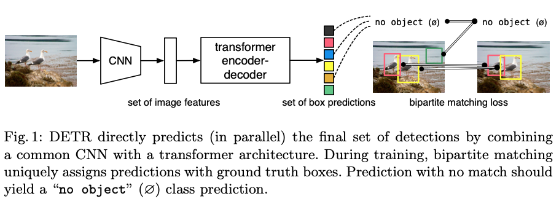

>论文标题：End-to-End Object Detection with Transformers  
发表时间：2020 
研究组织：Facebook AI    
本文标签：图像目标识别、ICCV

# 速读概览：
## 1.针对什么问题？ 
    现代detectors的性能依赖于在大量proposals、anchors上定义代理回归和分类问题，通过间接方式解决set prediction问题。用于目标检测和实例分割的端到端的set predictions方法也大部分是基于RNN的，没有利用最近的具有并行解码能力的Transformer。

## 2.采用什么方法？
    本文提出了DETR，通过将目标检测视为直接的set prediction问题简化了训练流程。这是一种基于Transformer和二分匹配损失（匈牙利算法）的目标检测系统的新设计。采用CNN提取特征，然后送入encoder-decoder Transformer处理，最后通过一个FFN产生检测预测。
    
## 3.达到什么效果？  
    DETR 在具有挑战性的 COCO 目标检测数据集上展示了与完善且高度优化的 Faster R-CNN 基线相当的准确性和运行时性能。
  
## 4.存在什么不足？
    

# 论文精读
## 0.Abstract
* 本文提出了一种将目标检测视为直接的set prediction问题的新方法。我们的方法简化了检测流程，有效地消除了对许多手动设计的组件的需求，例如显式编码我们关于任务的先验知识的非极大值抑制过程或anchor generation。新框架的主要成分，称为 DEtection TRansformer 或 DETR，是一个set-based的全局损失，通过二分匹配强制进行独特的预测，以及一个transformer encoder-decoder architecture。 Given a fixed small set of learned object queries, DETR reasons about the relations of the objects and the global image context to directly output the final set of predictions in parallel. The new model is conceptually simple and does not require a specialized library, unlike many other modern detectors.DETR 在具有挑战性的 COCO 目标检测数据集上展示了与完善且高度优化的 Faster R-CNN 基线相当的准确性和运行时性能。 此外，DETR 可以很容易地推广，以统一的方式产生全景分割。 我们表明它显着优于竞争基线。 训练代码和预训练模型可在 https://github.com/facebookresearch/detr 获得。

## 5.Conclusion
* 本文提出了DETR，一种基于Transformer和二分匹配损失的目标检测系统的新设计，用于直接的set prediction。DETR在具有挑战性的COCO数据集上取得了与优化过的Faster R-CNN基线相媲美的结果。DETR 易于实施，具有灵活的架构，可轻松扩展到全景分割，并具有竞争性结果。 此外，它在大型对象上的性能明显优于 Faster R-CNN，这可能要归功于 self-attention 对全局信息的处理。
* 这种新的detector设计也带来了新的挑战，特别是在小物体的训练、优化和性能方面。 当前的detector需要几年的改进才能解决类似的问题，我们希望未来的工作能够成功解决 DETR 的问题。

## 1.Introduction
* （目标检测的目的）The goal of object detection is to predict a set of bounding boxes and category labels for each object of interest.
* （现代detectors采用的方法）现代detectors通过在大量proposals、anchors或window centers上定义代理回归和分类问题，以间接方式解决这一set prediction任务。它们的性能受到折叠近乎重复预测的后处理步骤、anchor sets的设计以及将目标框分配给anchor的启发式方法的显着影响。
* （本文方法）To simplify these pipelines, we propose a direct set prediction approach to bypass the surrogate tasks.这种端到端的理念在复杂的结构化预测任务（例如机器翻译或语音识别）方面取得了重大进展，但在目标检测方面还没有：以前的尝试要么添加其他形式的先验知识，或者在具有挑战性的基准上没有被证明具有强大的基线竞争力。This paper aims to bridge this gap.
* （具体操作）We streamline the training pipeline by viewing object detection as a direct set prediction problem.We adopt an encoder-decoder architecture based on transformers, a popular architecture for sequence prediction.Transformer的自注意力机制明确地对序列中元素之间的所有成对交互进行建模，使这些架构特别适用于set prediction的特定约束，例如删除重复预测。

* （二分匹配）我们的DETR一次预测了所有目标,并使用一组损失函数进行端到端训练，该函数在预测目标和真实目标之间执行二分匹配。DETR simplifies the detection pipeline by dropping multiple hand-designed components that encode prior knowledge, like spatial anchors or non-maximal suppression.DETR 不需要任何自定义层，因此可以在任何包含标准 CNN 和Transformer类的框架中轻松复制。
* （模型特点）Compared to most previous work on direct set prediction，DETR 的主要特点是二分匹配损失和Transformer与（非自回归）并行解码的结合。作为对比，之前的工作集中在RNNs的自回归decoding。我们的匹配损失函数将预测唯一地分配给真值目标，并且对预测目标的排列保持不变，因此我们可以并行发出它们。
* （实验效果）We evaluate DETR on one of the most popular object detection datasets, COCO, against a very competitive Faster R-CNN baseline.Faster R-CNN 经历了多次设计迭代，其性能自最初发表以来得到了极大的提升。我们的结果表明我们的模型实现了相媲美的结果。
* （表现）更详细的说，DETR受到transformer中non-local computations的影响，在大目标上的表现非常出色。但是在小目标上的表现则稍显逊色。We expect that future work will improve this aspect in the same way the development of FPN did for Faster R-CNN.
* DETR的training settings在许多方面与标准的目标detectors不同。新模型需要超长的训练计划并受益于Transformer中的辅助解码损失。DETR的设计很容易拓展到更多的复杂任务上。在我们的实验中，在预先训练的 DETR 之上训练的简单分割头在全景分割上优于竞争基线。

## 2.Related work
* Our work build on prior work in several domains: 
  * bipartite matching losses for set prediction
  * encoder-decoder architectures based on the transformer
  * parallel decoding
  * object detection methods

### 2.1 Set Prediction
* 没有规范的深度学习模型可以直接predict sets。基础的set prediction 任务是一个多标签分类问题，其基线方法 one-vs-rest 不适用于诸如检测存在元素之间的底层结构（即，near-identical boxes）。
* 这些任务中的第一个困难就是avoid near-duplicates。现在的大部分detectors使用如非极大值抑制之类的后处理方法来解决这个问题，but direct set prediction are postprocessing-free.他们需要全局推理方案来模拟所有预测元素之间的交互以避免冗余。
* 对于constant-size的set prediction，密集全连接网络足够但昂贵。一个通用的方法是使用如RNN这样的自回归序列模型。在所有情况下，损失函数都应该通过预测的排列保持不变。 通常的解决方案是根据匈牙利算法设计一个损失，以找到真实和预测之间的二分匹配。这强制了排列不变性，并保证每个目标元素都有一个唯一的匹配。 
* 我们遵循二分匹配损失方法。 然而，与大多数先前的工作相比，我们远离自回归模型并使用具有并行解码的转换器，我们将在下面进行描述。

### 2.2 Transformers and Parallel Decoding
* Transformers were introduced by Vaswani et al. as a new attention-based building block for machine translation.注意力机制是圣经网络层，从整个输入序列中聚合信息。Transformer引入了自注意力层，类似于NLNnet，它扫描序列的每个元素并通过聚合来自整个序列的信息来更新它。 
* 基于注意力的模型的主要优势之一是它们的全局计算和完美的记忆，这使得它们比 RNN 更适合长序列。
* Transformer正在NLP、speech processing以及CV领域的许多问题中取代RNNs。Transformers最早是在自回归模型中使用的，跟随早期的sequence-to-sequence的模型，一个接一个的生成output tokens。
* 然而，过高的推理成本（与输出长度成正比，并且难以批量处理）导致并行序列生成的发展，在音频、机器翻译、单词表示学习以及最近的语音识别领域。 我们还结合了Transformer和并行解码，以在计算成本和执行集合预测所需的全局计算的能力之间进行适当的权衡。

### 2.3 Object detection
* 大多数现代目标检测方法都会根据一些初始猜测进行预测。
* Two-stage detectors predict boxes w.r.t. proposals, whereas single-stage methods make predictions w.r.t. anchors or a grid of possible object centers
* 最近的工作证明，这些系统的最终性能很大程度上依赖于它们设置初始猜测具体方式。在我们的模型中，我们能够通过使用绝对框预测直接预测检测集来移除这个手工制作的过程并简化检测过程，关于输入图像而不是锚点。

#### Set-based loss
* Several object detectors used the bipartite matching loss.然而，在这些早期的深度学习模型中，不同的预测之间的关系，仅通过卷积或者全连接层建模，一个手工设计的NMS后处理可以提高他们的性能。最近的detectors使用非唯一分配规则与 NMS 一起在真值和预测之间。
* Learnable NMS methods and relation networks explicitly model relations between different predictions with attention. Using direct set losses, they do not require any post-processing steps.然而，这些方法使用额外的手工制作的上下文特征（如proposal坐标）来有效地模拟检测之间的关系，同时我们寻找减少模型中编码的先验知识的解决方案。

#### Recurrent detectors
* 与我们的方法最相关的是用于目标检测和实例分割的端到端的set predictions。与我们的类似，他们使用基于 CNN 激活直接生成一组边界框的带有encoder-decoder结构的二分匹配损失。然而，这些方法仅在小型数据集上进行评估，而不是针对现代基线进行评估。 特别是，它们基于自回归模型（更准确地说是 RNN），因此它们没有利用最近的具有并行解码的Transformer。

## 3.The DETR model
* Two ingredients are essential for direct set predictions in detection:
  * a set prediction loss that forces unique matching between predicted and ground truth boxes
  * an architecture that predicts (in a single pass) a set of objects and models their relation.

### 3.1 Object detection set prediction loss
* DETR infers a fixed-size set of N predictions, in a single pass through the decoder, where N is set to be significantly larger than the typical number of objects in an image.
* One of the main difficulties of training is to score predicted objects (class, position, size) with respect to the ground truth.
* Our loss produces an optimal bipartite matching between predicted and ground truth objects, and then optimize object-specific (bounding box) losses.

### 3.2 DETR architecture
* DETR有三个主要组成：
  * 一个提取完整的特征表示的CNN backbone
  * a encoder-decoder transformer
  * a simple feed forward network that makes the final detection prediction

#### Backbone

#### Transformer encoder
* First, a 1x1 convolution reduces the channel dimension of the high-level activation map f from C to a smaller dimension d. creating a new feature map z0 ∈ Rd×H×W . The encoder expects a sequence as input, hence we collapse the spatial dimensions of z0 into one dimension, resulting in a d×HW feature map. 
* Each encoder layer has a standard architecture and consists of a multi-head self-attention module and a feed forward network (FFN). Since the transformer architecture is permutation-invariant, we supplement it with fixed positional encodings that are added to the input of each attention layer.

#### Transformer decoder
* (遵循标准transformer)The decoder follows the standard architecture of the transformer, transforming N embeddings of size d using multi-headed self- and encoder-decoder attention mechanisms.
* (不同之处是并行decode)The difference with the original transformer is that our model decodes the N objects in parallel at each decoder layer, while Vaswani et al. use an autoregressive model that predicts the output sequence one element at a time. 
*  Since the decoder is also permutation-invariant, the N input embeddings must be different to produce different results. These input embeddings are learnt positional encodings that we refer to as object queries, and similarly to the encoder, we add them to the input of each attention layer. 
*  The N object queries are transformed into an output embedding by the decoder. They are then independently decoded into box coordinates and class labels by a feed forward network (described in the next subsection), resulting N final predictions. 
*  Using self- and encoder-decoder attention over these embeddings, the model globally reasons about all objects together using pair-wise relations between them, while being able to use the whole image as context.
  
#### Prediction feed-forward networks(FFNs)
* The final prediction is computed by a 3-layer perceptron with ReLU activation function and hidden dimension d, and a linear projection layer. 
* The FFN predicts the normalized center coordinates, height and width of the box w.r.t. the input image, and the linear layer predicts the class label using a softmax function. 
* Since we predict a fixed-size set of N bounding boxes, where N is usually much larger than the actual number of objects of interest in an image, an additional special class label ∅ is used to represent that no object is detected within a slot. This class plays a similar role to the “background” class in the standard object detection approaches.

## 4.Experiments
