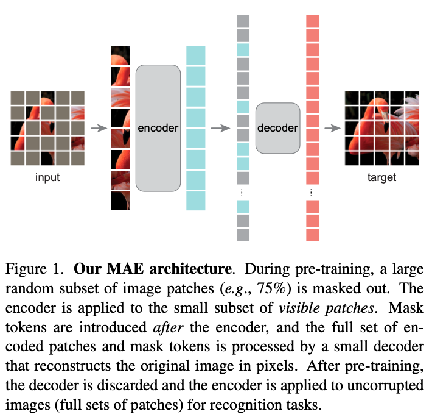

>论文标题：Masked Autoencoders Are Scalable Vision Learners  
发表时间：2021  
研究组织：FAIR    
本文标签：视觉目标识别
论文讲解：https://www.bilibili.com/video/BV1sq4y1q77t/?spm_id_from=333.788

注：标题中的masked取自BERT中类似完形填空的思想；autoencoders中的auto并不是自动的意思，二是自的意思，如自回归模型，这一大类模型的特点是标签和样本来自于同一个东西。

# 速读概览：
## 1.针对什么问题？ 
    自监督预训练在NLP领域应用的很好，而CV领域仍然在使用需要百万张图像训练大型模型的监督学习。CV领域autoencoder的进展远落后于NLP。
## 2.采用什么方法？  
    本文可以看作是Bert在CV领域的应用。由what makes masked autoencoding different between vision and language?引出本文设计——随机盖住输入图像的块并在像素空间重建缺失的块。通过不对称的encoder-decoder设计，encoder只作用于可见的块上（without mask tokens），decoder是轻量的，从潜在表示中重构输入以及mask tokens。实现CV领域的自监督。（计算量会大幅降低）
## 3.达到什么效果？  
    通过 MAE 预训练，可以在 ImageNet-1K 上训练像 ViT-Large/-Huge 这样的data-hungry的模型，并提高泛化性能。 使用 vanilla ViT-Huge 模型，在 ImageNet-1K 上微调达到 87.8% 的准确率。 这优于之前所有仅使用 ImageNet-1K 数据的结果。 
## 4.存在什么不足？

# 论文精读
## 0.摘要
* 本文展示了带掩码的自编码器（MAE）是CV领域可拓展的自监督学习器。我们的MAE方法非常简单：我们随机的隐藏图像中的一些块，然后重构缺失的像素。它基于两个核心设计。首先，我们开发了一个非对称的encoder-decoder架构，其中encoder只作用在可以看见的块上，decoder是轻量级的，能够从encoder的表示和mask的tokens中重构原始图像。其次，我们发现如果隐藏了输入图像的大量的块，如75%的区域，会得到一个非显然的而且有意义的自监督任务。结合这两个设计可以使我们更有效的训练大的模型：我们能够加速训练（3倍以上）并且提高精度。我们可拓展的方法允许学习高容量的模型能够泛化的更好，如在简单的ViT-Huge模型实现了最好的精度（87.8%），且只使用ImageNet-1K作为数据。下游任务中的迁移性能优于有监督的预训练，并显示出有希望的扩展行为。

## 1.Introduction
* 深度学习见证了能力和容量不断增长的架构的爆炸式增长。在硬件快速增长的帮助下，今天的模型可以轻松地过拟合一百万张图像并开始需要数亿张（通常是公众无法访问的）标记图像。
* 这种对于数据的需求在NLP领域被自监督预训练解决了。这种基于GPT中自回归语言建模和BERT中带掩码的自编码器的解决方法，在概念上非常简单：他们删除部分数据并学习预测删除的内容。这些方法现在可以训练包含超过一千亿个参数的通用 NLP 模型。
* 带掩码的自编码器是更通用的去噪自编码器的一种形式，其idea在CV领域也很自然且适用。与视觉密切相关的研究早于 BERT。然而，尽管BERT的成功让很多人对这个idea有了强烈的兴趣，但在视觉领域自编码器的进展仍落后于NLP。We ask: what makes masked autoencoding different between vision and language? 我们希望从以下几个方面回答这个问题：
  * 直到最近，它们的架构是不同的。在视觉领域，卷积网络在过去十年占据主导地位。卷积通常在规则的grid上作用，将诸如masks tokens或positional embeddings之类的“指标”集成到卷积网络中并不简单。然而架构之间的差距已经被ViT的诞生所解决，不再是一个阻碍。
  * 语言和视觉之间的信息密度也是不同的。语言是人类产生的一种高级语义且信息密集的信号。在训练模型来预测每句话中少量缺失的词时，这个任务似乎诱导了复杂的语言理解。相反，图像是有个严重空间冗余的自然信号——例如，可以从相邻的块中恢复缺失的块，而对部分、目标和场景的理解很少。为了克服这个不同并鼓励学习有用的特征，我们展示了简单的能在CV领域起作用的简单策略工作：masking a very high portion of random patches。这个策略极大的降低了冗余并生成了一个有挑战性的自监督任务——需要超越低级的图像统计的整体理解。要对我们的重建任务有一个定性的认识，请参见图2-4。
  
  * 自编码器的decoder将潜在表示映射回输入，在重建文本和图像之间扮演不同的角色。在视觉领域，decoder重建像素，因此其输出的语义级别低于常见的识别任务。这与语言相反，语言的decoder预测缺失的词是包含大量语义信息的。虽然在 BERT 中，decoder可以是微不足道的（一个 MLP），但我们发现对于图像，解码器设计在确定学习的潜在表示的语义级别方面起着关键作用。
* Driven by this analysis，我们提出了一个简单、高效并且可扩展的用于视觉表示学习的带掩码的自编码器（MAE）的形式。如图1所示。
  
* 我们的MAE随机盖住输入图像的块并在像素空间重建缺失的块。它具有不对称的encoder-decoder设计。我们的encoder只作用于可见的块上（without mask tokens），并且我们的decoder是轻量级的，从潜在表示中重构输入以及mask tokens。在我们的非对称encoder-decoder中将mask tokens转移到小型decoder会导致计算量大大减少。在这个设计理念下，非常高的覆盖率（例如，75%）可以实现双赢：它优化了准确性，同时允许编码器只处理一小部分（例如，25%）的块。 这可以将整体预训练时间减少 3 倍或更多，同时减少内存消耗，使我们能够轻松地将 MAE 扩展到大型模型。
* 我们的 MAE 学习了一个可以泛化的很好的高容量模型。通过 MAE 预训练，我们可以在 ImageNet-1K 上训练像 ViT-Large/-Huge 这样的data-hungry的模型，并提高泛化性能。 使用 vanilla ViT-Huge 模型，我们在 ImageNet-1K 上微调达到 87.8% 的准确率。 这优于之前所有仅使用 ImageNet-1K 数据的结果。 我们还评估了目标检测、实例分割和语义分割的迁移学习。 在这些任务中，我们的预训练比其监督的预训练对手取得了更好的结果，更重要的是，我们通过扩大模型观察到显着的收益。 这些观察结果与 NLP 中自我监督预训练中的观察结果一致，我们希望它们能让我们的领域探索类似的轨迹。

## 2.Related work
### Masked language modeling
* 带掩码的语言建模及其自回归对应物，如BERT和GPT是NLP中预训练高度成功的方法。这些方法去掉了输入句子中的一部分，并训练方法预测缺失的内容。这些方法已被证明可以很好地扩展，大量证据表明这些预训练的表示可以很好地泛化到各种下游任务。

### Autoencoding
* 自编码是表示学习的一种经典方法。它有一个encoder将输入映射到潜在表示上和一个decoder重建输入。例如，PCA和k-means都是自编码器。去噪自编码器 (DAE) 是一类自编码器，它破坏输入信号并学习重建原始的、未破坏的信号。 一系列方法可以被认为是不同损坏下的广义 DAE，例如，屏蔽像素或移除颜色通道。 我们的 MAE 是一种去噪自编码的形式，但在许多方面与经典 DAE 不同。

### Masked image encoding
* 带掩码的图像编码方法从被掩蔽破坏的图像中学习表示。 [59](Stacked denoising au- toencoders: Learning useful representations in a deep network with a local denoising criterion)的开创性工作将掩蔽作为 DAE 中的一种噪声类型。 上下文编码器使用卷积网络修复大的缺失区域。 受 NLP 成功的推动，最近的相关方法基于 Transformers。 iGPT对像素序列进行操作并预测未知像素。 ViT 论文研究了用于自监督学习的掩蔽补丁预测。 最近，BEiT 提出预测离散tokens。

### Self-supervised learning
* 自监督学习方法已经引起了人们对计算机视觉的极大兴趣，通常专注于不同的预训练任务。最近，对比学习开始流行起来，例如 [62, 43, 23, 7]，它模拟两个或多个视角之间的图像相似性和不相似性（或仅相似性 [21, 8]）。对比和相关方法强烈依赖于数据增强。 自动编码追求一个概念上不同的方向，它表现出不同的行为，正如我们将展示的那样。

## 3.Approach
* 我们的MAE方法是一个简单的自编码方法，可以根据部分观察重建原始信号。和所有的自编码器一样，我们的方法有一个encoder将观察的信号投影到潜在的表示，和一个decoder从潜在的表示中重建原始信号。与传统的自编码器不同，我们使用了非对称的设计，允许encoder仅对部分观察到的信号（没有mask tokens）进行操作，并采用轻量级解码器从潜在表示和mask tokens重建完整信号。 图 1 说明了这个想法，下一步将介绍。
### Masking
* 遵循ViT的设计，我们将图像划分为规则的非重叠块。然后我们对一个图像块子集进行采样并mask（即删除）剩余的块。 我们的抽样策略很简单：我们随机抽样不放回块，遵循均匀分布。 我们简单地将其称为“随机抽样”。
* 具有高masking率（即，已移除块的比率）的随机采样在很大程度上消除了冗余，因此创建了一项无法通过从可见的相邻块外推来轻松解决的任务（参见图 2-4）。 均匀分布可防止潜在的中心偏差（即图像中心附近有更多的被mask的块）。 最后，高度稀疏的输入为设计高效编码器创造了机会，下一步将介绍。

### MAE encoder
* 我们的encoder是一个只应用在可见的没有被mask的块上的ViT。和标准的ViT一样，我们的encoder通过线性投影嵌入块并添加positional embeddings，然后通过一系列 Transformer 块处理结果集。但我们的encoder只作用在所有块的小子集上（如25%）。被mask的块被移除了，没有使用mask tokens。这使我们能够只用一小部分计算和内存来训练非常大的编码器。 完整的由轻量级decoder处理，如下所述。
  
### MAE decoder
* MAE 解码器的输入是由 (i) 编码可见块和 (ii) mask tokens组成的完整tokens集。 参见图 1。每个mask token是一个共享的学习向量，表示存在要预测的缺失块。 我们将positional embeddings添加到这个完整集合中的所有tokens； 没有这个，mask tokens将没有关于它们在图像中的位置的信息。解码器有另一个系列的 Transformer 块。
* MAE 解码器仅在预训练期间用于执行图像重建任务（仅encoder用于生成用于识别的图像表示）。 因此，decoder架构可以以独立于encoder设计的方式灵活设计。 我们用非常小的decoder进行实验，比encoder更窄更浅。 例如，我们的默认decoder与encoder相比，每个token的计算量 <10%。 通过这种不对称设计，完整的tokens仅由轻量级decoder处理，这显着减少了预训练时间。

### Reconstruction target
* 我们的MAE通过预测每个被mask的块的像素值来重建输入图像。decoder的输出的每个元素都是代表块的像素值向量。 decoder的最后一层是线性投影，其输出通道数等于块中像素值的数量。 decoder的输出被reshape以形成重建图像。 我们的损失函数计算像素空间中重建图像和原始图像之间的均方误差（MSE）。 我们只计算被mask的块上的损失，类似于 BERT。
* 我们还研究了一种变体，其重建目标是每个被mask的块的归一化像素值。 具体来说，我们计算一个块中所有像素的平均值和标准偏差，并使用它们来规范化这个块。 在我们的实验中，使用归一化像素作为重建目标可以提高表示质量。

### Simple implementation
* 我们的 MAE 预训练可以高效实现，重要的是，不需要任何专门的稀疏操作。 首先，我们为每个输入块生成一个token（通过添加positional embeddings的线性投影）。 接下来，我们根据masking ratio随机打乱tokens列表并删除列表的最后一部分。 此过程为encoder生成一小部分tokens，相当于在没有放回的情况下对块进行采样。 编码后，我们将一个mask tokens列表附加到编码块列表中，并取消打乱这个完整列表（反转随机打乱操作）以将所有标记与其目标对齐。 encoder应用于这个完整列表（添加了positional embeddings）。 如前所述，不需要稀疏操作。 这个简单的实现引入了可忽略的开销，因为混洗和非混洗操作很快。

## 4.ImageNet Experiments
* 我们在InageNet-1K训练集上进行自监督预训练。然后我们进行监督训练，通过 (i) 端到端微调或 (ii) 线性探测来评估表示。 我们报告了单个 224×224 crop的 top-1 验证准确度。 详细信息在附录 A.1 中。
### Baseline：ViT-Large
* 我们使用ViT-Large作为我们消融实验的backbone。ViT-L 非常大（比 ResNet-50 大一个数量级）并且容易过拟合。 以下是从头开始训练的 ViT-L 与从我们的基线 MAE 微调的对比：

| scratch,original | scratch, our impl. | baseline MAE |
| :----:| :----: | :----: |
| 76.5 | 82.5 | 84.9 |
* 我们注意到，从头开始训练有监督的 ViT-L 并非易事，并且需要具有强正则化的良好配方（82.5%，参见附录 A.2）。 尽管如此，我们的 MAE 预训练还是做出了很大的改进。 这里微调仅针对 50 个 epoch（而从头开始为 200 个），这意味着微调的准确性在很大程度上取决于预训练。

### 4.1 Main Properties

### 4.2 Comparisons with Previous Results

### 4.3 Partial Fine-tuning

## 5.Transfer Learning Experiments

## 6.Discussion and Conclusion
* 简单且可以拓展很好的算法是整个深度学习的核心。在NLP领域，简单的自监督学习方法可以从指数拓展模型中受益。在计算机视觉领域，在计算机视觉中，尽管自监督学习取得了进展，但实际的预训练范式仍然由监督学习主导。我们在 ImageNet 和迁移学习中观察到，自编码器（一种类似于 NLP 技术的简单自监督方法）提供了可扩展的优势。视觉中的自监督学习现在可能走上了与 NLP 类似的轨迹。
* 另一方面，我们注意到图像和语言是不同性质的信号，必须仔细处理这种差异。 图像只是记录下来的光，没有将语义分解为单词的视觉类似物。 我们没有尝试删除对象，而是删除了最有可能不形成语义段的随机块。 同样，我们的 MAE 重建不是语义实体的像素。 尽管如此，我们观察到我们的 MAE 推断出复杂的整体重建，这表明它已经学习了许多视觉概念，即语义。 我们假设这种行为是通过 MAE 内部丰富的隐藏表示发生的。 我们希望这种观点能够激发未来的工作。
* Broader impacts。本文提出的方法基于训练数据集的学习统计数据预测内容，因此将反映这些数据中的偏差，包括具有负面社会影响的偏差。该模型可能会生成不存在的内容。 在基于这项工作生成图像时，这些问题值得进一步研究和考虑。