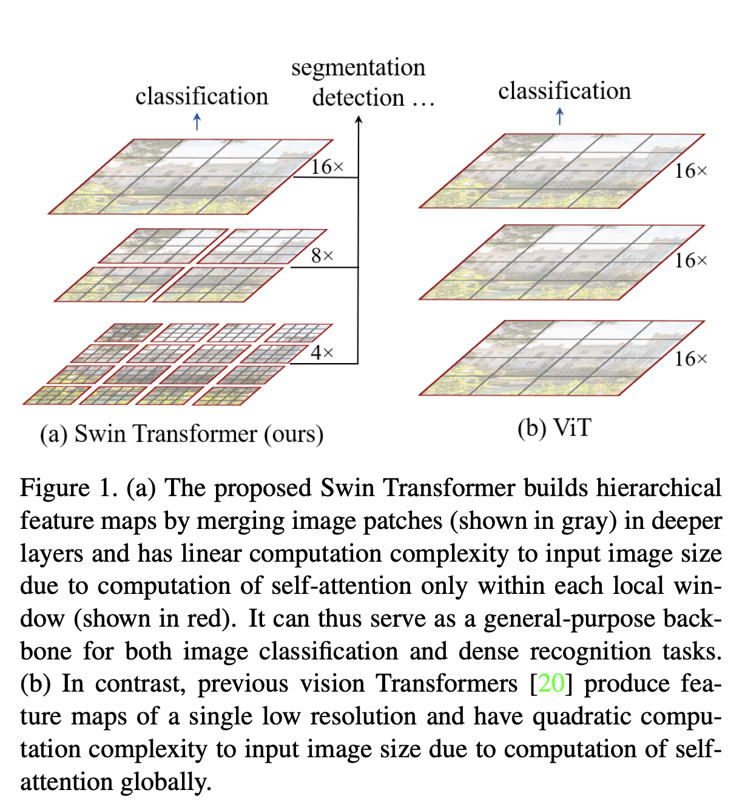
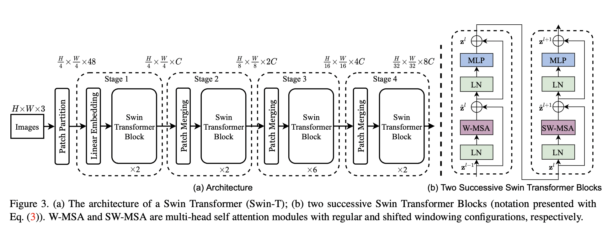

>论文标题：Swin Transformer: Hierarchical Vision Transformer using Shifted Windows  
发表时间：2021  
研究组织：MSRA    
本文标签：图像目标识别、ICCV
论文讲解：https://www.bilibili.com/video/BV13L4y1475U/?spm_id_from=333.788

# 速读概览：
## 1.针对什么问题？ 
    本文希望可以扩展Transformer的能力以使其可以作为CV领域通用的backbone。现有的基于Transformer的方法中，tokens都是固定的尺度，不适合视觉应用的属性。且图像中像素的分辨率要比文本中文章的词高多了。许多视觉任务需要在像素级别密集预测，这对于高分辨率图像上的 Transformer 来说是难以处理的，因为其自注意力的计算复杂性与图像大小成二次方。（ViT）
## 2.采用什么方法？  
    本文提出了一个通用的Transformer架构，称为Swin Transformer，它构建层级式特征图且计算复杂度与小的patches成线性关系。其关键设计元素是他在连续的自注意力层之间的shifted window部分。
## 3.达到什么效果？  
    Swin Transformer的性能在 COCO 上超过了 +2.7 box AP 和 +2.6 mask AP，在 ADE20K 上超过了 +3.2 mIoU，大大超过了之前的 state-of-the-art，展示了基于 Transformer 的模型作为视觉骨干的潜力。
## 4.存在什么不足？

# 论文精读
## 0.摘要
* 本文提出了一个叫做Swin Transformer的新的vision Transformer，它可以用作CV领域的通用目的的backbone。将 Transformer 从语言适应到视觉的挑战来自两个领域之间的差异，例如视觉实体的尺度变化很大，以及与文本中的单词相比，图像中像素的高分辨率。为了解决这些差异，我们提出了一个层级式的 Transformer，其表示是用 Shifted windows 计算的。Shifted windows方案通过将 self-attention 计算限制在不重叠的local windows上，同时还允许跨窗口连接，从而带来更高的效率。这种分层架构具有在各种尺度上建模的灵活性，并且计算复杂度与图像大小成线性关系。Swin Transformer 的这些品质使其与广泛的视觉任务兼容，包括图像分类（ImageNet-1K 上 87.3 top-1 准确度）和密集预测任务，例如目标检测（COCO 上 58.7 box AP 和 51.1 mask AP test-dev）和语义分割（ADE20K val 上的 53.5 mIoU）。 它的性能在 COCO 上超过了 +2.7 box AP 和 +2.6 mask AP，在 ADE20K 上超过了 +3.2 mIoU，大大超过了之前的 state-of-the-art，展示了基于 Transformer 的模型作为视觉骨干的潜力。 分层设计和Shifted Window方法也证明对全 MLP 架构有益。 代码和模型可在 https://github.com/microsoft/Swin-Transformer 公开获得。

## 1.Introduction
* CV领域的模型已经在很长时间内由CNN主导。从AlexNet及其在ImageNet图像分类挑战上的革命性表现开始，通过更大的规模、更广泛的连接和更复杂的卷积形式，CNN 架构已经发展得越来越强大。 随着 CNN 作为各种视觉任务的backbone，这些架构上的进步带来了性能改进，从而广泛提升了整个领域。
* 另一方面，NLP领域的网络架构的发展也发生了很大的变化，如今流行的架构是Transformer。为序列建模和转导任务设计的Transformer由于其使用注意力机制来对数据中的长范围依赖建模而闻名。它在语言领域的巨大成功引领了许多研究者探索它在CV领域的应用，它最近在某些任务上展示了有希望的结果，特别是图像分类和联合视觉-语言建模。
* 在本文中，我们希望可以扩展Transformer的能力以使其可以作为CV领域通用的backbone，如同它在NLP领域和CNN在视觉领域的地位。我们观察到将其在语言领域的高性能迁移到视觉领域的挑战可以用两种模式之间的差异来解释。尺度是这些差异中的一个。与作为语言Transformer中处理的基本元素的word tokens不同，视觉元素在规模上可以有很大的不同，这是在目标检测等任务中受到关注的问题。在现有的基于Transformer的方法中，tokens都是固定的尺度，不适合这些视觉应用的属性。另一个差异在于图像中像素的分辨率要比文本中文章的词高多了。许多视觉任务如语义分割需要在像素级别密集预测，这对于高分辨率图像上的 Transformer 来说是难以处理的，因为其自注意力的计算复杂性与图像大小成二次方。为了克服这个问题，我们提出了一个通用的Transformer架构，称为Swin Transformer，它构建层级式特征图且计算复杂度与小的patches成线性关系。
 
* Swin Transformer 通过从小尺寸的patches（灰色轮廓）开始并逐渐合并更深的 Transformer 层中的相邻patches来构建分层表示。借助这些分层特征图，Swin Transformer 模型可以方便地利用高级技术进行密集预测，例如特征金字塔网络 (FPN) 或 U-Net 。线性计算复杂度是通过在分割图像的非重叠窗口中局部计算自注意力来实现的（红色轮廓）。每个窗口中块的数量是固定的，因此复杂度与图像尺寸成线性。这些优点使 Swin Transformer 适合作为各种视觉任务的通用backbone，与以前基于 Transformer 的架构形成对比，后者产生单一分辨率的特征图并具有二次复杂度。
* Swin Transformer的关键设计元素是它在连续的 self-attention 层之间移动窗口分区。Shifted windows桥接前一层的windows，提供它们之间的连接，显着增强建模能力。这个策略在实际延迟方面也很有效：一个window中的所有 query 块共享相同的key set，这有助于硬件中的内存访问。对比来看，早期的基于sliding window的自注意力方法由于不同query pixels的不同key set，在通用硬件上存在低延迟。我们的实验表明，我们提出的shifted window方法比sliding window方法有更低的延迟，但在建模能力上却差不多。shifted window方法也证明对全 MLP 架构有益。
* 本文提出的Swin Transformer在图像分类、目标检测和语义分割的识别任务上实现了强大的性能。它显着优于 ViT / DeiT 和 ResNe(X)t 模型，在三个任务上具有相似的延迟。 它在 COCO 测试开发集上的 58.7 box AP 和 51.1 mask AP 通过 +2.7 box AP（没有外部数据的Copy-paste）和 +2.6 mask AP（ DetectoRS）。 在 ADE20K 语义分割上，它在 val 集上获得了 53.5 mIoU，比之前的最先进技术（SETR ）提高了 +3.2 mIoU。 它还在 ImageNet-1K 图像分类上实现了 87.3% 的 top-1 准确率。
* 我们相信，跨计算机视觉和自然语言处理的统一架构可以使这两个领域受益，因为它将促进视觉和文本信号的联合建模，并且可以更深入地共享来自两个领域的建模知识。 我们希望 Swin Transformer 在各种视觉问题上的出色表现能够在社区中更深入地推动这种信念，并鼓励视觉和语言信号的统一建模。

## 2.Related work
### CNN and variants
* CNN 在整个计算机视觉中充当标准网络模型。虽然 CNN 已经存在了几十年，但直到 AlexNet 的引入，CNN 才起飞并成为主流。从那以后，提出了更深入和更有效的卷积神经架构，以进一步推动计算机视觉中的深度学习浪潮，如VGG，GoogLeNet，ResNet，DenseNet，HRNet和EfficientNet。
* 除了这些架构上的进步之外，在改进单个卷积层方面也有很多工作，例如深度卷积和可变形卷积。 虽然 CNN 及其变体仍然是计算机视觉应用的主要骨干架构，但我们强调了类似 Transformer 的架构在视觉和语言之间统一建模的巨大潜力。 我们的工作在几个基本的视觉识别任务上取得了出色的表现，我们希望它有助于模型的转变。

### Self-attention based backbone architecture
* 受NLP领域中自注意力层和Transformer架构的成功的启发，一些工作使用自注意力层替代流行的ResNet中的一些或全部空间卷积层。在这些工作中，self-attention 在每个像素的局部窗口内计算以加快优化，与对应的 ResNet 架构相比，它们实现了稍微更好的准确率/FLOPs 权衡。 然而，它们昂贵的内存访问导致它们的实际延迟明显大于卷积网络的延迟。 我们提出了连续层之间的shifted window，而不是使用sliding window，这允许在通用硬件中更有效地实现。

### Self-attention/Transformers to complement CNNs
* 另一项工作是使用自注意力层或 Transformer 来增强标准 CNN 架构。 自注意力层可以通过提供编码远距离依赖或异构交互的能力来补充backbone或头部网络。 最近，Transformer 中的encoder-decoder设计已应用于目标检测和实例分割任务。 我们的工作探索了Transformer对基本视觉特征提取的改编，并与这些工作相辅相成。

### Transformer based vision backbones
* 与我们的工作最相近的是ViT及其后续工作。ViT 的开创性工作直接将 Transformer 架构应用于非重叠的中型图像块进行图像分类。它在图像分类任务上，比起卷积网络，它实现了惊人的速度与精度的权衡。虽然 ViT 需要大规模的训练数据集（即 JFT-300M）才能表现良好，但 DeiT 引入了几种训练策略，使 ViT 也可以有效地使用较小的 ImageNet-1K 数据集。ViT在图像分类上的结果激动人心，但他的结构并不适合作为密集视觉任务上或图像分辨率较高时的通用backbone，因为他的特征图是低分辨率的，并且复杂度与图像尺寸的增长呈二次关系。有一些工作通过直接上采样或反卷积将 ViT 模型应用于目标检测和语义分割的密集视觉任务，但性能相对较低。与我们的工作同时进行的是修改 ViT 架构以获得更好的图像分类。 根据经验，我们发现我们的 Swin Transformer 架构可以在这些图像分类方法中实现最佳的速度-准确度权衡，尽管我们的工作侧重于通用性能而不是专门用于分类。 另一项并行工作探索了类似的思路，以在 Transformer 上构建多分辨率特征图。 它的复杂性仍然是图像大小的二次方，而我们的复杂性是线性的并且也在局部运行，这已被证明有利于对视觉信号的高相关性进行建模。 我们的方法既高效又有效，在 COCO 目标检测和 ADE20K 语义分割方面都达到了最先进的准确性。

## 3.Method
### 3.1 Overall Architecture
* Swin Transformer的架构总览如下图所示，展示的是tiny版本。
 
* 它首先通过像 ViT 这样的图像块分割模块将输入的 RGB 图像分割成不重叠的块。每个块都被视为一个“token”，其特征被设置为原始像素 RGB 值的串联。 在我们的实现中，我们使用 4 × 4 的块大小，因此每个块的特征维度为 4×4×3 = 48。在这个原始值特征上应用线性嵌入层，以将其投影到任意维度（表示为 C）。
* 在这些图像块tokens上应用了几个具有改进的自注意力计算的 Transformer 块（Swin Transformer 块）。 Transformer 块保持tokens的数量（${\frac{H}{4} \times \frac{W}{4}}$），与线性嵌入一起被称为“Stage 1”。
* 为了引入层级表示，随着网络变得更深，通过块合并层减少tokens的数量。第一个块合并层将每组 2×2 个相邻块的特征连接起来，并在 4C 维的连接特征上应用一个线性层。这将tokens数量减少了 2 × 2 = 4 的倍数（2× 分辨率下采样），并且输出维度设置为 2C。 之后应用 Swin Transformer 块进行特征转换，分辨率保持在 H8 × W8 。 第一个块合并和特征转换被称为“Stage 2”。该过程重复两次，分别为“Stage 3”和“Stage 4”，分别为H/16 × W/16 和 H/32 × W/32 的输出分辨率。 这些阶段共同产生分层表示，具有与典型卷积网络（例如 VGG 和 ResNet）相同的特征图分辨率。 因此，所提出的架构可以方便地替换现有方法中的骨干网络，用于各种视觉任务。

#### Swin Transformer block
* Swin Transformer 是通过将 Transformer 块中的标准多头自注意力 (MSA) 模块替换为基于shifted window的模块而构建的，其他层保持不变。 Swin Transformer 模块由一个基于移动窗口的 MSA 模块组成，然后是一个 2 层 MLP，其间具有 GELU 非线性。 在每个 MSA 模块和每个 MLP 之前应用一个 LayerNorm (LN) 层，在每个模块之后应用一个残差连接。

### 3.2 Shifted Window based Self-Attention
* 标准的 Transformer 架构及其对图像分类的改进都进行全局自注意力计算，计算了一个token和所有其他tokens之间的关系。 全局计算导致相对于token数量的二次复杂度，使其不适用于许多需要大量tokens进行密集预测或表示高分辨率图像的视觉问题。

#### Self-attention in non-overlapped windows
* 为了有效建模，我们提出在局部窗口内计算自注意力。 窗口被布置成以不重叠的方式均匀地划分图像。 假设每个窗口包含 M × M 个块，全局 MSA 模块和基于 h × w 个图像块的窗口的计算复杂度为
$${\Omega(MSA) = 4h\omega C^2 + 2(h\omega)^2C \tag{1}}$$
$${\Omega(W-MSA) = 4h\omega C^2 + 2M^2h\omega C \tag{2}}$$
* 其中，前者是块编号 hw 的二次方，后者在 M 固定时是线性的（默认设置为 7）。 全局自注意力计算通常对于大型硬件来说是负担不起的，而基于窗口的自注意力是可扩展的。

#### Shifted window partitioning in successive blocks
* 基于窗口的自注意力模块缺乏跨窗口的连接，这限制了它的建模能力。 为了在保持非重叠窗口的有效计算的同时引入跨窗口连接，我们提出了一种Shifted window分区方法，该方法在连续 Swin Transformer 块中的两个分区配置之间交替。
* 第一个模块使用从左上角像素开始的常规窗口划分策略，将 8×8 的特征图均匀划分为大小为 4×4(M =4) 的 2×2 窗口。 下一个模块采用与前一层不同的窗口配置，通过将窗口从规则分区的窗口中替换 (⌊ M/2 ⌋, ⌊ M/2 ⌋) 个像素。
* 使用Shifted window分区方法，连续的 Swin Transformer 块计算为
$${\hat z^l = W-MSA(LN(z^{l-1})) + z^{l-1},}$$
$${z^l = MLP(LN(\hat z ^l)) + \hat z^l, }$$
$${\hat z^{l+1} = SW-MSA(LN(z^l)) + z^l, }$$
$${z^{l+1} = MLP(LN(\hat z^{l+1})) + \hat z^{l+1} \tag{3}}$$
* 其中$\hat z^l$和$z^l$分别表示块 l 的 (S)W-MSA 模块和 MLP 模块的输出特征；
W-MSA 和 SW-MSA 分别表示使用常规和Shifted window分区配置的基于窗口的多头自注意。

#### Efficient batch computation for shifted configurati
* Shifted window分区的一个问题是它会在移位配置中产生更多窗口，从⌈ h/M ⌉×⌈ w/M ⌉到(⌈ h/M ⌉+1)× (⌈ w/M ⌉+1)，并且一些窗口将小于 M × M。一个简单的解决方案是将较小的窗口填充到 M × M 的大小，并在计算注意力时屏蔽掉填充的值。当常规分区中的窗口数量较少时，例如2 × 2，使用这种简单的解决方案增加的计算量是相当大的（2 × 2 → 3 × 3，是 2.25 倍）。在这里，我们提出了一种更有效的批处理计算方法，通过向左上方向循环移位。在这种移位之后，批处理窗口可能由几个不相邻的子窗口组成在特征图中，因此采用掩码机制将自注意力计算限制在每个子窗口内。使用循环移位，批处理窗口的数量与常规窗口分区的数量相同，因此也是有效的。

#### Relative position bias
* 在计算自注意力时，我们在计算相似度时为每个头部包含一个相对位置偏差${B ∈ R^{M^2 × M^2}}$：
$${Attention(Q, K, V) = SoftMax(QK^T/\sqrt{d} + B)V \tag{4}}$$
* 其中Q，K，V分别是query，key和value矩阵。由于沿每个轴的相对位置位于 [-M + 1, M - 1] 范围内，我们参数化了一个较小尺寸的偏置矩阵${\hat B ∈ R^{(2M-1)×(2M-1)}}$，值 B 取自$\hat B$。
* 我们观察到与没有此偏差项或使用绝对位置嵌入的对应项相比有显着改进。进一步将绝对位置嵌入添加到输入中会稍微降低性能，因此在我们的实现中没有采用。
* 在预训练中学习到的相对位置偏差也可用于通过双三次插值初始化具有不同窗口大小的微调模型。

### 3.3 Architecture Variants
* 我们构建了我们的基础模型，称为 Swin-B，具有类似于 ViT-B/DeiT-B 的模型大小和计算复杂度。 我们还介绍了 Swin-T、Swin-S 和 Swin-L，它们分别是模型大小和计算复杂度的 0.25 倍、0.5 倍和 2 倍的版本。 请注意，Swin-T 和 Swin-S 的复杂度分别类似于 ResNet-50 (DeiT-S) 和 ResNet-101。 默认情况下，窗口大小设置为 M = 7。 对于所有实验，每个 head 的查询维度为 d = 32，每个 MLP 的扩展层为 α = 4。 这些模型变体的架构超参数是：
  * Swin-T：C = 96， layer numbers = {2, 2, 6, 2}
  * Swin-S: C = 96, layer numbers ={2, 2, 18, 2}
  * Swin-B: C = 128, layer numbers ={2, 2, 18, 2}
  * Swin-L: C = 192, layer numbers ={2, 2, 18, 2}
* 其中C是第一阶段隐藏层的通道数。

## 4.Experiments

## 5.Conclusion
* 本文提出了Swin Transformer，这是一种引入分层特征表示的vision transformer，相对于输入图像size而言就有线性计算复杂度。Swin Transformer实现了COCO目标检测和ADE20K语义分割上最好的性能。我们希望Swin Transformer在各种视觉任务上的强大表现可以促进视觉和语言信号的通用模型。
* 基于自注意力的Shifted window作为Swin Transformer中的关键元素展示了它在视觉任务上的高效性，我们期待其在NLP领域的应用研究出现。