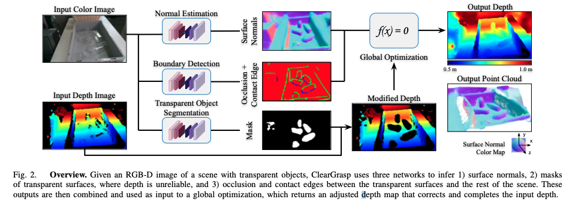
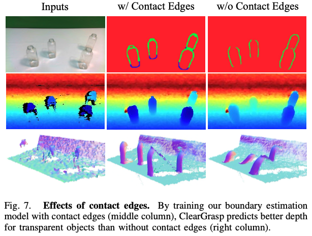
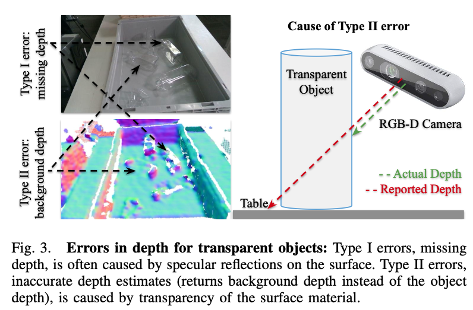

>论文标题：ClearGrasp- 3D Shape Estimation of Transparent Objects for Manipulation  
发表时间：2020  
研究组织：Google Research  
本文标签：深度估计、透明物体、CNN、ICRA

# 速读概览：
## 1.针对什么问题？ 
    透明物体既折射又镜面的视觉特性，使机器难以感知和操纵它们。标准 3D 传感器难以为透明物体生成准确的深度估计。
## 2.采用什么方法？  
    利用深度学习和合成训练数据（文中一并提出了包含超过50000张RGB-D图像的大规模的合成数据集）来推断透明物体的准确 3D 几何形状。使用深度卷积网络来推断透明物体表面的法线、掩膜和遮挡边界。然后使用这些输出来优化场景中所有透明表面的初始深度估计。
## 3.达到什么效果？  
    模型在很大程度上优于单目深度估计方法。对新物体的泛化效果也较好。
## 4.存在什么不足？
    没有在复杂环境中进行尝试，对于受不同光照条件的影响还是未知。

# 论文精读
## 0.摘要
透明物体是生活中常见的一部分，但他们具有独特的视觉特性，使得标准的3D传感器难以对其进行准确的深度估计。在许多情况下，它们通常表现为位于物体后面的表面发生的干扰或畸变的近似。为了应对这些挑战，我们提出了ClearGrasp——一种用于从单个RGB-D图像中估计透明物体的准确3D几何形状以进行机器人操作的深度学习方法。给定透明物体的单个RGB-D图像，ClearGrasp使用深度卷积网络来推断表面的法线、透明物体表面的蒙版和遮挡边界。然后使用这些输出来优化场景中所有透明表面的初始深度估计。为了训练和测试ClearGrasp，我们构建了一个包含超过50000张RGB-D图像的大规模的合成数据集，以及一个包含286张透明物体的RGB-D图像及其真实几何图形的真实世界测试基准。实验表明，ClearGrasp比单目深度估计基线要好得多，并且能够推广到现实世界的图像和新对象。我们还证明了ClearGrasp可以开箱即用，以提高抓取算法对透明物体的性能。代码、数据以及基准将会发布。支撑材料：https://sites.google.com/view/cleargrasp

## 1.介绍
* 透明物体（如老花镜到塑料瓶）在日常生活中很常见，但其独特的视觉特性，使机器难以感知和操纵它们。透明材料既折射又镜面的特性不符合经典立体视觉算法中的几何光路假设。加之透明物体通常表现为位于其后面的表面的干扰或失真近似，使得标准 3D 传感器难以为透明物体生成准确的深度估计。
* **ClearGrasp是一种利用深度学习和合成训练数据来推断透明物体的准确 3D 几何形状以进行机器人操作的算法**。ClearGrasp 的设计由以下三个关键思想驱动：
  * 商用RGB-D相机通常能为常见的非透明表面提供较准确的深度估计。因此，相比于直接从头开始估计所有几何形状，推测并校正来自 RGB-D 相机的初始深度估计更加实用：能够使用非透明表面的深度来推导透明表面的深度。为使结果更可靠，我们预测透明表面的像素级掩码（以检测和去除不可靠的深度），以及透明表面和背景之间的遮挡和接触边缘（以扩展可靠的深度）。
  * 出现在透明物体上的折射和镜面反射图案为其曲率（例如表面法线）提供了比绝对深度更强的视觉线索。这促使我们使用深度网络从 RGB 数据推断表面法线信息，这比直接推断深度值要可靠得多。
  * 虽然透明物体在真实世界的真值 3D 训练数据难以获得，但使用具有域随机化的高质量渲染合成图像作为训练数据得到的真实世界数据上的推导的结果是可行的。 有趣的是，我们还发现，通过将合成训练数据与真实世界的域外数据（例如没有透明对象的图像）混合，我们的模型能够更好地泛化到真实世界的图像和训练期间看不见的新透明对象。
* 本文的主要贡献有两方面。首先，本文提出了根据RGB-D图像估计透明物体的精确3D几何形状的算法。其次，本文构建了一个包含超过 50,000 张 RGB-D 图像的大规模合成数据集以及一个真实世界的测试基准，其中包含 286 个透明物体的 RGB-D 图像及其真实几何形状。实验表明，ClearGrasp 不仅能够泛化到现实世界中的透明对象，还能够泛化到训练中看不到的新对象。ClearGrasp 比单眼深度估计基线要好得多，我们的消融研究（类似控制变量）表明了关键设计决策的重要性。 我们还证明了 ClearGrasp 可以通过最先进的操作算法开箱即用，在真实世界的机器人平台上分别实现 86% 和 72% 的抽吸和平行爪抓取的拾取成功率。

## 2.相关工作
### 从彩色图像中估计几何形状
* 表面法线估计是深度卷积网络解决的一个流行问题。虽然预测的表面法线对于着色、2D-3D 对齐和面部变形等任务很有用，但仅靠它不足以描述对象的完整 3D 几何形状，因此很难被需要3D数据（如深度图像、点云）的操作算法直接使用。
* 最近的工作研究如何通过直接推断深度图像或填充商用 3D 相机捕获的 RGB-D 图像中缺失的深度值，从彩色图像中获取 3D 数据。 然而，由于商用3D立体相机对透明表面的深度估计不准确，很难获得真实的3D数据，这些工作都没有明确处理透明物体。

### 识别透明物体
* 透明物体是一直困扰着计算机视觉的难题。由于它们的折射和反射性质，它们的外观会根据背景和照明条件而发生巨大变化。检测透明物体的经典方法主要依赖于特殊性，例如镜面反射或由于折射引起的边缘局部特征。后来的方法依赖于深度学习模型，如 SSD或 RCNN来预测包围透明物体的边界框。 塞布等人提出了一种利用卷积网络在深度图像中利用传感器故障进行透明物体定位的方法。 王等人提出使用马尔可夫随机场定位玻璃物体，以从 RGB-D 相机的多种模态联合预测玻璃边界和区域。 基于定位，他们通过分段平面模型恢复深度读数。 然而，我们的方法不仅可以检测透明物体，还可以恢复详细的非平面几何图形，这对于操作算法至关重要。

### 估计透明物体的几何形状
* 估计透明物体几何形状的工作通常在受限环境中进行研究：例如，该工作可能假设特定的捕获程序、已知背景图案、传感器类型或已知物体 3D 模型。 李森科夫等人提出了一种使用 Kinect 传感器识别和估计刚性透明物体的方法。 使用透明对象的分割掩码，在训练阶段创建的对象的 3D 模型适合提取的边缘。 我们的方法能够泛化到训练期间未看到的对象，并且不需要对象的 3D 模型或相机位置等先验知识。

### 从合成数据中学习
* 合成数据已被证明可用于各种任务，如深度估计、3D语义场景完成、手势估计、机器人抓取、草图着色和人物重绘。但很少有合成数据集支持平面反射器，更不必说透明物体。在我们的实验中，我们发现需要非常高质量的渲染和3D模型来合成透明物体及其相关工件的代表性图像，如镜面高光和焦散。包含透明对象的数据集已被用于研究折射流估计、语义分割或相对深度。这些数据集是在简化的设置中生成的（例如，在来自COCO的随机图像前渲染透明对象）。相反，我们的方法旨在重建现实环境中透明物体的详细绝对深度。

## 3.方法
* 给定透明物体的单个RGB-D图像，ClearGrasp首先使用彩色图像作为深度卷积网络的输入来推断一组信息：表面法线、透明物体表面的掩膜和遮挡边界。随后ClearGrasp使用这些信息和初始深度图像作为全局优化的输入，该优化输出新的深度图像，根据传感器细化了场景中所有透明物体表面的初始深度估计。对于训练和测试，我们构建了一个合成数据集和一个透明对象的真实世界基准。方法概览如下图二所示。

### 3.1 透明物体的3D几何形状估计
* 我们采用Zhang等提出的深度补全管道并进行了一些关键修改以解决透明物体带来的独特挑战。首先，我们没有采取填充缺失的深度区域的方式，而是训练了一个额外的网络来预测透明物体表面的像素级掩膜，并使用它来移除深度相机的不可靠的深度测量。其次，我们并非只预测遮挡边缘（深度不连续），而是同时预测了遮挡和接触的边缘（与其他表面接触的物体的边界），以便网络可以区分不同类型的边缘并预测更准确的深度不连续边界，这对于全局优化步骤至关重要，如下图7所示。

### 3.1.1 透明物体分割
* 由于透明物体的反射和折射特性，它们会导致商用 RGB-D 传感器出现错误读数。两种错误类型如下图3所示。

* I类错误是指深度缺失，通常由镜面高光引起。当光线通过透明材料折射，仅从物体后面的表面反射回来时，就会发生 II 类错误。这会导致传感器报告物体背后的表面深度，而不是物体本身。这些不准确的非零深度估计很难使用标准深度补全来检测，这只会传播不准确的深度并导致重建损坏。 为了解决这个问题，我们使用带有 DRN-D-54 主干的 Deeplabv3+ 来预测透明对象的像素级掩膜，以移除与透明表面对应的所有深度像素。

### 3.1.2 表面法线估计
* 该模块使用带有 DRN-D-54 的 Deeplabv3+ 预测输入 RGB 彩色图像的逐像素表面法线。 最后一个卷积层被修改为具有 3 个输出类。 为了确保估计的法线是单位向量，输出是 L2 归一化的。

### 3.1.3 边界检测
* 该模块将输入彩色图像的每个像素标记为以下三个类别之一：（a）非边缘，（b）遮挡边界（深度不连续）（c）接触边缘（2 个对象之间的接触点）。 接触边缘虽然不直接由优化步骤使用，但非常重要，因为它有助于网络更好地区分彩色图像中观察到的不同类型的边缘，从而更准确地预测深度不连续边界。这显着降低了模型预测整个对象周围边界的机会，这将阻止全局优化步骤使用预测的表面法线求解其深度。（**「不太理解」**） 我们使用相同的 Deeplabv3+ 模型和 DRN-D-54 主干。 由于边界与背景的像素比很低，我们使用加权交叉熵损失，边界像素的权重是背景像素的 5 倍。

### 3.1.4 深度的全局优化
* 使用深度图像（与透明表面对应的所有像素都被移除）以及表面法线、遮挡和接触边缘的预测，ClearGrasp 通过Zhang提出的全局优化算法重建透明对象的 3D 表面（缺少深度区域）。 优化算法使用预测法线填充去除的深度以指导重建的形状，同时观察遮挡边界指示的深度不连续性。它求解方程组，目标是最小化三个项的加权平方和：
$$E = \lambda_DE_D+\lambda_SE_S+\lambda_NE_NB$$
    其中$E_D$测量估计深度和观察到的原始深度之间的距离，$E_S$测量相邻像素深度之间的差异,$E_N$测量估计深度和预测表面法线之间的一致性。 B 根据像素位于遮挡边界上的预测概率对正态项进行加权。在我们的实验中，$\lambda_D=1000$，$\lambda_S=0.001$，$\lambda_N=1.0$。

### 3.2 合成训练数据生成
* 我们选择 Synthesis AI 的平台来生成我们的合成数据，使用 Blender 的物理引擎以及基于物理的光线追踪 Blender Cycles 渲染引擎。 我们选择它是因为它具有高度可配置性，并且能够模拟透明对象的重要效果，例如通过多个表面的折射和反射以及软阴影。
* 该数据集由 9 个以真实世界透明塑料物体为模型的 CAD 模型组成，其中我们在训练期间保留了 4 个物体以测试算法的泛化能力。此外，一个灰色手提箱用作背景对象。 我们为透明物体下方的地平面采用了 33 个 HDRI 照明环境和 65 个纹理。 相机内在函数设置为英特尔实感 D415 相机的内在函数。为了生成每个场景，在平面上方创建了 1 到 5 个 CAD 模型对象，带有或不带有灰色手提箱，然后放下 CAD 模型对象，以便它们根据物理原理静止不动。 然后，随机选择的 HDRI 照明环境和地平面表面纹理也将应用于每个场景。
* 对于每个场景，地面实况数据包括：(1) 单目 RGB 渲染，(2) 以米为单位的对齐深度，(3) 所有透明对象的语义分割，(4) 相机位姿 (5) 每个 CAD 对象的姿势 , 和 (6) 场景的表面法线。最终的训练数据集包含超过 13,000 张图像，每个图像包含 3 个对象，每个图像包含 5000 个图像，每个图像包含另外 2 个对象。 每个图像的 100 个图像被保留作为验证集。 对于测试集，我们渲染了 4 个测试对象中的每一个的大约 100 张图像。

### 3.3 真实世界基准
* 为了测试我们的模型泛化到真实世界图像的能力，我们创建了一个真实世界透明对象的数据集。
* 为了捕捉透明物体的深度，我们将物体平均分成 2 组，并用粗糙的石头纹理喷涂一组，这比平面颜色提供更好的深度。我们开发了一个 GUI 应用程序，它可以覆盖从相机读取的 2 帧。首先将透明物体与各种随机不透明物体（如纸板箱、装饰壁炉架和水果）一起放置在场景中。 在捕获并冻结该帧后，每个对象都被替换为相同的喷漆实例。 随后的帧将覆盖在冻结的帧上，以便可以观察到喷漆对象和它们正在替换的透明对象之间的重叠。 借助高分辨率图像，可以在物体定位方面达到亚毫米级精度。
* 验证数据集由合成训练数据中使用的 5 个已知对象的 173 张图像组成。 测试集由 5 个新物体的 113 张图像组成，包括合成数据集中不存在的 3 个新玻璃物体。 每个图像包含 1-6 个对象，每个图像平均包含 2 个对象。

### 3.4 抓取计划
* 通过将 ClearGrasp 集成到机器人拣选系统中，我们可以研究其对下游操作任务的好处。我们为我们的实验采用了一种最先进的抓取算法，该算法由一个卷积网络组成，该网络通过从ClearGrasp得到的完整的深度图像得到的密集像素级采样的末端执行器的位置和方向，预测了脚本化抓取原语拾取成功的概率。
* 具体来说，它使用了一个 18 层的全卷积残差网络，带有扩张的卷积和 ReLU 激活，与 2 层最大池化、2 层空间双线性 2x 上采样交错。网络将 4 通道图像作为输入——表面法线图（3 通道）与从 ClearGrasp 推断出的完整深度图像（1 通道）逐通道连接——并输出与输入图像具有相同大小和分辨率的概率图。拣选系统假设 3D 相机使用[54]中的校准程序相对于机器人坐标进行校准因此深度图像中的每个像素都映射到 3D 位置。机器人执行自上而下的平行爪抓取或抽吸，其中末端执行器的尖端以网络预测概率最高的像素的 3D 位置为中心。
* ...(not I need)

## 4.评估
* 我们评估了 ClearGrasp 在合成和现实世界基准上估计透明物体几何形状的能力，然后将其应用于现实世界的机器人拾取系统。
* 指标：对于表面法线估计，我们计算均值和中值误差（以度为单位）以及估计法线小于阈值 11.25、22.5 和 30 度的像素百分比。 对于深度估计，我们使用以前工作中的度量标准：以米为单位的均方根误差 (RMSE)、相对于深度的中值误差 (Rel) 以及预测深度落在一个区间内的像素百分比 ([δ = |预测 - 真|/真]，其中 δ 为 1.05、1.10 或 1.25）。 通过将图像和地面实况调整为 144x256p 分辨率来评估深度。 对于掩码预测，我们使用像素级交集而不是联合进行评估以及真阳性率。 除非指定，否则仅在属于透明对象的像素上的真实已知数据集上计算度量。
* 泛化：真实世界的图像。 表 I 还显示了测试我们模型的跨域性能的实验结果。 尽管从未接受过真实世界透明对象的训练，但我们发现我们的模型能够很好地适应真实世界的领域，在跨领域的已知对象上实现非常相似的 RMSE 和 Rel 分数。 然而，表面法线预测精度在真实图像上会降低。 当透明物体遮挡新的不透明物体时，我们观察到表面法线估计的大误差。 令人惊讶的是，Real-novel 对象的指标优于 Syn-novel。 我们将其归因于现实世界图像中使用的 3 个新玻璃物体，与所有其他物体的薄塑料材料相比，由于它们的材料较厚，因此显示出更明显的折射特性。
* 泛化：新的对象形状。 我们检查我们的算法泛化到以前没见过的对象形状的能力。 表 I 显示了由合成数据和现实世界数据进行的对新对象深度估计的结果。 我们看到它在这两种情况下都能够很好地泛化，取得比已知对象更好的结果。 这可能是由于新物体的尺寸较小，导致深度重建的误差相对较小。
* 与单目深度估计的比较。 我们将我们的方法与 DenseDepth进行比较，DenseDepth 是一种具有最先进性能的单目深度估计方法。 DenseDepth 使用深度神经网络直接从彩色图像中预测深度值。 我们使用与我们的方法相同的训练数据训练 DenseDepth。 表 I 中的结果表明，我们的模型在很大程度上优于单目深度估计方法。
* 掩模预测的效果。 我们通过删除属于透明对象的所有像素来测试清理输入深度的有效性，如表 II 所示。 通过不去除初始噪声深度值，我们注意到最终深度估计误差显着增加。 表 I 报告了并集交叉和真阳性率中掩码预测的准确性。 在我们的方法中，具有较高的真阳性率（> 95%）对于去除所有不正确的初始深度值至关重要。
* 接触边缘和边缘权重的影响。表 II 显示了使用加权损失函数的影响以及将额外的接触边缘类别添加到我们的遮挡边界估计模型中的影响。 这两种方法都有助于显着改善深度完井结果。
* 训练数据的影响。 我们的主要训练数据集由透明物体的合成图像组成。 由于为透明物体捕获具有精确几何地面实况的真实世界数据是昂贵的，因此我们建议在训练中混合典型的真实世界 RGB-D 室内场景图像以减少域差距。 表 III 显示了不同训练程序下的模型性能：有/没有对域外真实世界数据（来自 Scannet 和 Matterport 数据集的 80k 图像）进行预训练和有/没有域内合成数据微调。 图 6 还显示了上述所有情况下表面法线估计的定性结果。 我们看到，在域外真实世界数据上训练的模型无法拾取透明对象。 但是，使用此类数据进行预训练可以改善结果，尤其是对于真实世界的测试集。

## 5.结论与下一步工作
* 我们提出了 ClearGrasp，这是一种利用深度学习与合成训练数据和多种传感器模式（颜色和深度）来推断透明对象的精确 3D 几何形状以进行操作的算法。 然而，所提出的系统还远未完善。 未来可能的方向可能包括：在推理步骤中明确利用光照信息来提高算法在不同光照条件下的准确性，在杂乱环境中提高算法的鲁棒性，其中预测准确的遮挡和接触边缘更具挑战性，并使算法对锐度具有鲁棒性、焦散和阴影。