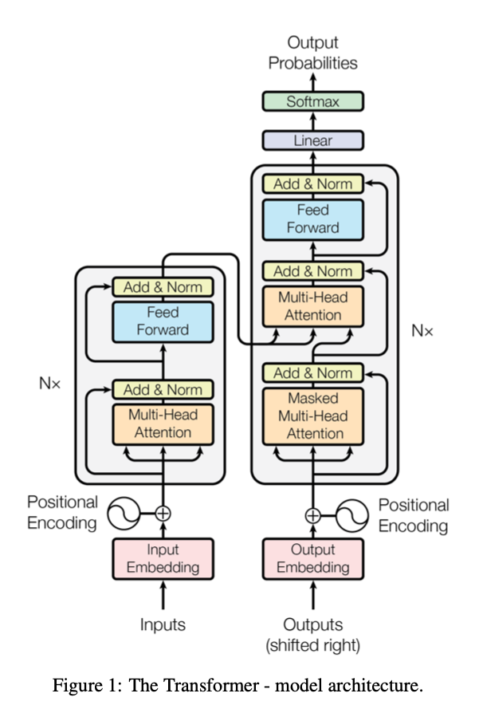

>论文标题：Attention is all you need  
发表时间：2017  
研究组织：Google  
本文标签：网络结构、Transformer、NIPS

# 速读概览：
## 1.针对什么问题？ 

## 2.采用什么方法？  

## 3.达到什么效果？  

## 4.存在什么不足？

# 论文精读
## 0.摘要
* 主流的序列转录模型都是基于包含encoder-decoder的复杂的循环或卷积神经网络。性能最好的模型一般通过注意力机制将编码器和解码器连接起来。我们提出了一个新的简单的网络架构，Transformer，它完全基于注意力机制，完全没有用之前的循环和卷积。在两个机器翻译任务上的实验表明这些模型在质量上更胜一筹，同时更具有并行性，并且需要更少的训练时间。我们的模型在WMT 2014 英-德翻译任务上取得了28.4 BLEU，比现有的最佳结果（包括集成）提高了 2 BLEU。 在 WMT 2014 英语到法语翻译任务中，我们的模型在 8 个 GPU 上训练 3.5 天后建立了一个新的单模型最先进的 BLEU 分数 41.8，这个cost只是最佳模型训练成本的一小部分。 我们还展示了通过将 Transformer 成功应用于具有大量和有限训练数据的英语选区解析，可以很好地推广到其他任务。

## 1.Introduction
* 循环神经网络，特别是长短期记忆和门控循环神经网络，已被牢固地确立为序列建模和转导问题（如语言建模和机器翻译）的最先进方法。此后，无数努力继续推动循环语言模型和encoder-decoder架构的界限。
* 循环模型通常沿着输入和输出序列的符号位置进行因子计算。

## 2.Background
* 

## 3.Model Architecture
* 大多数具有竞争力的神经序列转录模型都具有encoder-decoder结构。encoder将符号表示输入序列${x_1, ...x_n}$映射到连续的序列表示${z=(z_1, ..., z_n)}$。给定 z，decoder生成一个符号的输出序列${(y1, ..., ym)}$，每次一个元素。在每一步，模型都是自回归的，在生成下一个时，将先前生成的符号作为额外的输入使用。
* Transformer遵循这一整体架构，使用堆叠的自注意力和逐点、完全连接的encoder和decoder层。

### 3.1 Encoder and Decoder Stacks
#### Encoder
* encoder由六个相同层的堆栈组成。每个层有两个子层。第一个是多头自注意力机制，第二个是简单的逐位置的全连接前馈网络。我们在两个子层的每一个周围都使用了一个残差连接，然后是layernorm。即每个子层的输出是${LayerNorm(x + Sublayer(x))}$，其中${Sublayer(x)}$是子层自己实现的函数。 为了促进这些残差连接，模型中的所有子层以及嵌入层产生维度 ${d_{model} = 512}$ 的输出。（残差连接要求输入和输出是相同的维度，否则需要做投影）

#### Decoder
* encoder也由六个相同层的堆栈组成。除了每个编码器层中的两个子层之外，解码器还插入了第三个子层，该子层对编码器堆栈的输出执行多头注意力机制。 与encoder类似，我们在每个子层周围使用残差连接，然后进行layernorm。 我们还修改了encoder堆栈中的自注意子层，以防止位置关注后续位置。 这种mask与输出嵌入偏移一个位置的事实相结合，确保位置 i 的预测只能依赖于小于 i 的位置的已知输出。

### 3.2 Attention
* 注意力函数是将一个query和一些key-value对映射成一个输出的一个函数，query、keys、values和输出都是向量。output是values的加权和，每个value的权重是value对应的key和query的相似度计算得到的。

#### 3.2.1 Scaled Dot-Product Attention
* queries和keys的维度都是$d_k$，values的维度是$d_v$。对每一个query和key做内积得到相似度，结果除以${\sqrt{d_k}}$，再用一个softmax得到权重。
* 在实践中，我们同时计算一组query的注意力函数，并一起打包成矩阵 Q。key和value也一起打包成矩阵 K 和 V。 我们计算输出矩阵为：
$${Attention(Q, K, V) = softmax(\frac{QK^T}{\sqrt{d_k}})V \tag{1}}$$
* 两个最常用的注意力函数是加性注意力和点积（乘法）注意力。 点积注意力与我们的算法相同，除了${\frac{1}{\sqrt{d_k}}}$的缩放因子。 加性注意力使用具有单个隐藏层的前馈网络计算兼容性函数。 虽然两者在理论复杂度上相似，但点积注意力在实践中速度更快，空间效率更高，因为它可以使用高度优化的矩阵乘法代码来实现。
* 虽然对于较小的$d_k$值，这两种机制的表现相似，但加性注意力优于点积注意力，而无需针对较大的 dk 值进行缩放。 我们怀疑对于较大的$d_k$值，点积在幅度上增长很大，将 softmax 函数推入具有极小梯度 的区域。为了抵消这种影响，我们将点积缩放{\frac{1}{\sqrt{d_k}}}$。

#### 3.2.2 Multi-Head Attention
* 

### 3.3 Position-wise Feed-Forward Networks

### 3.4 Embeddings and Softmax

### 3.5 Positional Encoding

## 4. Why Self-Attention

## 5.Training

## 6.Results

## 7.Conclusion
* 本文中，我们提出了Transformer，这是第一个完全基于注意力机制的序列转录模型，将循环层全部替换成了带有多头自注意力机制的encoder-decoder架构。
* 对于翻译任务，Transformer的训练要比基于循环或者卷积层的结构快很多。我们最好的模型甚至优于所有先前报告的集成。
* 我们对基于注意力模型的未来感到兴奋，并计划将它们应用于其他任务。 我们计划将 Transformer 扩展到涉及文本以外的输入和输出模式的问题，并研究局部、受限的注意力机制以有效处理大型输入和输出，如图像、音频和视频。 减少生成的时序化是我们的另一个研究目标。
* 代码仓库： https://github.com/ tensorflow/tensor2tensor