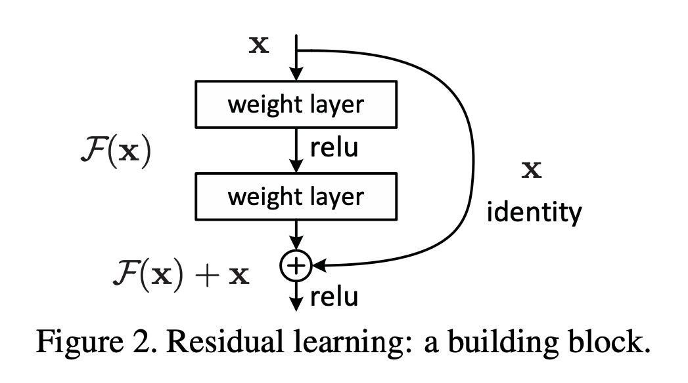

>论文标题：Deep residual learning for image recognition  
发表时间：2015  
研究组织：Microsoft  
本文标签：ResNet、DL、CNN

# 速读概览：
## 1.针对什么问题？ 
传统的卷积神经网络大部分都是通过将一系列卷积层与下采样层进行堆叠得到的。但是当堆叠到一定网络深度时，就会出现两个问题。
* 梯度消失或梯度爆炸。
* 退化问题(degradation problem)。

通过数据的预处理以及在网络中使用BN（Batch Normalization）层能够解决梯度消失或者梯度爆炸问题。但是对于退化问题（随着网络层数的加深，效果还会变差）并没有很好的解决办法。
## 2.采用什么方法？  
* ResNet论文提出了residual结构（残差结构）来减轻退化问题。针对层数少和层数多的网络提出了两种不同的结构。
* 本质：降低数据中信息的冗余度
* 对非冗余信息采用了线性激活（通过skip connection获得无冗余的identity部分），然后对冗余信息采用非线性激活（通过ReLU对identity之外的其余部分进行信息提取/过滤，提取出的有用信息即是残差）。
## 3.达到什么效果？  
* 易于优化，而当深度增加时，对应的简单网络会产生较大的训练误差（退化问题）
* 增加深度能够显著提高准确率，并且结果提升比先前的网络模型要好
    

## ResNet残差模型
