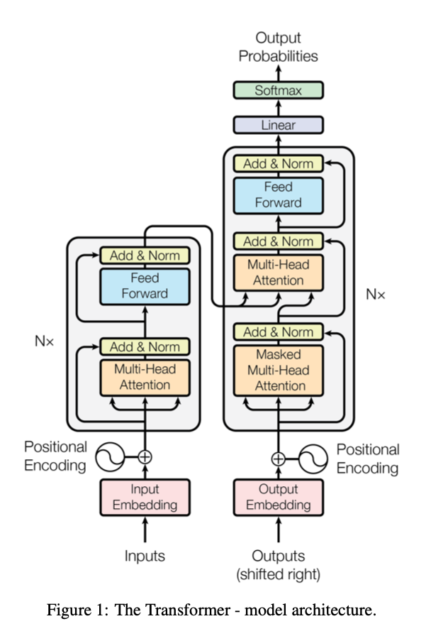

>论文标题：Attention is all you need  
发表时间：2017  
研究组织：Google  
本文标签：网络结构、Transformer、NIPS

# 速读概览：
## 1.针对什么问题？ 
    主流的序列转录模型大体都是基于CNN或RNN的复杂模型，计算量大。现有的考虑注意力机制的模型也只是将其与前者融合，没有使用完全基于注意力机制的模型。
## 2.采用什么方法？  
    提出了一个新的简单的网络架构——Transformer，它完全基于注意力机制，没有用之前的循环和卷积。
## 3.达到什么效果？  
    在WMT 2014 英-德翻译任务上取得了28.4 BLEU，比现有的最佳结果（包括集成）提高了 2 BLEU。
## 4.存在什么不足？
    没有做一些空间上的假设，抓取数据中信息的能力变差了，需要使用更多的数据更大的模型达到需要的效果。

# 论文精读
## 0.摘要
* 主流的序列转录模型都是基于包含encoder-decoder的复杂的循环或卷积神经网络。性能最好的模型一般通过注意力机制将编码器和解码器连接起来。我们提出了一个新的简单的网络架构，Transformer，它完全基于注意力机制，完全没有用之前的循环和卷积。在两个机器翻译任务上的实验表明这些模型在质量上更胜一筹，同时更具有并行性，并且需要更少的训练时间。我们的模型在WMT 2014 英-德翻译任务上取得了28.4 BLEU，比现有的最佳结果（包括集成）提高了 2 BLEU。 在 WMT 2014 英语到法语翻译任务中，我们的模型在 8 个 GPU 上训练 3.5 天后建立了一个新的单模型最先进的 BLEU 分数 41.8，这个cost只是最佳模型训练成本的一小部分。 我们还展示了通过将 Transformer 成功应用于具有大量和有限训练数据的英语选区解析，可以很好地推广到其他任务。

## 1.Introduction
* 循环神经网络，特别是长短期记忆和门控循环神经网络，已被牢固地确立为序列建模和转导问题（如语言建模和机器翻译）的最先进方法。此后，无数努力继续推动循环语言模型和encoder-decoder架构的界限。
* 循环模型通常沿着输入和输出序列的符号位置进行因子计算。将位置与计算时间的步骤对齐，它们生成一系列隐藏状态${h_t}$，作为先前隐藏状态${h_{t-1}}$ 和位置 t 的输入的函数。这种固有的顺序性质排除了训练示例中的并行化，这在更长的序列长度下变得至关重要，因为内存限制限制了示例之间的批处理。最近的工作通过分解技巧和条件计算在计算效率方面实现了显著的提升，同时在后者的情况下也提高了模型性能。 然而，顺序计算的基本约束仍然存在。
* （attention在RNN中的应用）注意机制已成为各种任务中引人注目的序列建模和转换模型的组成部分，允许对依赖关系进行建模，而无需考虑它们在输入或输出序列中的距离 。 然而，除了少数情况，这种注意力机制与循环网络结合使用。
* 我们提出了 Transformer，这是一种避免重复的模型架构，而是完全依赖注意力机制来绘制输入和输出之间的全局依赖关系。 在八个 P100 GPU 上经过短短 12 小时的训练后，Transformer 可以实现更多的并行化，并且可以在翻译质量方面达到新的水平。

## 2.Background
* 减少顺序计算的目标也构成了扩展神经 GPU 、ByteNet 和 ConvS2S 的基础，它们都使用卷积神经网络作为基本构建块，并行计算所有输入和输出位置的隐藏表示。在这些模型中，关联来自两个任意输入或输出位置的信号所需的操作数量随着位置之间的距离而增长，对于 ConvS2S 呈线性增长，而对于 ByteNet 则呈对数增长。这使得学习远距离位置之间的依赖关系变得更加困难。 在 Transformer 中，这被减少到恒定数量的操作，尽管由于平均注意力加权位置而降低了有效分辨率，我们使用多头注意力来抵消这种影响，如 3.2 节所述。
* 自注意力，有时称为内部注意力，是一种将单个序列的不同位置关联起来以计算序列表示的注意力机制。 自注意力已成功用于各种任务，包括阅读理解、抽象摘要、文本蕴涵和学习任务无关的句子表示。
* 端到端记忆网络基于循环注意机制而不是序列对齐循环，并且已被证明在简单语言问答和语言建模任务中表现良好
* 然而，据我们所知，Transformer 是第一个完全依赖自注意力来计算其输入和输出表示而不使用序列对齐 RNN 或卷积的转换模型。 在接下来的部分中，我们将描述 Transformer，激发自注意力并讨论其相对于 [17](Neural GPUs learn algorithms)、[18](Neural machine translation in linear time) 和 [9](Convolu- tional sequence to sequence learning) 等模型的优势。

## 3.Model Architecture
* 大多数具有竞争力的神经序列转录模型都具有encoder-decoder结构。encoder将符号表示输入序列${x_1, ...x_n}$映射到连续的序列表示${z=(z_1, ..., z_n)}$。给定 z，decoder生成一个符号的输出序列${(y1, ..., ym)}$，每次一个元素。在每一步，模型都是自回归的，在生成下一个时，将先前生成的符号作为额外的输入使用。
* Transformer遵循这一整体架构，使用堆叠的自注意力和逐点、完全连接的encoder和decoder层。

### 3.1 Encoder and Decoder Stacks
#### Encoder
* encoder由六个相同层的堆栈组成。每个层有两个子层。第一个是多头自注意力机制，第二个是简单的逐位置的全连接前馈网络。我们在两个子层的每一个周围都使用了一个残差连接，然后是layernorm。即每个子层的输出是${LayerNorm(x + Sublayer(x))}$，其中${Sublayer(x)}$是子层自己实现的函数。 为了促进这些残差连接，模型中的所有子层以及嵌入层产生维度 ${d_{model} = 512}$ 的输出。（残差连接要求输入和输出是相同的维度，否则需要做投影）

#### Decoder
* encoder也由六个相同层的堆栈组成。除了每个编码器层中的两个子层之外，解码器还插入了第三个子层，该子层对编码器堆栈的输出执行多头注意力机制。 与encoder类似，我们在每个子层周围使用残差连接，然后进行layernorm。 我们还修改了encoder堆栈中的自注意子层，以防止位置关注后续位置。 这种mask与输出嵌入偏移一个位置的事实相结合，确保位置 i 的预测只能依赖于小于 i 的位置的已知输出。

### 3.2 Attention
* 注意力函数是将一个query和一些key-value对映射成一个输出的一个函数，query、keys、values和output都是向量。output是values的加权和，每个value的权重是value对应的key和query的相似度计算得到的。

#### 3.2.1 Scaled Dot-Product Attention
* queries和keys的维度都是$d_k$，values的维度是$d_v$。对每一个query和key做内积得到相似度，结果除以${\sqrt{d_k}}$，再用一个softmax得到权重。
* 在实践中，我们同时计算一组query的注意力函数，并一起打包成矩阵 Q。key和value也一起打包成矩阵 K 和 V。 我们计算输出矩阵为：
$${Attention(Q, K, V) = softmax(\frac{QK^T}{\sqrt{d_k}})V \tag{1}}$$
* 两个最常用的注意力函数是加性注意力和点积（乘法）注意力。 点积注意力与我们的算法相同，除了${\frac{1}{\sqrt{d_k}}}$的缩放因子。 加性注意力使用具有单个隐藏层的前馈网络计算兼容性函数。 虽然两者在理论复杂度上相似，但点积注意力在实践中速度更快，空间效率更高，因为它可以使用高度优化的矩阵乘法代码来实现。
* 虽然对于较小的$d_k$值，这两种机制的表现相似，但加性注意力优于点积注意力，而无需针对较大的 dk 值进行缩放。 我们怀疑对于较大的$d_k$值，点积在幅度上增长很大，将 softmax 函数推入具有极小梯度的区域。为了抵消这种影响，我们将点积缩放{\frac{1}{\sqrt{d_k}}}$。

#### 3.2.2 Multi-Head Attention
* 与使用${d_{model}}$维的key、value和query执行单个注意函数不同，我们发现将query、key和value分别线性投影到$d_k$、$d_k$ 和 $d_v$ 维的不同学习线性投影是有益的。然后，在每个query、key和value的投影版本上，我们并行执行注意功能，产生$d_v$维输出值。 这些被连接起来并再次投影，产生最终值。
* 多头注意力允许模型共同关注来自不同位置的不同表示子空间的信息。 对于单个注意力头，平均化会抑制这一点。
$${MultiHead(Q,K,V) = Concat(head_1, ... , head_h)W^{O}}$$
$${where head_i = Attention(QW^Q_i, KW_i^K, VW_i^V)}$$
其中，投影是参数矩阵${W_i^Q \in R^{d_{model}\times d_k}}$,${W_i^K \in R^{d_{model}\times d_k}}$,${W_i^V \in R^{d_{model}\times d_v}}$,${W^O \in R^{hd_v\times d_{model}}}$
* 在这项工作中，我们使用 h = 8 个并行注意力层或头。 对于其中的每一个，我们使用${d_k = d_v = d_{model}/h = 64}$。由于每个头的维度减少，总计算成本类似于具有全维度的单头注意力。

#### 3.2.3 Applications of Attention in our Model
* Transformer以三种不同的方式使用多头注意力
  * 在“encoder-decoder 注意力”层，queries来自之前的decoder层，记忆的keys和values来自encoder的输出。这允许解码器中的每个位置参与输入序列中的所有位置。 这模仿了序列到序列模型中典型的encoder-decoder注意机制。
  * encoder层包括自注意力层。在自注意力层中，在自注意力层中，所有的keys、values和queries都来自同一个地方，在这种情况下，是encoder中前一层的输出。 encoder中的每个位置都可以关注encoder上一层中的所有位置。
  * 类似地，encoder中的自注意力层允许解码器中的每个位置关注解码器中直到并包括该位置的所有位置。 我们需要防止解码器中的信息向左流动，以保持自回归特性。 我们通过屏蔽掉（设置为${-\infty}$）softmax 输入中与非法连接相对应的所有值来实现缩放点积注意力的内部。

### 3.3 Position-wise Feed-Forward Networks
* 除了注意力子层之外，我们的encoder和decoder中的每一层都包含一个完全连接的前馈网络，该网络分别且相同地应用于每个位置。 这包括两个线性变换，中间有一个 ReLU 激活。
$${FFN(x) = max(0, xW_1+b_1)W_2 + b_2\tag{2}}$$
* 虽然线性变换在不同位置上是相同的，但它们在层与层之间使用不同的参数。 另一种描述方式是内核大小为 1 的两个卷积。输入和输出的维数为${d_{model} = 512}$，内层的维数为${d_{ff} =2048}$。

### 3.4 Embeddings and Softmax
* 与其他序列转导模型类似，我们使用学习嵌入将输入标记和输出标记转换为维度${d_{model}}$的向量。 我们还使用通常的学习线性变换和 softmax 函数将decoder输出转换为预测的下一个令牌概率。 在我们的模型中，我们在两个嵌入层和 pre-softmax 之间共享相同的权重矩阵线性变换。 在嵌入层中，我们将这些权重乘以${d_{model}}$。

### 3.5 Positional Encoding
* 由于我们的模型既不含循环也不含卷积，为了让模型利用序列顺序信息，我们必须往序列中添加tokens的相对或绝对位置信息。我们最终在位于encoder和decoder栈底部的input embeddings中添加了“positional encodings”。
  
## 4. Why Self-Attention
* 我们将自注意力层的各个方面与循环层和卷积层进行比较，这些层通常用于将一个可变长度的符号表示序列${(x_1, ..., x_n)}$映射到另一个等长序列${(z_1, ..., z_n)}$，q其中${x_i, z_i \in R^d}$ ，例如典型序列转导encoder或decoder中的隐藏层。 以下三个需要激励我们使用自注意力机制。
* 第一个是每层总的计算复杂度。另一个是可以并行计算的数量，由所需的最小顺序操作数来衡量。
* 第三个是网络中远程依赖关系之间的路径长度。学习远距离以来是很多序列转导任务的关键挑战。影响学习这种依赖的能力的一个关键因素是前向和后向信号必须在网络中遍历的路径长度。输入和输出序列中任意位置组合之间的这些路径越短，就越容易学习远程依赖。 因此，我们还比较了由不同层类型组成的网络中任意两个输入和输出位置之间的最大路径长度。
* 自注意力层将所有位置与恒定数量的顺序执行操作连接起来，而循环层需要${O(n)}$顺序操作。就计算复杂度而言，当序列长度n比表示维度d小的时候，自注意力层要比循环层快，这在机器翻译中最先进的模型使用的句子表示中最常见，例如 word-piece 和 byte-pair 表示。为了提高涉及较长序列的任务的计算性能，可以将自注意力限制为仅考虑输入序列中以相应输出位置为中心的大小为 r 的邻域。 这会将最大路径长度增加到 O(n/r)。 我们计划在未来的工作中进一步研究这种方法。
* 内核宽度${k < n}$的单个卷积层不会连接所有输入和输出位置对。 这样做需要在连续内核的情况下堆叠${O(n/k)}$卷积层，或者在扩张卷积的情况下需要${O(log_k(n))}$，从而增加任意两个位置之间最长路径的长度 在网络中。 卷积层通常比循环层更昂贵，高出 k 倍。 然而，可分离卷积将复杂度大大降低到${O(k · n · d + n · d2)}$。 然而，即使${k = n}$，可分离卷积的复杂度也等于自注意力层和逐点前馈层的组合，这是我们在模型中采用的方法。
* 作为附带的好处，self-attention 可以产生更多可解释的模型。 我们从我们的模型中检查注意力分布，并在附录中展示和讨论示例。 不仅单个注意力头清楚地学习执行不同的任务，而且许多似乎表现出与句子的句法和语义结构相关的行为。

## 5.Training

## 6.Results

## 7.Conclusion
* 本文中，我们提出了Transformer，这是第一个完全基于注意力机制的序列转录模型，将循环层全部替换成了带有多头自注意力机制的encoder-decoder架构。
* 对于翻译任务，Transformer的训练要比基于循环或者卷积层的结构快很多。我们最好的模型甚至优于所有先前报告的集成。
* 我们对基于注意力模型的未来感到兴奋，并计划将它们应用于其他任务。 我们计划将 Transformer 扩展到涉及文本以外的输入和输出模式的问题，并研究局部、受限的注意力机制以有效处理大型输入和输出，如图像、音频和视频。 减少生成的时序化是我们的另一个研究目标。
* 代码仓库： https://github.com/tensorflow/tensor2tensor