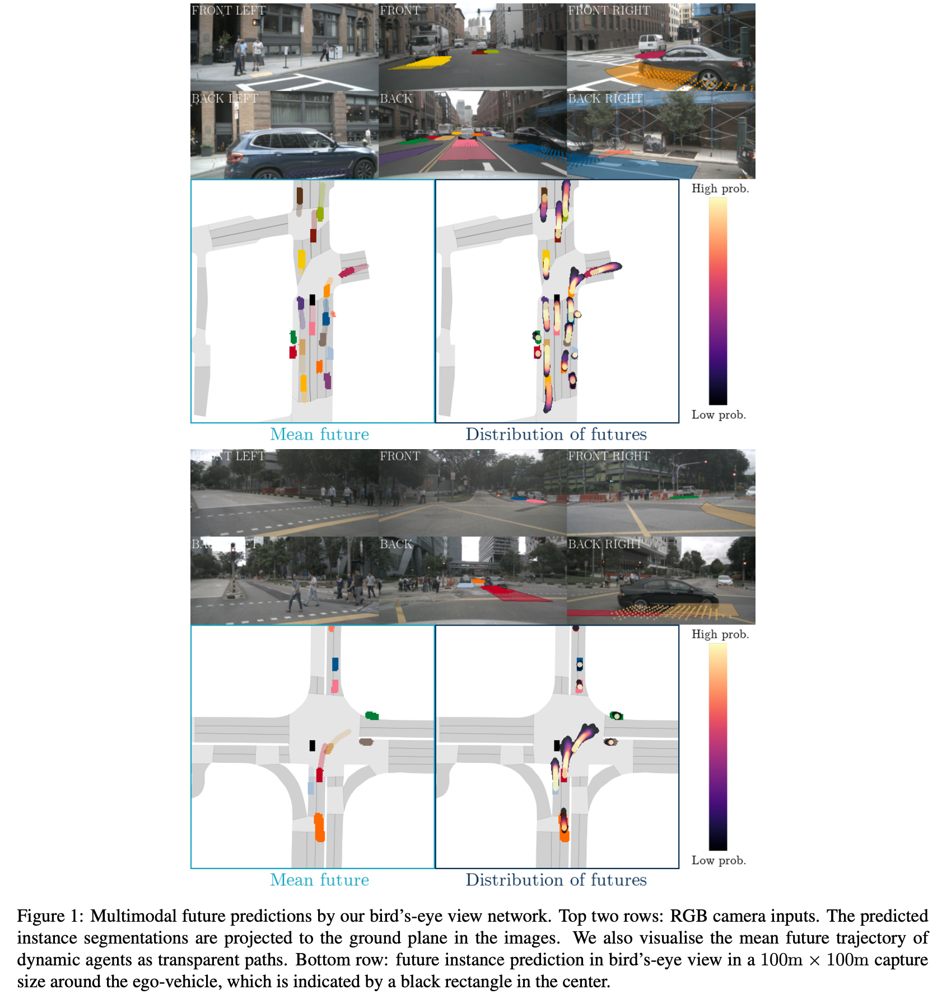
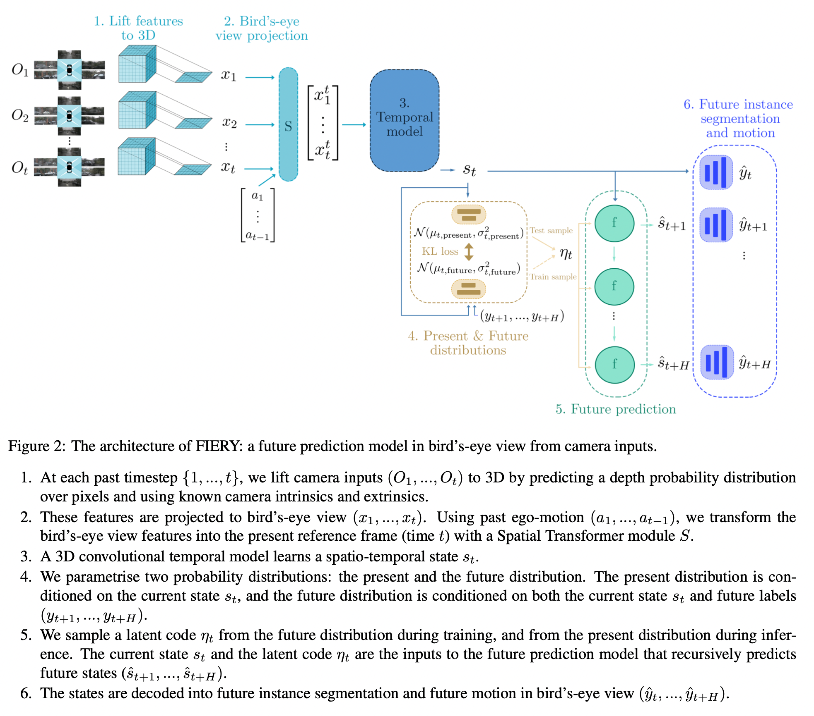

>论文标题：FIERY: Future Instance Segmentation in Bird's-Eye view from Surround Monocular Cameras  
发表时间：2021  
研究组织：Wayve、University of Cambridge  
本文标签：自动驾驶、BEV、cross-view、预测、ICCV  

# 速读概览：
## 1.针对什么问题？ 
    很多现有的方法都依赖高精度地图、LiDAR数据，并且不能对未来进行预测。

## 2.采用什么方法？  
    本文提出的FIERY在传统的自动驾驶任务上结合了感知、传感器融合和预测，直接通过车身的RGB单目相机估计BEV的预测信息。FIERY以end-to-end的形式，在不依赖高精度地图的情况下，仅从摄像头驱动数据未来固有的随机性进行建模，而不依赖于高清地图，并预测多模态未来轨迹。
    整个模型首先输入六个相机的连续三帧（以及各个相机对应的内外参的信息），提取各个图像的特征并将其映射到三维空间上。将三维空间的特征投影到BEV上，将相邻三帧的前两帧warp到第三帧上。然后使用一个3D卷积的时间模型学习一个时空状态，得到一个现在/未来的概率分布，由此进行未来的预测。最后通过一个decoder得到BEV上的future instance segmentation 和 future motion。

## 3.达到什么效果？  
    Our model outperforms previous prediction baselines on the NuScenes and Lyft datasets.

## 4.存在什么不足？
    NuScenes的数据太精准了，模型在理想数据集上才能得到文中呈现的效果。

# 论文精读

## 0.Abstract
* Driving requires interacting with road agents and predicting their future behaviour in order to navigate safely. 
* We present FIERY: a probabilistic future prediction model in bird’s-eye view from monocular cameras. Our model predicts future instance segmentation and motion of dynamic agents that can be transformed into non-parametric future trajectories. Our approach combines the perception, sensor fusion and prediction components of a traditional autonomous driving stack by estimating bird’s-eye-view prediction directly from surround RGB monocular camera inputs. FIERY learns to model the inherent stochastic nature of the future solely from camera driving data in an end-to-end manner, without relying on HD maps, and predicts multimodal future trajectories. We show that our model outperforms previous prediction baselines on the NuScenes and Lyft datasets. The code and trained models are available at https://github.com/wayveai/fiery.

## 1.Introduction
* Prediction of future states对自动驾驶来说很重要
  * Prediction of future states is a key challenge in many autonomous decision making systems. This is particularly true for motion planning in highly dynamic environments: for example in autonomous driving where the motion of other road users and pedestrians has a substantial influence on the success of motion planning. Estimating the motion and future poses of these road users enables motion planning algorithms to better resolve multimodal outcomes where the optimal action may be ambiguous knowing only the current state of the world.
* 本文是camera-based
  * 自动驾驶本质上是一个几何问题，其目标是在 3D 空间中安全、正确地导航车辆。 因此，an orthographic bird’s-eye view (BEV) perspective常用于基于 LiDAR 传感的运动规划和预测。
  * 基于相机的感知的最新进展已经与基于 LiDAR 的感知相媲美，我们预计这也将适用于更广泛的单目视觉任务，包括预测。 建立一个基于摄像头的感知和预测系统将使一个比 LiDAR 传感更精简、更便宜和更高分辨率的视觉识别系统成为可能。
* 之前的camera-based的预测工作要么直接在透视图坐标系中执行，要么使用 HDmapping 系统生成的场景的简化 BEV 光栅表示。 我们希望构建在正交鸟瞰框架中运行的预测模型（由于规划和控制的好处），不依赖辅助系统来生成场景的 BEV 光栅表示。
  * Most of the work in camera-based prediction to date has either been performed directly in the perspective view coordinate frame, or using simplified BEV raster representations of the scene generated by HDmapping systems . We wish to build predictive models that operate in an orthographic bird’s-eye view frame (due to the benefits for planning and control), though without relying on auxiliary systems to generate a BEV raster representation of the scene.
* 传感器融合能够提高目标检测的性能。我们追求从周围的RGB单目相机输入中估计BEV预测得到与传感器融合相同的好处。
  * A key theme in robust perception systems for autonomous vehicles has been the concept of early sensor fusion, generating 3D object detections directly from image and LiDAR data rather than seeking to merge the predicted outputs of independent object detectors on each sensor input. Learning a task jointly from multiple sources of sensory data, rather than a staged pipeline, has been demonstrated to offer improvement to perception performance in tasks such as object detection. We seek similar benefits in joining perception and sensor fusion to prediction by estimating bird’s-eye-view prediction directly from surround RGB monocular camera inputs, rather than a multi-stage discrete pipeline of tasks.
* 不依赖HDmap来预测multimodal future trajectories
  * Lastly, traditional autonomous driving stacks tackle future prediction by extrapolating the current behaviour of dynamic agents, without taking into account possible interactions. They rely on HD maps and use road connectivity to generate a set of future trajectories. Instead, FIERY learns to predict future motion of road agents directly from camera driving data in an end-to-end manner, without relying on HD maps. It can reason about the probabilistic nature of the future, and predicts multimodal future trajectories. 如图1所示

* To summarise the main contributions of this paper
  * 1.We present the first future prediction model in BEV from monocular camera videos. Our framework explicitly reasons about multi-agent dynamics by predicting future instance segmentation and motion in BEV.
  * 2.Our probabilistic model predicts plausible and multi-modal futures of the dynamic environment.
  * 3.We demonstrate quantitative benchmarks for future dynamic scene segmentation, and show that our learned prediction outperforms previous prediction baselines for autonomous driving on the NuScenes and Lyft datasets.

## 2.Related work
### Bird’s-eye view representation from cameras
* 之前的工作解决了2D到BEV的inherently ill-posed problem，也有从images直接生成语义BEV maps的工作
  * Many prior works have tackled the inherently ill-posed problem of lifting 2D perspective images into a BEV representation. [35, 33] dealt specifically with the problem of generating semantic BEV maps directly from images and used a simulator to obtain the ground truth.
* 最近的多传感器数据集如NuScenes 和 Lyft，从 3D 目标检测生成 BEV 语义分割标签
  * Recent multi-sensor datasets, such as NuScenes or Lyft, made it possible to directly supervise models on real-world data by generating BEV semantic segmentation labels from 3D object detections.
  * **文献39（Predicting semantic map representations from images using pyramid occupancy networks） proposed a Bayesian occupancy network to predict road elements and dynamic agents in BEV directly from monocular RGB images.** 
  * **Most similar to our approach, Lift-Splat learned a depth distribution over pixels to lift camera images to a 3D point cloud, and project the latter into BEV using camera geometry.**
  * Fishing Net tackled the problem of predicting deterministic future BEV semantic segmentation using camera, radar and LiDAR inputs.

### Future prediction
* 经典方法使用多阶段的范式——“detect-track-predict”来预测轨迹，但这些方法容易出现级联错误和高延迟，因此已经转向end-to-end的方法来进行未来的预测。
  * Classical methods for future prediction generally employ a multi-stage detect-track-predict paradigm for trajectory prediction. However, these methods are prone to cascading errors and high latency, and thus many have turned to an end-to-end approach for future prediction.
* 许多end-to-end的方法严重依赖LiDAR数据，通过结合高清地图、编码约束以及融合radar和其他传感器以提高鲁棒性，从而显示出改进。 与传统的多阶段方法相比，这些端到端方法速度更快，性能更高。
  * Most end-to-end approaches rely heavily on LiDAR data, showing improvements by incorporating HD maps, encoding constraints, and fusing radar and other sensors for robustness. These end-to-end methods are faster and have higher performance as compared to the traditional multi-stage approaches.
* 上述方法尝试通过产生单个确定性轨迹或单个分布来对轨迹的每个航路点的不确定性进行建模，从而进行未来预测。但是自动驾驶场景必须能够共同预测场景中运动者的一系列行为。
  * The above methods attempt future prediction by producing a single deterministic trajectory, or a single distribution to model the uncertainty of each waypoint of the trajectory. However, in the case of autonomous driving, one must be able to anticipate a range of behaviors for actors in the scene, jointly. 
* 从观察到的过去，有许多可能发生的有效和可能的未来。 关于概率多假设轨迹预测的其他工作已经完成，但是所有工作都假设访问自上而下的光栅化表示作为输入。 我们的方法是第一个直接从原始相机视频输入预测多样化和合理的未来车辆轨迹的方法。
  * From an observed past, there are many valid and probable futures that could occur. Other work has been done on probabilistic multi-hypothesis trajectory prediction, however all assume access to top-down rasterised representations as inputs. Our approach is the first to predict diverse and plausible future vehicle trajectories directly from raw camera video inputs.

## 3.Model Architecture
* An overview of our model is given in Figure 2.

### 3.1 Lifting camera features to 3D
* 使用EfficientNet提取特征
* For every past timestep, we use the method of Lift, splat, shoot to extract image features from each camera and then lift and fuse them into a BEV feature map. 
* In particular, each image is passed through a standard convolutional encoder E (EfficientNet) to obtain a set of features to be lifted and a set of discrete depth probabilities.
* Let Ot = {It1, ..., Itn} be the set of n = 6 camera images at time t. We encode each image Itk with the en- coder:ekt =E(Itk)∈R(C+D)×He×We,withCthenumber of feature channels, D the number of discrete depth values and (He , We ) the feature spatial size. D is equal to the number of equally spaced depth slices between Dmin (the minimum depth value) and Dmax (the maximum depth value) with size Dsize = 1.0m. Let us split this feature into two: ekt = (ekt,C , ekt,D ) with ekt,C ∈ RC ×He ×We and ekt,D ∈ RD×He×We . A tensor ukt ∈ RC×D×He×We is formed by taking the outer product of the features to be lifted with the depth probabilities:
$${\tag{1}}$$
* The depth probabilities act as a form of self-attention, modulating the features according to which depth plane they are predicted to belong to. Using the known camera intrinsics and extrinsics (position of the cameras with respect to the center of gravity of the vehicle), these tensors from each camera (u1t , ..., unt ) are lifted to 3D in a common reference frame (the inertial center of the ego-vehicle at time t).

### 3.2 Projecting to BEV
* In our experiments, to obtain a BEV feature, we discretise the space in 0.50m × 0.50m columns in a 100m × 100m capture size around the ego-vehicle. The 3D features are sum pooled along the vertical dimension to form BEV view feature maps xt ∈ RC ×H ×W , with (H, W ) = (200, 200) the spatial extent of the BEV feature.

### 3.3 Learning a temporal representation
* 使用Spatial Transformer实现
* The past BEV features (x1, ..., xt) are transformed to the present’s reference frame (time t) using known past ego-motion (a1 , ..., at−1 ). at−1 ∈ S E (3) corresponds to the ego-motion from t − 1 to t, i.e. the translation and rotation of the ego-vehicle. Using a Spatial Transformer module S, we warp past features xi to the present for i∈{1,...,t−1}:
$${\tag{2}}$$
* Since we lose the past ego-motion information with this operation, we concatenate spatially-broadcast actions to the warped past features xti .
* These features are then the input to a temporal model T which outputs a spatio-temporal state st :
$${\tag{3}}$$
* with xt = xt. T is a 3D convolutional network with local spatio-temporal convolutions, global 3D pooling layers, and skip connections. For more details on the temporal module, see Appendix B.

### 3.4 Present and future distributions
* 采用条件变分方法模拟未来预测的固有随机性
* Following 21（Probabilistic future prediction for video scene understanding） we adopt a conditional variational approach to model the inherent stochasticity of future prediction. 
* **We introduce two distributions: a present distribution P which only has access to the current spatio-temporal state st, and a future distribution F that additionally has access to the observed future labels (yt+1,...,yt+H), with H the future prediction horizon.** The labels correspond to future centerness, offset, segmentation, and flow (see Section 3.6).
* We parametrise both distributions as diagonal Gaussians with mean μ ∈ RL and variance σ2 ∈ RL, L being the latent dimension. During training, we use samples ηt ∼ N (μt,future, σ2 ) from the future distribution to enforce predictions consistent with the observed future, and a mode covering Kullback-Leibler divergence loss to encourage the present distribution to cover the observed futures:
$${\tag{4}}$$
* During inference, we sample ηt ∼ N (μt,present, σ2 ) from the present distribution where each sample encodes a possible future.

### 3.5 Future prediction in BEV
* The future prediction model is a convolutional gated recurrent unit network taking as input the current state st and the latent code ηt sampled from the future distribution F during training, or the present distribution P for inference. It recursively predicts future states (sˆt+1 , ..., sˆt+H ).

### 3.6 Future instance segmentation and motion
* The resulting features are the inputs to a BEV decoder D which has multiple output heads: semantic segmentation, instance centerness and instance offset, and future instance flow. For j ∈ {0, ..., H }:
$${\tag{5}}$$
withsˆt =st.
* For each future timestep t + j, the instance centerness indicates the probability of finding an instance center (see Figure 3b). By running non-maximum suppression, we get a set of instance centers. The offset is a vector pointing to the center of the instance (Figure 3d), and can be used jointly with the segmentation map (Figure 3c) to assign neighbouring pixels to its nearest instance center and form the bird’s-eye view instance segmentation (Figure 3f). The future flow (Figure 3e) is a displacement vector field of the dynamic agents. It is used to consistently track instances over time by comparing the flow-warped instance centers at time t + j and the detected instance centers at time t + j + 1 and running a Hungarian matching algorithm.
* A full description of our model is given in Appendix B.

### 3.7 Losses
* For semantic segmentation, we use a top-k cross-entropy loss. As the bird’s-eye view image is largely dominated by the background, we only backpropagate the top-k hardest pixels. In our experiments, we set k = 25%. The centerness loss is a l2 distance, and both offset and flow losses are l1 distances. We exponentially discount future timesteps with a parameter γ = 0.95.

## 4.Experimental Setting
### 4.1 Dataset
* NuScenes contains 1000 scenes, each 20 seconds in length, annotated at 2Hz. The camera rig covers the full 360° field of view around the ego-vehicle, and is comprised of 6 cameras with a small overlap in field of view. Camera intrinsics and extrinsics are available for each camera in every scene.
* The labels (yt , ..., yt+H ) are generated by projecting the provided 3D bounding boxes of vehicles into the bird’s-eye view plane to create a bird’s-eye view occupancy grid. 

### 4.3 Training
* Our model takes 1.0s of past context and predicts 2.0s in the future. In NuScenes, this corresponds to 3 frames of past temporal context and 4 frames into the future at 2Hz.
* For each past timestep, our model processes 6 camera images at resolution 224 × 480. It outputs a sequence of 100m × 100m BEV predictions at 50cm pixel resolution in both the x and y directions resulting in a BEV video with spatial dimension 200 × 200. We use the Adam optimiser with a constant learning rate of 3×10−4. We train our model on 4 Tesla V100 GPUs with a batch size of 12 for 20 epochs at mixed precision.

## 6.Conclusion
* Autonomous driving requires decision making in multimodal scenarios, where the present state of the world is not always sufficient to reason correctly alone. 
* Predictive models estimating the future state of the world – particularly other dynamic agents – are therefore a key component to robust driving. 
* We presented the first prediction model of dynamic agents for autonomous driving in bird’s-eye view from surround RGB videos. 我们将其作为一个端到端的学习问题提出，其中我们的网络使用变分分布对未来的随机性进行建模。
* We demonstrated that FIERY predicts temporally consistent future instance segmentations and motion and is able to model diverse futures accurately. In future work, we would like to jointly train a driving policy to condition the future prediction model on future actions.