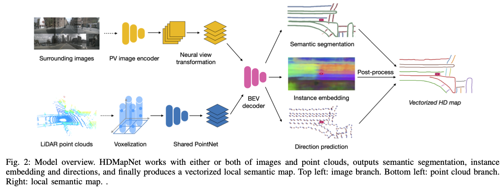
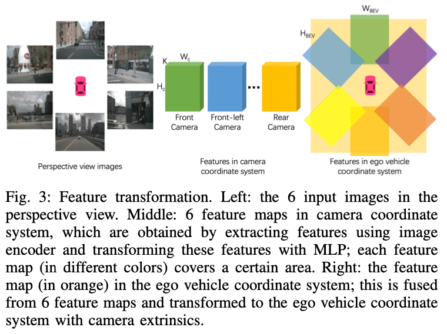

>论文标题：HDMapNet: A Local Semantic Map Learning and Evaluation Framework    
发表时间：2022  
研究组织：清华大学交叉信息院MARS Lab  
本文主页：https://tsinghua-mars-lab.github.io/HDMapNet/   
本文标签：自动驾驶、语义地图、高精地图、跨视图学习、ICRA

# 速读概览：
## 1.针对什么问题？ 
    全局地图的构建、标注和维护需要耗费大量的人力和资源，限制了其可扩展性。

## 2.采用什么方法？  
    引入局部语义地图学习方法，即HDMapNet，根据周身的相机和/或LiDAR生成的点云编码图像特征，然后在BEV中预测矢量地图元素。
    具体来说，use an MLP to convert the perspective view features to bird’s-eye view features in the camera coordinate system.
    For the perspective view image encoder, we adopt EfficientNet-B0 pre-trained on ImageNet.
    For point clouds, we use a variant of PointPillars with dynamic voxelization. We use a PointNet with a 64-dimensional layer to aggregate points in a pillar. 
    ResNet with three blocks is used as the BEV decoder.
## 3.达到什么效果？  
    our fusion-based HDMapNet outperforms existing methods by more than 50% in all metrics.

## 4.存在什么不足？
    代码不开源，实现细节不够清楚。对于本文所提到的生成局部语义地图的概念，局部地图是保存车辆附近多少距离的地图。论文网站上演示的效果看起来很好，是完全不需要任何先验信息，仅凭车载传感器就能构建这种程度的高精地图的话看起来还是很厉害的。

# 论文精读
## 0.Abstract
* 从传感器输入中估计局部语义是自动驾驶中高精度地图构建的核心组成部分。但是传统模式需要大量的人力和资源来注释和维护地图中的语义，这限制了其可扩展性。本文我们引入了局部语义地图学习的问题，，它基于车载传感器观察动态构建矢量化语义。同时，我们引入了一种局部语义地图学习方法，称为HDMapNet。**HDMapNet encodes image features from surrounding cameras and/or point clouds from LiDAR, and predicts vectorized map elements in the bird’s-eye view.**
* We benchmark HDMapNet on nuScenes dataset and show that in all settings, it performs better than baseline methods. Of note, our fusion-based HDMapNet outperforms existing methods by more than 50% in all metrics.
* In addition, we develop semantic-level and instance-level metrics to evaluate the map learning performance. Finally, we showcase our method is capable of predicting a locally consistent map. By introducing the method and metrics, we invite the community to study this novel map learning problem. Code and evaluation kit will be released to facilitate future development.

## 1.Introduction
* HD maps对自动驾驶来说是必要的模块。传统的构建模式包括事先获取点云，使用SLAM构造全局一致性的地图，在地图中标注语义。这种范式虽然可以生成准确的高清地图并被许多自动驾驶公司采用，但需要大量的人力。
* 作为替代方案，我们研究可扩展且价格合理的自动驾驶解决方案，例如 最大限度地减少人工注释和维护高清地图的工作量。为此，我们引入了一种新的局部语义地图学习框架，利用板载传感器和计算来估计矢量化局部语义图。**我们的框架并非旨在取代全局高清地图重建，而是提供一种简单的方法来预测局部语义地图以进行实时运动预测和规划。**
* We propose a local map learning method named HDMapNet, which produces vectorized map elements from images of the surrounding cameras and/or from point clouds like LiDARs.**We study how to effectively transform perspective image features to bird’s-eye view features when depth is missing.**We put forward a novel view transformer that consists of both neural feature transformation and geometric projection.
* 此外，我们研究了点云和相机图像在这项任务中是否相互补充。我们发现不同的地图元素在单一模式中的识别度不同。 为了两全其美，我们最好的模型将点云表示与图像表示相结合。该模型在所有类别中都显着优于其单模态模型。
* 最后，我们提出了评估地图学习性能的综合方法。 这些指标包括语义级别和实例级别的评估，因为地图元素通常表示为高清地图中的对象实例。 在公开的 NuScenes 数据集上，HDMapNet 在语义分割方面比现有方法提高了 12.1 IoU，在实例检测方面提高了 13.1 mAP。
* 本文主要贡献如下：
  * 本文提出了一种新的框架用于从传感器的观察中学习局部语义地图，并结合一种名为 HDMapNet 的方法
  * 本文提出了一种新的从透视图到鸟瞰图的特征投影模块。 该模块隐式地模拟 3D 环境，并明确地考虑相机外部
  * 本文制定综合评估协议和指标以促进未来研究

## 2.Related work
### Semantic map construction
* 大多数现有的高清语义地图都是在环境的 LiDAR 点云上手动或半自动注释的，这些地图是从使用高端 GPS 和 IMU 的勘测车辆收集的 LiDAR 扫描合并而来的。 SLAM 算法是将 LiDAR 扫描融合到高度准确和一致的点云中的最常用算法。 
  * 首先，采用成对对齐算法，如 ICP 、NDT 及其变体，使用语义或几何信息在两个附近的时间戳匹配 LiDAR 数据。
  * 其次，估计本车辆的准确姿势被表述为非线性最小二乘问题或因子图，这对于构建全局一致的地图至关重要。 杨等人提出了一种在成对对齐因子约束下基于位姿图优化的城市尺度地图重建方法。为了降低人工标注语义图的成本，Jian 等人提出了几种机器学习技术来从融合的 LiDAR 点云和相机中提取静态元素。
* 由于需要高精度和及时更新，维护高清语义图仍然是费力和昂贵的。 在本文中，我们认为我们提出的局部语义地图学习任务是一种潜在的更具可扩展性的自动驾驶解决方案。

### Perspective view lane detection
* 传统的基于透视图的车道检测流程涉及局部图像特征提取（例如颜色、方向滤波器）、线拟合（例如 Hough 变换）、图像到世界投影等等。
* 随着基于深度学习的图像分割和检测技术的进步，研究人员探索了更多的数据驱动方法。为道路分割、车道检测、可驾驶区域分析等开发了深度模型。最近，建立了模型以提供 3D 输出而不是 2D。 白等人结合了 LiDAR 信号，以便可以将图像像素投影到地面上。 加内特等人和郭等人使用合成车道数据集对摄像机高度和俯仰角的预测进行监督训练，使输出车道位于 3D 地平面上。 除了检测车道之外，我们的工作还从环绕摄像头或激光雷达输出车辆周围一致的局部语义地图。

### Cross-view learning
* 最近，已经有一些工作在研究跨视图学习，以促进机器人的周围感知能力。 Pan使用 MLP 来学习透视图特征图和鸟瞰图特征图之间的关系。 Roddick 和 Cipolla对沿水平轴的图像特征应用一维卷积来预测鸟瞰图。 Philion 和 Fidler 使用软注意力预测单目相机的深度并将图像特征投影到鸟瞰图中。 我们的工作侧重于局部语义地图构建的关键任务，我们使用跨视图传感方法以矢量化形式生成地图元素。 此外，我们的模型可以很容易地与 LiDAR 输入融合，以进一步提高其准确性。

## 3.Local Semantic Map Learning
* We propose local semantic map learning, a novel framework that produces local semantic maps. It takes sensor inputs like camera images and LiDAR point clouds, and outputs vectorized map elements, such as lane dividers, lane boundaries and pedestrian crossings. 
* We use I and P to denote the images and point clouds, respectively. Optionally, the framework can be extended to include other sensor signals like radars. We define M as the map elements to predict.

### A.HDMapNet
* Our local semantic map learning model, named HDMapNet, predicts map elements M from **single frame I** and P with neural networks directly. An overview is shown in Figure 2, **four neural networks parameterize our model: a perspective view image encoder φI and a neural view transformer φV in the image branch, a pillar-based point cloud encoder φP, and a map element decoder φM.**

We denote our HDMapNet family as HDMapNet(Surr), HDMapNet(LiDAR), HDMapNet(Fusion) if the model takes only surrounding images, only LiDAR, or both of them as input.

#### Image encoder
* Our image encoder has two components, namely perspective view image encoder and neural view transformer.
* Perspective view image encoder.
  * 我们的图像分支从$N_m$个周围的摄像机获取透视图输入，覆盖场景的全景。每个图像$I_i$通过共享神经网络$\Phi I$嵌入，得到透视图特征图$F_{I_i}^{pv} \subseteq R^{H_{pv}×W_{pv}×K}$，其中$H_{pv}、W_{pv}$和 K 分别是高度、宽度和特征维度。

* Neural view transformer.
  * 如图3所示，我们先将图像特征从透视视图transform到相机坐标系，然后再转成鸟瞰图。透视视图和相机坐标系统中任意两个像素的关系通过一个多层感知机$\Phi V_i$建模：
  $${F_{I_i}^c [h][w] = \Phi_{V_i}^{hw}(F_{I_i}^{pv}[1][1],...,F_{I_i}^{pv}[H_{px}][W_{px}]) \tag{1}}$$
  其中$\Phi_{V_i}^{hw}$建立了相机坐标系中位置$(h,w)$处的特征向量和透视特征图中每个像素的关系。我们将$H_c$和$W_c$表示为$F_I^c$的自上而下的空间维度。鸟瞰图(ego coordinate system)特征$F_{I_i}^{pv} \subseteq R^{H_{bev}×W_{bev}×K}$是通过使用几何投影和相机外在函数对特征$F_{I_i}^c$进行变换而获得的,其中$H_{bev}$和$W_{bev}$是鸟瞰图中的高度和宽度。 最终的图像特征$F_I^{bev}$是$N_m$个相机特征的平均值。

#### Point cloud encoder
* 我们的点云编码器$\Phi P$是具有动态体素化的 PointPillar 的变体，它将 3d 空间划分为多个pillars，并从pillar-wise点云的pillar-wise特征中学习特征图。输入是点云中的N个Lidar点。对每个点p，它有三维坐标和额外的K维特征，表示为$f_p \subseteq R^{K+3}$。
* 在将特征从点投影到鸟瞰图时，多个点可能会落入同一个pillar中。 我们将$P_j$定义为对应于pillar j 的点集。 为了从pillar中的点聚合特征，需要使用 PointNet （表示为 PN），其中
$${f_j^{pillar} = PN({f_p|\forall p \in P_j}) \tag{2}}$$
然后，pillar-wise特征通过卷积神经网络$\Phi pillar$进一步编码。 我们将鸟瞰图中的特征图表示为$F_P^{bev}$。

#### Bird's-eye view decoder
* 地图是一个复杂的图网络，包括了车道分隔线和车道边界的instance-level和方向信息。Instead of pixel-level representation, lane lines need to be vectorized so that they can be followed by self-driving vehicles. Therefore, our BEV decoder$\Phi M$not only outputs semantic segmentation but also predicts instance embedding and lane direction. A post-processing process is applied to cluster instances from embeddings and vectorize them.
* Overall architecture
  * BEV decoder是一个有三个branch的全连接网络，分别称为语义分割branch、实例嵌入branch和方向预测branch。BEV decoder的输入是一个图像特征图${F_I^{bev}}$和/或点云特征图${F_P^{bev}}$，如果两者都存在，我们将它们连接起来。
* Instance embedding
  * 我们的实例嵌入模块旨在对每个鸟瞰图嵌入进行聚类。为了便于表示，我们遵循文献33(Semantic instance segmentation for autonomous driving)中的确切定义：C 是 ground truth 中的簇数，$N_c$是簇 c 中的元素数，$\mu_c$是簇 c 的平均嵌入，$||  \cdot ||$是 L1 范数，$[x]+ = max(0, x) $表示元素最大值。 $\delta v$和$\delta d$分别是方差和距离损失的边际。 聚类损失 L 由下式计算：
$$L_{var} = \frac{1}{C} \sum_{c=1}^C \frac{1}{N_c} \sum_{j=1}^{N_c}[||\mu_c - f_j^{instance}|| - \delta_v]_{+}^2 \tag{3}$$
$$L_{dist} = \frac{1}{C(C-1)} \sum_{c_A \not ={c_B} \in C}  [2\delta_d - ||\mu_{c_A} - \mu_{c_B}||]_{+}^2 \tag{4}$$
$${L = \alpha L_var + \beta L_{dist} \tag{5}}$$
* Direction prediction
  * 我们的方向模块旨在根据每个车道节点C预测车道的方向。方向被离散化为均匀分布在单位圆上的$N_d$个类。 通过对当前节点$C_{now}$的方向 D 进行分类，可以得到车道$C_{next}$的下一个节点为$C_{next} = C_{now} + \Delta_{step}\cdot D$，其中$\Delta_{step}$是预定义的步长。 由于我们不知道车道的方向，所以我们无法识别每个节点的前进和后退方向
  * 相反，我们将它们都视为正面标签。 具体来说，每个车道节点的方向标签是一个 $N_d$向量，其中 2 个索引标记为 1，其他索引标记为 0。请注意，自上而下地图上的大多数像素都不位于车道上，这意味着它们没有方向。 这些像素的方向向量是零向量，我们在训练期间从不对这些像素进行反向传播。 我们使用 softmax 作为分类的激活函数。
* Vectorization
  * 在推理过程中，我们首先使用基于密度的噪声应用空间聚类 (DBSCAN) 对实例嵌入进行聚类。 然后使用非最大抑制（NMS）来减少冗余。 最后，在预测方向的帮助下，通过贪心法连接像素来获得向量表示。

### B.Evaluation
* 我们提出了局部语义地图学习的评估协议，包括语义度量和实例度量。
#### Semantic metrics
* 模型预测的语义可以用欧拉方式和拉格朗日方式进行评估。 欧拉度量在密集网格上计算并测量像素值差异。 相反，拉格朗日度量随着形状移动并测量形状的空间距离。
* Eulerian metrics.
  * 我们使用IoU作为Eulerian metrics， 
$${IoU(D_1, D_2) =  \frac{|D_1\cap D_2|}{|D_1\cup D_2|} \tag{6}}$$
    其中，$D_1, D_2 \subseteq R^{H\times W\times D}$是形状的密集表示（在网格上栅格化的曲线）；H和W是网格的高度和宽度，D是类别的数量，$|\cdot|$表示set的size
* Lagrangian metrics. 
  * 我们对结构化输出感兴趣，即曲线由连接点组成。 为了评估预测曲线和真实曲线之间的空间距离，我们使用曲线上采样的点集之间的倒角距离Chamfer distance (CD)：
$$CD_{Dir}(S_1, S_2) = \frac{1}{S_1}\sum_{x\in S_1}min_{y\in S_2}||x - y||_2 \tag{7}$$
$$CD(S_1, S_2) = CD_{Dir}(S_1, S_2) +  CD_{Dir}(S_2, S_1) \tag{8}$$
其中$CD_{dir}$是方向倒角距离，CD是双向倒角距离； S1 和 S2 是曲线上的两组点。
#### Instance metrics
* We further evaluate the instance detection capability of our models. We use average precision (AP) similar to the one in object detection, given by
$$AP = \frac{1}{10} \sum_{r \in {0.1, 0.2, ..., 1.0}} AP_r \tag{9}$$
其中，$AP_r$是recall=r时的精度。我们收集所有预测并根据语义置信度按降序排列它们。 然后，我们根据 CD 阈值对每个预测进行分类。 例如，如果 CD 低于预定义的阈值，则认为是真正例，否则认为是假正例。 最后，我们获得所有精确召回对并相应地计算 AP。

## 4.Experiments
### A.Implementation details
* Tasks & Metrics
  * We evaluate our approach on the NuScenes dataset. We focus on two sub-tasks: semantic map semantic segmentation and instance detection. Due to the limited types of map elements in the nuScenes dataset, we consider three static map elements: lane boundary, lane divider, and pedestrian crossing.
* Architecture
  * For the perspective view image encoder, we adopt EfficientNet-B0 pre-trained on ImageNet. Then, we use an MLP to convert the perspective view features to bird’s-eye view features in the camera coordinate system. The MLP is shared channel-wisely and does not change the feature dimension. For point clouds, we use a variant of PointPillars with dynamic voxelization. We use a PointNet with a 64-dimensional layer to aggregate points in a pillar. ResNet with three blocks is used as the BEV decoder.
* Training details
  * We use the cross-entropy loss for the semantic segmentation use the discriminative loss (Equation 5) for the instance embedding where we set α = β = 1, δv = 0.5, and δd = 3.0. We use Adam for model training, with a learning rate of 1e − 3.

### B.Baseline methods
* Inverse Perspective Mapping (IPM). 
  * The most straightforward baseline is to map segmentation predictions to the bird’s-eye view via IPM
* IPM with perspective view feature encoder and bird’s-eye view decoder (IPM(CB)).
  *  The next extension is to perform feature learning in the perspective view while making predictions in the bird’s-eye view.
* Lift-Splat-Shoot. 
  * Lift-Splat-Shoot estimates a distribution over depth in the perspective view images. Then, it converts 2D images into 3D point clouds with features and projects them into the ego vehicle frame.
* View Parsing Network (VPN). 
  * VPN proposes a simple view transformation module to transform feature map from the perspective view to bird’s-eye view: it uses a view relation module to model the relations between any two pixels in the perspective view feature map; then, a view fusion module with average pooling layer fuses the features of pixels that fall into the same bird’s-eye view position.

### C.Results
* Our HDMapNet(Surr), which is the surrounding camera-only method, outperforms all baselines. This suggests that our novel learning-based view transformation is indeed effective, without making impractical assumptions about a complex ground plane (IPM) or estimating the depth (Lift-Splat-Shoot).
* our HDMapNet(LiDAR) is better than HDMapNet(Surr) in boundary but worse in divider and pedestrian crossing. This indicates different categories are not equally recognizable in one modality
* Our fusion model with both camera images and LiDAR point clouds achieves the best performance. It improves over baselines and our camera-only method by 50% relatively.
* Another interesting phenomenon is that various models behave differently in terms of the CD. For example, VPN has the lowest CDP in all categories, while it underperforms its counterparts on CDL and has the worst overall CD. Instead, our HDMapNet(Surr) balances both CDP and CDL, achieving the best CD among all camera-only-based methods. This finding indicates that CD is complementary to IoU, which shows the precision and recall aspects of models. This helps us understand the behaviors of different models from another perspective.

* Instance map detection
  * In F2, (Instance detection branch), we show the visualization of embeddings using principal component analysis (PCA). Different lanes are assigned different colors even when they are close to each other or have intersections. This confirms our model learns instance-level information and can predict instance labels accurately. In Figure 2 (Direction classification branch), we show the direction mask predicted by our direction branch. The direction is consistent and smooth. We show the vectorized curve produced after post processing in Figure 4. In Table II, we present the quantitative results of instance map detection. HDMapNet(Surr) already outperforms baselines while HDMapNet(Fusion) is significantly better than all counterparts, e.g., it improves over IPM by 55.4%.

* Sensor fusion
  * **For divider and pedestrian crossing, HDMapNet(Surr) outperforms HDMapNet(LiDAR), while for lane boundary, HDMapNet(LiDAR) works better.**
  *  We hypothesize this is because there are elevation changes near the land boundary, making it easy to detect in LiDAR point clouds. 
  *  On the other hand, the color contrast of road divider and pedestrian crossing is helpful information, making two categories more recognizable in images; visualizations also confirm this in Figure 4. The strongest performance is achieved when combining LiDAR and cameras; the combined model outperforms both models with a single sensor by a large margin. This suggests these two sensors include complementary information for each other.

* Bad weather conditions
  * our model can generate complete lanes even when lighting condition is bad, or when the rain obscures sight. We speculate that the model can predict the shape of the lane based on partial observations when the roads are not completely visible. Although there are performance drop in extreme weather condition, the overall performance is still reasonable.
  
* Temporal Fusion
  * Here we experiment on temporal fusion strategies. We first conduct short-term temporal fusion by pasting feature maps of previous frames into current’s according to ego poses. The feature maps are fused by max pooling and then fed into decoder. As shown in Table IV, fusing multiple frames can improve the IoU of the semantics. We further experiment on long-term temporal accumulation by fusing segmentation probabilities. As shown in Figure 6, our method produces consistent semantic maps with larger field of view while fusing multiple frames.

## 5.Conclusion
* HDMapNet predicts local semantic maps directly from camera images and/or LiDAR point clouds. The local semantic map learning framework could be a more scalable approach than the global map construction and annotation pipeline that requires a significant amount of human efforts. Even though our baseline method of local semantic map learning does not produce map elements as accurate, it gives system developers another possible choice of the tradeoff between scalability and accuracy.