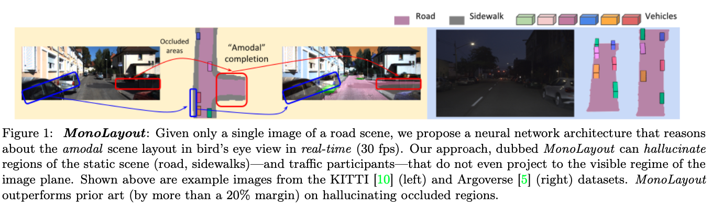
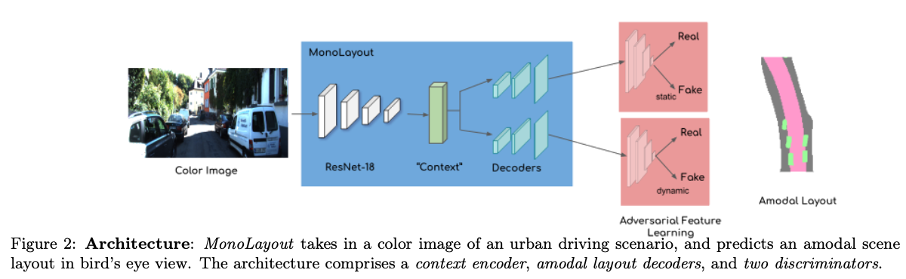
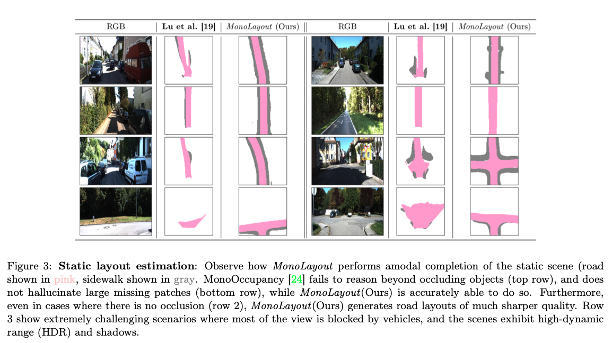

>论文标题：MonoLayout: Amodal scene layout from a single image  
发表时间：2020  
研究组织：Robotics Research Center, IIIT Hyderabad   
本文标签：自动驾驶、目标检测、高精地图、cross-view、IEEE/CVF  

# 速读概览：
## 1.针对什么问题？ 
    人类在感知图像中物体的amodal属性方面具有非凡的认知能力。 例如，在查看车辆图像时，人类可以推断出被遮挡的部分，以及车辆周围环境的潜在几何形状。 虽然现代神经网络在图像识别和目标检测方面优于人类，但它们仍然缺乏这种超越图像证据的推理认知能力。

## 2.采用什么方法？  
    本文希望实现从单个图像进行实时amodal场景布局估计的深度神经网络。将场景布局表示为多通道语义占用网格，并利用对抗性特征学习来“幻觉”被遮挡图像部分的合理完成。MonoLayout 对场景中的静态和动态对象进行amodally reason，通过使用共享上下文来推理场景实体。由基于ResNet的Context-aware Discriminator，一个静态场景decoder和一个动态场景decoder组成。

## 3.达到什么效果？  
    By leveraging temporal sensor fusion to generate training labels, we significantly outperform current art over a number of datasets. The hallucination capability is much more evident in the occluded region evaluation, where we see that MonoLayout-static improves by more than 10% on prior art. MonoLayout-dynamic outperforms prior art on the task of vehicle layout estimation.

## 4.存在什么不足？
    

# 论文精读
## 0.Abstract
* 本文提出了一个估计复杂城市驾驶场景布局的新颖、极具挑战性的问题。给定从驾驶平台捕获的单张彩色图像，我们的目标是预测道路和其他交通参与者的鸟瞰图布局。 估计的布局应该超出图像中可见的范围，并补偿由于投影造成的 3D 信息损失。我们将这个问题称为amodal场景布局估计，它涉及到即使是图像中被遮挡的世界部分的幻觉场景布局。 为此，我们提出了 MonoLayout，这是一种用于从单个图像进行实时amodal场景布局估计的深度神经网络。我们将场景布局表示为多通道语义占用网格，并利用对抗性特征学习来“幻觉”被遮挡图像部分的合理完成。我们将鸟瞰中用于道路布局估计和车辆占用率估计的几种最先进的方法扩展到amodal设置以进行严格评估。 通过利用时间传感器融合来生成训练标签，我们在许多数据集上显着优于当前技术。视频摘要可见：https://www.youtube.com/watch?v=HcroGyo6yRQ。

## 1.Introduction
* 自动驾驶平台的出现为感知和场景理解带来了一些有趣的新途径。 虽然大多数工业领先的解决方案利用强大的传感器（例如激光雷达、精密 GPS 等），但一个有趣的研究问题是推动单目视觉传感器的功能。 为此，我们考虑了在仅给定单色图像的情况下估计鸟瞰场景布局的新颖且极具挑战性的任务。
* 人类在感知图像中物体的amodal属性方面具有非凡的认知能力。 例如，在查看车辆图像时，人类名义上可以推断出被遮挡的部分，以及车辆周围环境的潜在几何形状。 虽然现代神经网络在图像识别和目标检测方面优于人类，但它们仍然缺乏这种超越图像证据的与生俱来的推理认知能力。带着这个动机，我们提出了 MonoLayout，这是一种神经架构，将道路场景的彩色图像作为输入，并以鸟瞰图的形式输出amodal场景布局。 MonoLayout 利用对抗性特征学习将道路区域、人行道以及其他交通参与者（例如汽车）占用的区域映射到鸟瞰图。
* 据我们所知，MonoLayout 是第一种对场景中的静态和动态对象进行amodally reason的方法。 我们表明，通过使用共享上下文来推理场景实体，与仅针对特定任务训练的方法相比，MonoLayout 在每个任务上实现了更好的性能。在 amodal 场景布局估计任务中，MonoLayout 在 KITTI 和 Argoverse 数据集的几个子集上明显优于所有评估的基线。 此外，MonoLayout 在鸟瞰视图中实现了最先进的目标检测性能，而无需使用任何形式的阈值/后处理。 

* 总之，我们的贡献如下：
  * 我们提出了 MonoLayout ，一种实用的深度架构，仅从单个图像估计 amodal 场景布局(如图1所示)
  * 我们证明了对抗性学习可用于进一步提高估计布局的质量，特别是在对场景的大缺失块产生幻觉时。
  * 我们评估了几种最先进的方法，并在许多已建立的基准（KITTI-Raw、KITTI-Object、KITTI-Odometry、Argoverse)。
  * 此外，我们还表明，通过利用最近在单目深度估计方面的成功，MonoLayout 也可以在不包含激光雷达扫描的数据集上进行有效训练。
* 有关更多结果，请参阅附录，我们证明提取的 amodal 布局可以适合多个更高级别的任务，例如（但不限于）多目标跟踪、轨迹预测等。

## 2.Related work
* To the best of our knowledge, **no published approach has tackled the task of simultaneous road layout (static scene) and traffic participant (dynamic scene) estimation from a single image.**
* However, several recent approaches have addressed the problem of estimating the layout of a road scene, and several other independent approaches have tackled 3D object detection.

### Road layout estimation
* Schulter et al. proposed one of **the first approaches to estimate an occlusion-reasoned bird’s eye view road layout from a single color image.** They use monocular depth estimation as well as semantic segmentation to bootstrap a CNN that predicts occluded road layout. They use priors from OpenStreetMap to adversarially regularize the estimates. 
* More recently, Wang et al. builds on top of to infer parameterized road layouts. 
* Our approach does not require to be bootstrapped using either semantic segmentation or monocular depth estimation, and can be trained end-to-end from color images.
* Perhaps the closest approach to ours is MonoOc- cupancy, which builds a variational autoencoder (VAE) to predict road layout from a given image. They also present results for extracting regions close to roads (eg. sidewalk, terrain, non-free space). However, they reason only about the pixels present in the image, and not beyond occluding obstacles. Also, the bottleneck enforced by that leads to non-sharp, blob-like layouts. 
* On the other hand, MonoLayout estimates amodal scene layouts, reasoning beyond occlusion boundaries. Our approach produces crisp road edges as well as vehicle boundaries, by leveraging adversarial feature learning and sensor fusion to reduce noise in the labeled ground-truth training data.

### Object detection in bird's eye view
* 现有的方法基本是使用LiDAR或者相机与LiDAR融合。只有很少的方法使用单目视觉进行目标检测，但大部分都是两阶段的，包括region-proposal阶段和分类阶段。
  * There exist several approaches to 3D object detection that exclusively use lidar, or a combination of camera and lidar sensors. However, there are only a handful of approaches that purely use monocular vision for object detection. Most of these are two stage approaches, comprising a region-proposal stage, and a classification stage.
* 另一类方法将单目图像映射到BEV表示，从而将 3D 对象检测的任务减少到 2D 图像分割的任务。 最近，BirdGAN 利用对抗性学习将图像映射到鸟瞰图，其中文献2（Birdnet）等激光雷达目标检测器被重新用于目标检测。
  * Another category of approaches map a monocular image to a bird’s eye view representation, thereby reducing the task of 3D object detection to that of 2D image segmentation. Recently, BirdGAN leveraged adversarial learning for mapping images to bird’s eye view, where lidar object detectors such as BirdNet were repurposed for object detection.
* 这种技术通常需要一个预处理阶段，将图像映射到鸟瞰图的神经网络，然后再进行进一步的处理。 我们证明我们可以通过直接从图像空间映射到鸟瞰图中的目标来实现显着更高的精度，完全绕过了对预处理阶段的需求。
  * Such techniques usually require a pre-processing stage (usually a neural network that maps an image to a bird’s eye view) after which further processing is applied. On the other hand, we demonstrate that we can achieve significantly higher accuracy by directly mapping from the image space to objects in bird’s eye view, bypassing the need for a pre-processing stage altogether.
* 所有上述方法都需要一个后处理步骤，该步骤通常涉及非最大抑制/阈值处理以输出目标检测。MonoLayout 既不需要预处理也不需要后处理，它直接估计可以评估或插入其他任务管道的场景布局。
  * More notably, all the above approaches require a post-processing step that usually involves non-maximum suppression / thresholding to output object detections. MonoLayout neither requires pre-processing nor post-processing and it directly estimates scene layouts that can be evaluated (or plugged into other task pipelines).

## 3.MonoLayout:Monocular Layout Estimation
### 3.1 Problem Formulation
* In this paper, we address the problem of amodal scene layout estimation from a single color image. Formally, given a color image I captured from an autonomous driving platform, we aim to predict a bird’s eye view layout of the static and dynamic elements of the scene. Concretely, we wish to estimate the following three quantities.
  * The set of all static scene points S (typically the road and the sidewalk) on the ground plane (within a rectangular range of length L and width W, in front of the camera), regardless of whether or not they are imaged by the camera.
  * The set of all dynamic scene points D on the ground plane (within the same rectangular range as above) occupied by vehicles, regardless of whether or not they are imaged by the camera.
  * For each point discerned in the above step as being occupied by a vehicle, an instance-specific labeling of which vehicle the point belongs to.

### 3.2 MonoLayout
* 从神经网络的角度来看，amodal场景布局估计的问题以几种有趣的方式具有挑战性。 首先，我们需要从有助于估计场景 3D 属性的图像中学习良好的视觉表示。 其次，它需要这些表示超越经典 3D 重建的推理； 这些表示必须使我们能够产生被遮挡物占据的图像区域的 3D 几何形状的幻觉。
  * The problem of amodal scene layout estimation is challenging from a neural networks standpoint in several interesting ways. First, it necessitates that we learn good visual representations from images that help in estimating 3D properties of a scene. Second, it requires these representations to reason beyond classic 3D reconstruction; these representations must enable us to hallucinate 3D geometries of image regions that are occupied by occluders.
* 此外，学习的表示必须隐式地将场景的静态部分（由道路点占据）与动态对象（例如停放/移动的汽车）分开。 考虑到这些要求，我们设计了具有以下组件的 MonoLayout。
  * Furthermore, the learned representations must implicitly disentangle the static parts of the scene (occupied by road points) from the dynamic objects (eg. parked/moving cars). With these requirements in mind, we design MonoLayout with the following components.

#### Maximum a posteriori estimation
* road layout estimation problem看作是最大后验估计(the distribution of scene statics and dynamics)
  * We formulate the amodal road layout estimation problem as that of recovering the Maximum a posteriori (MAP) estimate of the distribution of scene statics and dynamics.
* 给定图片$I$，我们希望在域${\Omega \triangleq  \{(x, H, z)| ||(x-x_0)||_1 \le L;||(z-z_0)||_1 \le W;(z-z_0) \gt 0 \} }$上恢复后验$P(S, D|I)$
* Note that the static (road) and dynamic (vehicle) marginals are not independent. They are not independent - they exhibit high correlation (vehicles ply on roads). 
* Hence, we introduce an additional conditioning context variable C that can be purely derived only using the image information I, such that, S and D are conditionally independent given C. 我们将此条件变量称为“共享上下文”，因为它必然包含估计静态和动态布局边缘所需的信息。 这允许后验以以下形式分解。
$${P(S,D|I) \propto P(S,D,C|I)=P(S|C,I) | P(D|C,I) P(C|I) \tag{1}}$$
$${P(S|C,I)\ static\ decoder}$$
$${P(D|C,I)\ dynamic\ decoder}$$
$${P(C|I)\ context\ encoder}$$

* 根据上述后验分解，MonoLayout 的架构包括三个子网络，如图2所示
  * 从输入单目图像中提取多尺度特征表示的上下文编码器。 这提供了一个共享上下文，该上下文捕获静态和动态场景组件以供后续处理。
  * 一个amodal静态场景解码器，它解码共享上下文以产生静态场景的非模态布局。 该模型由一系列反卷积和上采样层组成，这些层将共享上下文映射到静态场景鸟瞰图。
  * 一种动态场景解码器，在架构上类似于道路解码器，并在鸟瞰图中预测车辆占用情况。
  * 两个鉴别器通过将预测的静态/动态布局正则化，使其分布与可能的道路几何形状（可以很容易地从 OpenStreetMap 等巨大的未配对数据库中提取）和地面实况车辆占用率的真实分布相似，从而对预测的静态/动态布局进行正则化。

#### Feature Extractor
* From the input image, we first extract meaningful image features at multiple scales, using a ResNet-18 encoder (pre-trained on ImageNet). We finetune this feature extractor in order for it to learn low-level features that help reason about static and dynamic aspects of the scene.

#### Static and dynamic layout decoders
* The static and dynamic layout decoders share an identical architecture. They decode the shared context from the feature extractor by a series of upsampling layers to output a D × D grid each.

#### Adversarial Feature Learning
* 为了更好地确定可能性$P(S|C,I), P(D|C,I) (c.f. Eq. 1)$，我们引入了分别由$ θ_S $和$ θ_D $参数化的对抗正则化器（鉴别器）。 静态和动态解码器估计的布局被输入到这些patch-based的鉴别器。鉴别器规范输出布局的分布（假数据分布，在 GAN 用语中）以匹配可想象场景布局的先验数据分布（真实数据分布）。
* 这种先验数据分布是来自 OpenStreetMap 的道路片段的集合，以及鸟瞰图中车辆的光栅化图像。 我们选择收集一组不同的 OSM 图来代表BEV中道路布局的真实数据分布，而不是对每个图像使用配对的 OSM 进行训练，并以非配对的方式训练我们的鉴别器。这减少了将 OSM 视图与当前图像完美对齐的需要，与在开始处理之前执行 OSM 显式对齐的方法相比，MonoLayout 更有利。

#### Loss function
* Context encoder，amodal static scene decoder和dynamic scene decoder的参数$\phi,v,\psi$分别通过使用小批量随机梯度下降最小化以下目标来获得。
$$$$
* $L_{sup}$是一个有监督 (L2) 误差项，它惩罚预测的静态和动态布局$(S_{\phi,ν} (I))$, $D_{\phi,ν}(I))$与其对应的真实值 $(S_{gt}^i, D_{gt}^i)$ 的偏差。 对抗性损失$L_{adv}$鼓励来自静态/动态场景解码器 ($p_{fake}$) 的布局估计分布接近其真实对应物 ($p_{true}$)。 鉴别器损失$L_{discr}$是鉴别器更新目标

### 3.3. Generating training data: sensor fusion
* 由于我们的目标是恢复 amodal 场景布局，因此我们面临着从那些被视线遮挡的场景部分提取训练标签的问题。 虽然最近的自动驾驶基准提供了同步激光雷达扫描以及扫描中每个点的语义信息，但我们提出了一种传感器融合方法来生成更强大的训练标签，以及处理可能无法获得直接 3D 信息（例如激光雷达）的场景。
* 因此，我们使用单目深度估计网络 (Monodepth2) 或原始激光雷达数据，并在相机坐标系中初始化点云。使用 W 帧窗口上的里程计信息，我们随着时间的推移聚合/注册传感器观察结果，以生成更密集、无噪声的点云。 请注意，当使用单目深度估计时，我们会丢弃距离汽车超过 5 米的点的深度，因为它们很嘈杂。 为了补偿这种狭窄的视野，我们在更大的窗口大小（通常为 40-50）帧上聚合深度值。然后将密集的点云投影到BEV中的occupancy grid。 如果有可用的真实语义分割标签，则每个占用网格单元都会根据对应点标签的简单多数分配标签。 对于真实语义标签不可用的情况，我们使用最先进的语义分割网络来分割每一帧并将这些预测聚合到occupancy grid中。
* 对于车辆占用率估计，我们依赖BEV中的真实标签，并且仅在包含此类标签的数据集上进行训练。

## 4.Experiments
* 效果对比可以参考图3

### 4.1 Datasets
* We present our results on two different datasets - KITTI and Argoverse.

## 5.Discussion and conclusions
* 本文提出了 MonoLayout，这是一种通用的深度网络架构，能够实时估计复杂城市驾驶场景的模态布局。在附录中，我们展示了几个额外的结果，包括扩展消融，以及多目标跟踪和轨迹预测的应用。 未来研究的一个有希望的途径是将 MonoLayout 推广到看不见的场景，以及结合时间信息来提高性能。