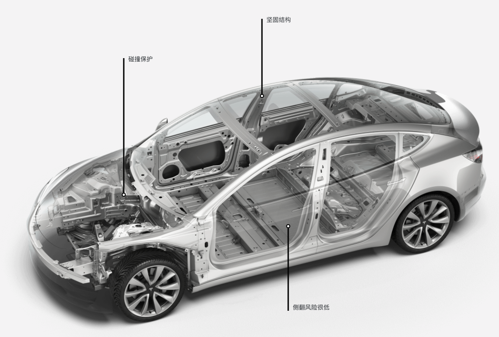
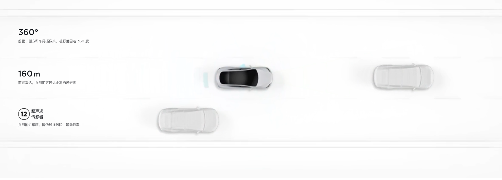
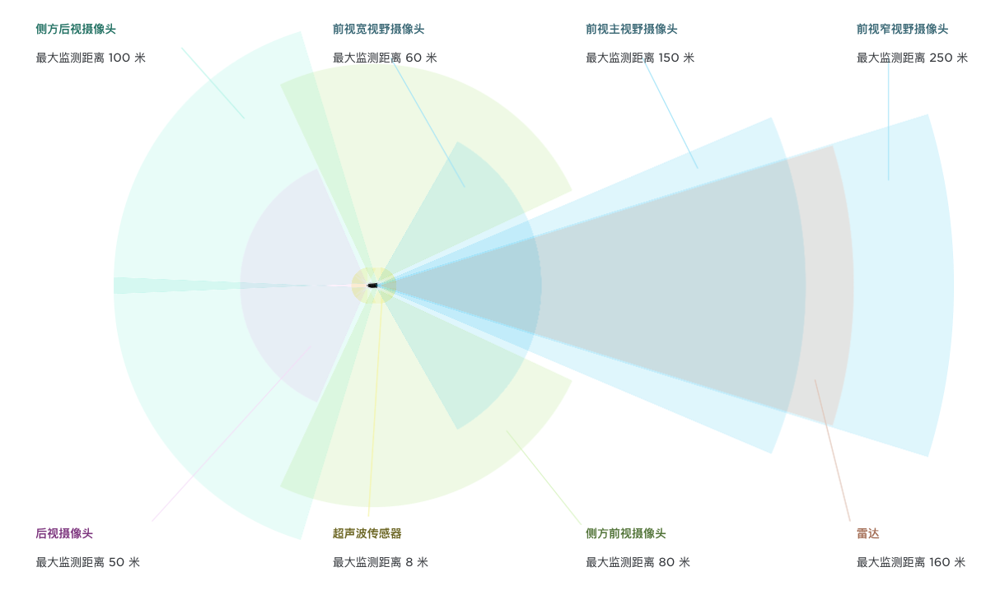
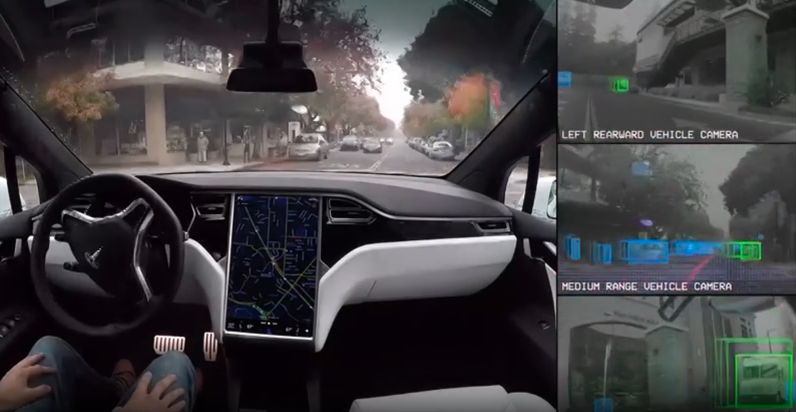
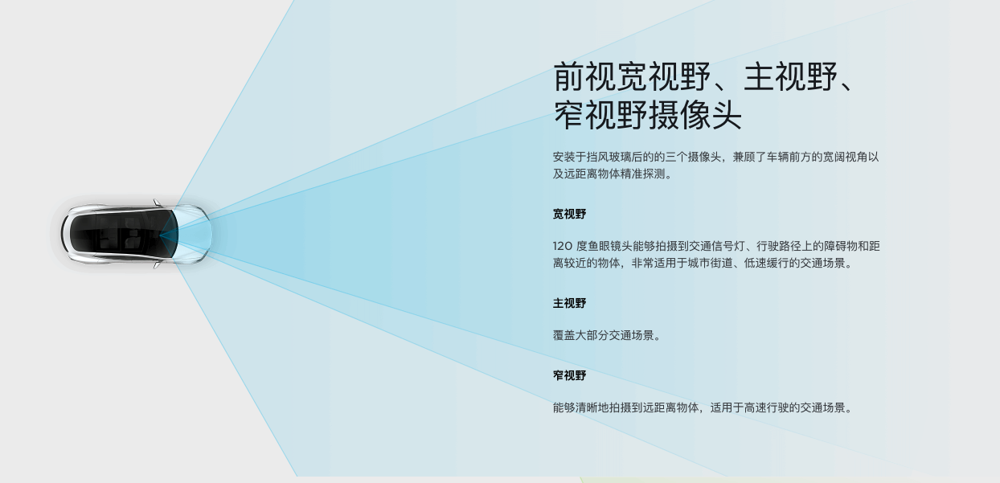
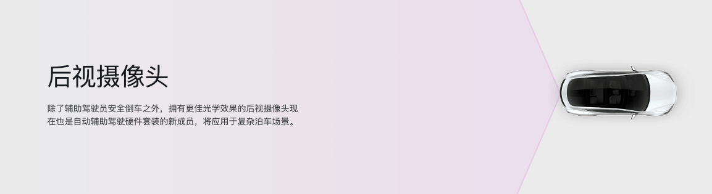
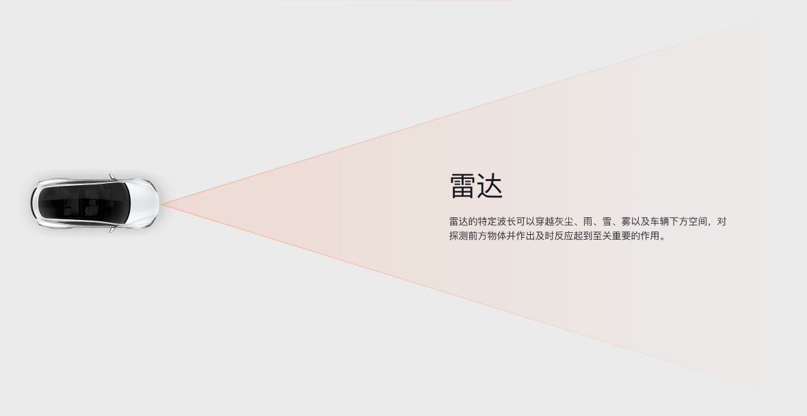
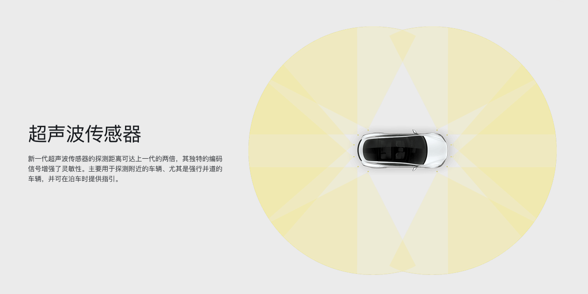

>车型：Tesla Model3  
时间：2021  
公司：Tesla  
本文标签：自动驾驶、Tesla  

## 1.车辆模型

## 2.自动驾驶方案

* 硬件：
  摄像头：前置，左右侧方（疑似装在车把手上），后方摄像头；环绕车身共配有 8 个摄像头，视野范围达 360 度，对周围环境的监测距离最远可达 250 米。
  
  前置雷达：160m前方障碍物。增强版前置雷达通过发射冗余波长的雷达波，能够穿越雨、雾、灰尘，甚至前车的下方空间进行探测，为视觉系统提供更丰富的数据。
  超声波传感器：12个，探测附近车辆，辅助泊车；作为整套视觉系统的补充，可探测到柔软或坚硬的物体，传感距离和精确度接近上一代系统的两倍。  
* 摄像头：

  前置摄像头用于检测车道线和前方物体
  
  左右侧方均用于检测物体，判断侧向来车
  后视摄像头
  
* 雷达
  
* 超声波传感器
  

* 算法
  为了充分利用这组高性能摄像头，新硬件套装还引入了一套全新的、由 Tesla 研发的视觉处理工具 Tesla Vision。 Tesla Vision 基于深度神经网络，能够对行车环境进行专业的解构分析，相比传统视觉处理技术可靠性更高。