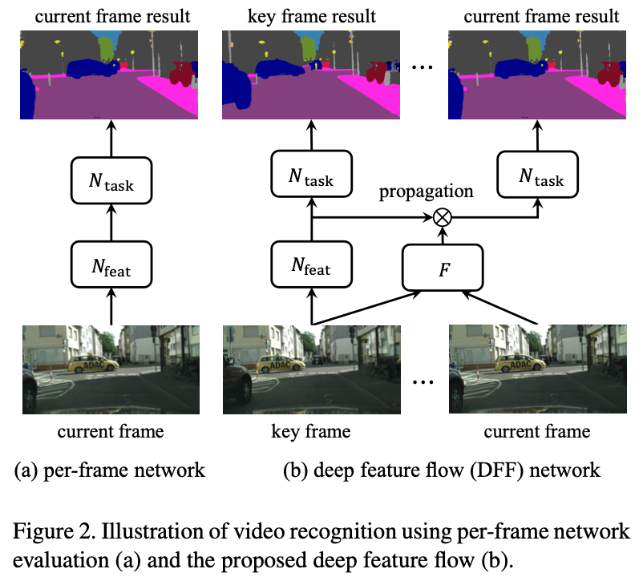

>论文标题：Deep Feature Flow for Video Recognition  
发表时间：2017  
研究组织：USTC、Microsoft      
本文标签：视频目标检测、CVPR

# 速读概览：
## 1.针对什么问题？ 
当下最先进的图像识别网络对视频流来说计算代价太大，并且无法利用视频流中的时间信息。已有的考虑时间信息的工作基本都是借助邻近帧的信息补充特征，提高精度，反而进一步增加了计算量。
## 2.采用什么方法？  
通过随机采样的方式选择相邻的帧构成一组，只在其中的关键帧上运行昂贵的卷积子网，并将得到的特征图通过flow network传播给同组中其他非关键帧。
## 3.达到什么效果？  
这项工作是前无仅有的，在Cityscapes上可以达到69.2%的mIoU。
## 4.存在什么不足？
速度慢且精度有限，无法达到实时性的要求。
关键帧的选择是按照固定的常数选取的，不能根据视频内容实现自适应的调整。

# 论文精读
## 0.摘要
* 深度卷积神经网络在图像识别任务中取得了巨大的成功。然而，将最先进的图像识别网络转移到视频并非易事，因为每帧评估太慢且无法负担。我们提出了深度特征流，一个用于视频识别的快且准确的框架。它只在少量关键帧上运行昂贵的卷积子网，并将它们的深度特征图通过流域传播给其他帧。它实现了显著的速度提升，因为流计算相对来说是比较快的。整个结构能够进行端到端的训练显著提升了识别精度。深度特征流是灵活且通用的。它在目标检测和语义分割的两个视频数据集上得到验证。显着推进了视频识别任务的实践。代码：https:// github.com/msracver/Deep-Feature-Flow.

## 1.Introduction
* 快速准确的视频识别对于高价值场景至关重要，例如自动驾驶和视频监控。然而，在单个视频帧上应用现有的图像识别网络会给大多数应用带来难以承受的计算成本。
* 图像的内容在视频帧上变化的很慢，特别是高级别的语义。这种观察已被用作特征学习中的正则化手段，将视频视为无监督数据源。这样的数据冗余性和连续性也能用来减少计算开销。然而，这方面在文献中使用 CNN 的视频识别很少受到关注。
* 现代CNN的结构大体类似。 中间的卷积特征图和输入图像的空间扩展相同。（通常是较小的分辨率，如16倍或更小）。它们保留了低级图像内容和中高级语义概念之间的空间对应关系。 这种对应提供了通过空间扭曲在附近帧之间廉价传播特征的机会，类似于光流。
* 本文中我们提出了深度特征流，一种用于视频识别的快且准确的方法。它在少量关键帧上应用图像识别网络。通过流域将关键帧的深度特征图传播给其他帧。
* 流估计和特征传播要比卷积特征的计算快得多。计算的瓶颈被避免了，可以实现显著的速度提升。当流域也由网络估计时，整个架构进行端到端的训练，图像识别和流网络都针对识别任务进行了优化。 识别准确率显着提高。
* 总之，深度特征流是一个面向视频识别的快速、准确、通用、端到端的框架。他能将大多数最新的图像识别网络应用于视频领域。就我们所知，这是第一个在深度学习框架中联合训练流和视频识别任务的工作。在最近的大规模视频数据集上进行的大量识别证明了它在视频目标检测和语义分割任务上的有效性。与单帧评估相比，我们的方法实现了前所未有的速度（最多快 10 倍，实时帧速率），但精度损失适中（几个百分点）。

## 2.Related work
* 据我们所知，我们的工作是前所未有的，没有相似的工作可以直接对比。
### Image Recognition
* 基于Region的方法在目标检测领域占据了主导地位，FCN网络在语义分割领域占据了主要地位。然而，将这些图像识别网络直接应用于视频识别的所有帧的计算量无法负担。我们的工作提供了一个高效有用的解决方案。

### Network Acceleration
* 为了降低计算量出现了许多方法。如使用矩阵分解将大型网络层分解为多个小层、量化网络权重等。这些方法都作用于单张图像上。它们都是通用的，可以作为我们的方法的补充。

### Optical Flow
* 这是视频分析领域的基础任务。相关话题已经被研究了几十年，主要被解决小位移的变分方法主导。最近的关注点在于大位移，组合匹配已被整合到变分方法中。 这些方法都是手工制作的。
* 深度学习和语义信息最近也被用于光流中。FlowNet率先使用深度CNN直接估计运动并取得了较好的效果。还有一些其他的工作尝试利用语义分割信息来帮助光流估计，根据区域类别对流提供特定限制。

### Exploiting temporal information in Video Recognition
* T-CNN在视频中结合了来自tubelet的时间和上下文信息。
* dense 3D CRF 提出了语义视频分割中的远程时空正则化
* STFCN考虑了一个用于语义视频分割的稀疏时间的FCN。
* 这些工作对体数据（volume data）进行操作，展示了识别精度的提升，但大大增加了计算成本。 相比之下，我们的方法试图通过利用视频中的时间连贯性来减少计算。网络仍然在单帧上运行并且速度很快。

* **上述反映的内容是，在视频检测领域，时间序列信息主要有两种用法：一是用于借助时间上的邻近帧，补充信息，提高识别精度；二是借助时间的连贯性减少计算，提高识别速度。**

### Slow Feature Analysis
* 在视频中，高级别的语义概念通常出现的比低级别的图像要慢。因此，在连续的视频帧上，深度特征变化的也要慢一些。这种现象已经被用于正则化视频中的特征学习。

### Clockwork Convnets
* Clock-work convnets for video semantic segmentation.
* 这篇文章是与本文最相关的工作，它也在某些视频帧上禁用网络中的某些层并重用以前的特征。但比本文要简单、低效的多。
* 在速度的提升方面，Clockwork只保存了部分帧中部分层的计算。我们的方法在大多数帧（例如，10 帧中的 9 帧）中的大多数层（任务网络只有 1 层）上保存了它。 因此，我们的加速比要高得多。
* 在精度方面，Clockwork没有利用帧间的对应关系，只是简单的复制了特征。它仅重新安排现成网络中的推理计算，不执行微调或重新训练。每次的速度提升都会导致显著的精度下降。而我们的工作中精度的下降很小。
* 在通用型方面，Clockwork只能通过FCN应用于语义分割任务。我们的方法则将传统的图像识别网络迁移到视频领域。

## 3.Deep Feature Flow
方法概览如下图所示

#### Deep feature flow inference
* 给定一个图像识别任务和一个前馈卷积神经网络${N}$，在给定输入图像I的条件相，输出的结果是${y = N(I)}$。我们的目标是在全部视频帧${I_i, i=0, ...,\infty}$上快速准确的应用网络。
* 遵循现代CNN结构和应用，在不失通用性的前提下，我们将${N}$分解为两个连续的子网络。第一个子网络${N_{feat}}$称为特征网络，是完全卷积的，并输出多个中间特征图，${f = N_{feat}(I)}$。第二个子网络${N_{task}}$称为任务网络，它的结构是根据任务特定的，并在特征图上实现识别任务，${y = N_{task}(f)}$。
* 连续的视频帧是高度相似的。编码高级语义概念的深度特征图的相似性更高。我们利用这个相似性来降低计算开销。特征网络${N_feat}$只在少量关键帧上运行。非关键帧的特征图是从它之前的关键帧传播来的。
* 深度卷积层的特征编码了语义概念和图像中的空间位置的对应关系。这样的空间对应关系允许我们通过空间扭曲的方式廉价地传播特征图。
* 令${M_{i\rightarrow k}}$是一个二维的流域。它是由一个流估计算法F得到的
${M_{i\rightarrow k} = F(I_k, I_i)}$。它是被双线性调整为与传播的特征图相同的空间分辨率。它在当前帧i的位置p投影回关键帧k的位置${p+\delta p}$，其中${\delta p = M_{i\rightarrow k}(p)}$
* 由于${\delta p}$的值通常是小数，特征扭曲通常是通过双线性插值实现的
$${f_i^c(p) = \sum_q G(q, p + \delta p)f_k^c(q) \tag{1}}$$
其中c表示特征图f的一个通道，q枚举特征图中的所有空间位置，${G(\cdot, \cdot)}$表示双线性差值的核。注意G是二维的，并且被分为两个一维的核
$${G(q, p + \delta p) = g(q_x, p_x + \delta p_x)\cdot g(q_y, p_y + \delta p_y) \tag{2}}$$
其中${g(a, b) = max(0, 1 - |a - b|)}$
* 我们注意到公式(1)计算起来很快，因为好几项是非零的。
* 由于流量估计、对象遮挡等引起的误差，空间扭曲可能不准确。为了更好的近似特征，他们的振幅由尺度场${S_{i\rightarrow k}}$调制，其空间和通道维度与特征图相同。尺度场是在两帧上应用尺度函数S得到的，${S_{i\rightarrow k} = S(I_k, I_i)}$。
* 最后，特征传播函数被定义为
$${f_i = W(f_k, M_{i \rightarrow k}, S_{i \rightarrow k})}$$
其中，W对特征图的所有位置和通道应用公式(1)，并以元素方式将特征与尺度${S_{i \rightarrow k}}$相乘。
* 本文提出的视频识别算法被称为深度特征流。请注意，任何流函数 F ，例如手工制作的低级流（例如 SIFT-Flow ），都可以轻松应用。 训练流函数不是必须的，尺度函数 S 处处都设置为 1。

#### Deep Feature Flow Training
* 流函数原本是为了得到低级的图像像素的对应关系设计的。在推理过程会很快，但是对于识别任务不会特别准确，因为高级别的特征图的变化不一样，通常比像素要慢。为了对这种变化建模，我们提出使用CNN来估计流域和尺度场，这样的话所有的组件都能被联合起来对任务进行端到端的训练。
* 训练是通过SGD实现的。在每个小批量，邻近的一组视频帧${I_k, I_i;0\le i-k\le 9}$是随机采样的。在前馈阶段，特征网络${N_feat}$被应用于${I_k}$以得到特征图${f_k}$。随后，一个流网络F运行在帧${I_i, I_k}$上来估计流域和尺度场。当${i\gt k}$时，特征图${f_k}$按照公式(3)的方式传播到${f_i}$。否则，特征图是相同的，并且没有进行传播。最终，任务网络${N_{task}}$被应用于${f_i}$以产生结果${y_i}$，这会导致与真实结果相比的损失。损失的误差梯度是反向传播来更新全部组件的。注意我们的训练适应了 i = k 时的特殊情况，并退化为每帧训练。
* 流网络比特征网络要快得多。它是在Flying Chairs数据集上预训练的。然后，我们通过适当增加最后一个卷积层中的通道数，在网络末端添加尺度函数 S 作为同级输出。 尺度函数初始化为全 1（输出层中的权重和偏差分别初始化为 0 和 1）。 然后对增强流网络进行微调。
* 公式(3)中的特征传播函数是非常规的。它是无参数且完全可微的。在反向传播中，我们计算${f_i}$中的特征相对于${f_k}$的特征、尺度场${S_{i\rightarrow k}}$，和流域${M_{i \rightarrow k}}$。前两项利用链式规则很容易计算。对于最后一项，根据公式(1)和(3)，对当前帧的每个通道c和每个位置p，我们有
$${\frac{\partial f_i^c(p)}{\partial M_{i \rightarrow k}(p)} = S_{i\rightarrow k}^c(p)\sum_q \frac{\partial G(q, p + \delta p)}{\partial \delta p}f_k^c (q) \tag{4}}$$
* ${\frac{\partial G(q, p + \delta p)}{\partial \delta p}f_k^c (q)}$项可以从公式(2)得到。注意流域${M(\cdot)}$是二维的，并且为了简单我们使用${\partial \delta p}$代表${\partial \delta p_x}$和${\partial \delta p_y}$。
* 本文提出的方法很容易在只有稀疏帧被注释的数据集上训练（这通常是由于视频识别任务中的高标记成本）。 在这种情况下，每帧训练只能使用带注释的帧，而 DFF 可以轻松使用所有帧，只要帧${I_i}$被注释。 换句话说，即使使用稀疏的真实标注，DFF 也可以充分利用数据。 这对于许多视频识别任务来说可能是有益的。

#### Inference Complexity Analysis
* 对于每个非关键帧，本文提出的方法与每帧检测的方法的计算成本比为
$${r = \frac{O(F) + O(S) + O(W) + O(N_{task})}{O(N_{feat}) + O(N_{task})} \tag{5}}$$
其中${O(\cdot)}$是函数复杂度。
* ${N_{task}}$的复杂度通常很小。尽管N的分割点是任意的，但在我们的实验中，只在${N_{task}}$中保留一个可学习的权重层就足够了。尽管${N_{feat}}$和${F}$都有相对大的复杂度，但是${O(N_{task})\ll O(N{(feat)})}$且${O(N_{task})\ll O(F)}$
* 由于W和S非常简单，${O(W)\ll O(F)}$且${O(S)\ll O(F)}$。因此公式(5)中的比例可以近似为
$${r\approx \frac{O(F)}{O(F_{feat})} \tag{6}}$$
* 它主要由流网络 F 和特征网络${N_{feat}}$的复杂度比决定，可以精确测量。
* 与每帧检测的方法相比，算法 的整体加速因子还取决于关键帧的稀疏性。 设每l个连续帧中有一个关键帧，加速因子为
$${s = \frac{l}{1 + (l - 1) * r}\tag{7}}$$

#### Key Frame Scheduling
* 推理速度的一个关键因素是何时分配新的关键帧。 在这项工作中，我们使用了一个简单的固定关键帧调度，即关键帧持续时间长度 l 是一个固定常数。 它易于实施和调整。 然而，图像内容的不同变化可能需要不同的 l 来提供准确度和速度之间的平滑权衡。 理想情况下，当图像内容发生剧烈变化时，应该分配一个新的关键帧。
* 如何设计有效且自适应的关键帧调度可以进一步改进我们的工作。 目前它超出了这项工作的范围。 不同的视频任务可能会呈现不同的行为和要求。 从数据中学习自适应关键帧调度程序似乎是一个有吸引力的选择。 这值得进一步探索并留作未来的工作。

### 4.Network Architectures
* 本文所提出的方法对于不同的网络和识别任务是通用的。 为了获得可靠的评估，采用了最先进的架构和重要的视觉任务。

#### Flow Network
* 我们采用最先进的基于 CNN的FlowNet 架构（“simple”版本）作为默认设置。我们还设计了两种复杂度较低的变体。 第一个称为 FlowNet Half，将 FlowNet 每一层中的卷积核数量减少一半，将复杂度减少到 ${\frac{1}{4}}$。 第二个称为 FlowNet Inception，采用 Inception 结构，将复杂度降低到 FlowNet 的${\frac{1}{8}}$。
* 三个流网络都在合成数据集Flying Chairs上进行预训练，输出的stride是4。输入图像的尺寸减半。因此流域的分辨率是原始分辨率的${\frac{1}{8}}$.

### 5.Experiments

#### 5.1 Experiment Setup

#### 5.2 Evaluation Methodology and Results

### 6.Future work
* 有几个重要方面有待进一步探索。 探索联合学习如何影响流的质量会很有趣。由于缺乏真实数据，我们不能进行评估。当下的光流工作也被合成数据或小的真实数据集所限制，这些对深度学习来说是不足够的。
* 我们的方法能够从流估计和关键帧的选择的提高上收益。在本文中，我们使用FlowNet主要是因为它是仅有的几个选择之一。设计更快、更准确的流网络一定会在未来收到更多的关注。至于关键帧的选择，一个好的选择器一定会显著提高速度和精度。这个问题毫无疑问值得更多的探索。