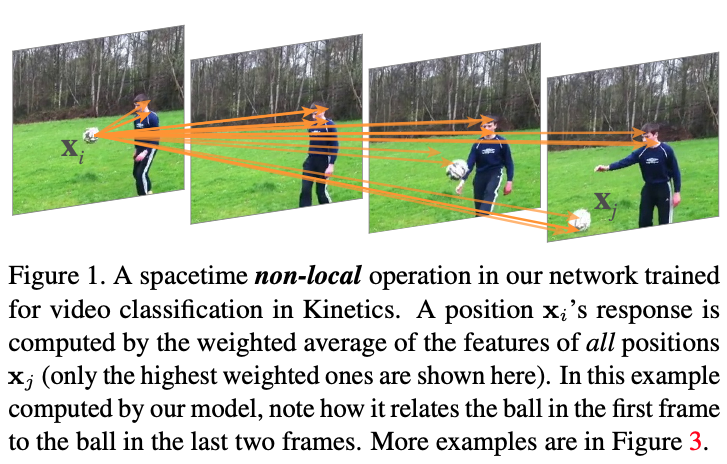

>论文标题：Non-local Neural Networks  
发表时间：2018  
研究组织：CMU、FAIR    
本文标签：视频目标识别、CVPR

# 速读概览：
## 1.针对什么问题？ 
    卷积和循环操作都在空间或时间上一次处理一个处理局部邻域；因此，只有在重复应用这些操作，通过数据逐步传播信号时，才能捕获远程依赖关系。这种模式具有以下几点限制：1.计算不够高效；2.导致的优化难题需要被小心的解决；3.这些挑战使得多跳依赖建模变得困难，例如需要在远距离位置之间来回传递消息时。

## 2.采用什么方法？  
    本文提出了一种新的神经网络，通过non-local操作捕获长距离依赖关系。
    
## 3.达到什么效果？  
    On the task of video classification, without any bells and whistles, non-local models can compete or outperform current competition winners on both Kinetics and Charades datasets. In static image recognition, non-local models improve object detection/segmentation and pose estimation on the COCO suite of tasks.
    
## 4.存在什么不足？

# 论文精读
## 0.摘要
* Both convolutional and recurrent operations are building blocks that process one local neighborhood at a time. 
* In this paper, we present non-local operations as a generic family of building blocks for capturing long-range dependencies. Inspired by the classical non-local means method in computer vision, our non-local operation computes the response at a position as a weighted sum of the features at all positions. 
* This building block can be plugged into many computer vision architectures. On the task of video classification, even without any bells and whistles, our non-local models can compete or outperform current competition winners on both Kinetics and Charades datasets. In static image recognition, our non-local models improve object detection/segmentation and pose estimation on the COCO suite of tasks. Code is available at https://github.com/facebookresearch/video-nonlocal-net.

## 7.Conclusion
* We presented a new class of neural networks which capture long-range dependencies via non-local operations. 
* Our non-local blocks can be combined with any existing architectures. 
* We show the significance of non-local modeling for the tasks of video classification, object detection and segmentation, and pose estimation. On all tasks, a simple addition of non-local blocks provides solid improvement over baselines. We hope non-local layers will become an important component of future network architectures.

## 1.Introduction
* For image data, long-distance dependencies are modeled by the large receptive fields formed by deep stacks of convolutional operations
* （长距离的依赖只能通过重复叠加层来捕获）Convolutional and recurrent operations both process a local neighborhood, either in space or time; thus long-range dependencies can only be captured when these operations are applied repeatedly, propagating signals progressively through the data.限制如下：
  * it is computationally inefficient
  * it causes optimization difficulties that need to be carefully addressed
  * 这些挑战使得多跳依赖建模变得困难，例如，当需要在远距离位置之间来回传递消息时。
* We present non-local operations as an efficient, simple, and generic component for capturing long-range dependencies with deep neural networks.(non-local operation is a generalization of the classical non-local mean operation in computer vision「*A non-local algorithm for image denoising.*」)

* （**实际上就是注意力机制的思想**）A non-local operation computes the response at a position as a weighted sum of the features at all positions in the input feature maps. The set of positions can be in space, time, or spacetime, implying that our operations are applicable for image, sequence, and video problems. (*Figure 1*)
* Advantages of using non-local operations:
  * In contrast to the progressive behavior of recurrent and convolutional operations, non-local operations capture long-range dependencies directly by computing interactions between any two positions, regardless of their positional distance; 
  * non-local operations are efficient and achieve their best results even with only a few layers (e.g., 5);
  * our non-local operations maintain the variable input sizes and can be easily combined with other operations 
* In videos, long-range interactions occur between distant pixels in space as well as time. A single non-local block, which is our basic unit, can directly capture these spacetime dependencies in a feedforward fashion. With a few non-local blocks, our architecures called non-local neural networks are more accurate for video classification than 2D and 3D convolutional networks
* In addition, non-local neural networks are more computationally economical than their 3D convolutional counterparts
* (**Performance**)Using RGB only and without any bells and whistles (e.g., optical flow, multi-scale testing), our method achieves results on par with or better than the latest competitions winners on both datasets.
* (**Generality**)We further present object detection/segmentation and pose estimation experiments on the COCO dataset. On top of the strong Mask R-CNN baseline, our non-local blocks can increase accuracy on all three tasks at a small extra computational cost. Together with the evidence on videos, these image experiments show that non-local operations are generally useful and can become a basic building block in designing deep neural networks.

## 2.Related work
### Non-local image processing
* Non-local means is a classical filtering algorithm that computes a weighted mean of all pixels in an image. It allows distant pixels to contribute to the filtered response at a location based on patch appearance similarity. 
* This non-local filtering idea was later developed into BM3D (block-matching 3D) , which performs filtering on a group of similar, but non-local, patches. 
* Non-local matching is also the essence of successful texture synthesis, super-resolution, and inpainting algorithms.

### Graphical models
* Long-range dependencies can be modeled by graphical models such as conditional random fields (CRF)
* Unlike these methods that were developed for segmentation, our general-purpose component is applied for classification and detection. **These methods and ours are also related to a more abstract model called graph neural networks**

### Feedforward modeling for sequences
* Recently there emerged a trend of using feedforward (i.e., non-recurrent) networks for modeling sequences in speech and language. 
* In these methods, long-term dependencies are captured by the large receptive fields contributed by very deep 1-D convolutions. These feedforward models are amenable to parallelized implementations and can be more efficient than widely used recurrent models.

### Self-attention
* Our work is related to the recent self-attention method「Attention is all you need」 for machine translation.A self-attention module computes the response at a position in a sequence (e.g., a sentence) by attending to all positions and taking their weighted average in an embedding space.
* Self-attention can be viewed as a form of the non-local mean, and in this sense our work bridges self-attention for machine translation to the more general class of non-local filtering operations that are applicable to image and video problems in computer vision.

### Interaction networks
* Interaction Networks (IN) were proposed recently for modeling physical systems. They operate on graphs of objects involved in pairwise interactions.
* Hoshen presented the more efficient Vertex Attention IN (VAIN) in the context of multi-agent predictive modeling.
* Relation Networks computes a function on the feature embeddings at all pairs of positions in its input.
* Our method also processes all pairs. The non-locality of the model, which is orthogonal to the ideas of attention/interaction/relation (e.g., a network can attend to a local region), is the key to their empirical success.

### Video classification architectures
* A natural solution to video classification is to combine the success of CNNs for images and RNNs for sequences . 
* In contrast, feedforward models are achieved by 3D convolutions (C3D)  in spacetime, and the 3D filters can be formed by “inflating” pre-trained 2D filters. 
* In addition to end-to-end modeling on raw video inputs, it has been found that optical flow and trajectories can be helpful. Both flow and trajectories are off-the-shelf modules that may find long-range, non-local dependency. A systematic comparison of video architectures can be found in [7].