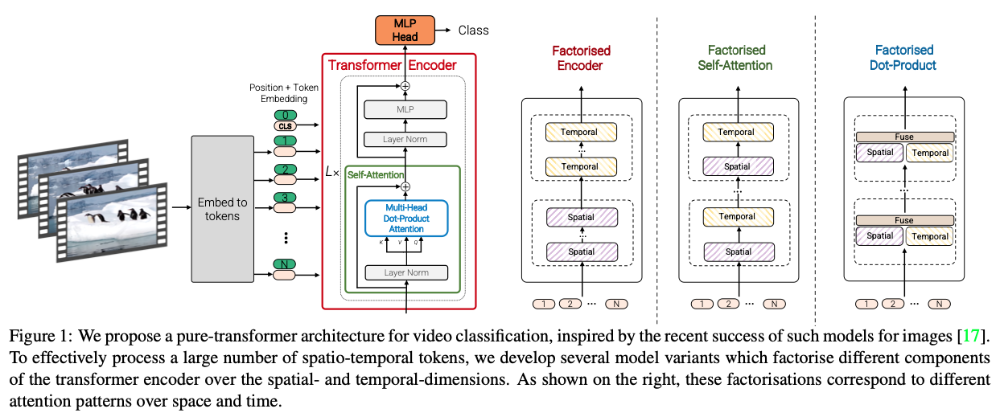

>论文标题：ViViT: A Video Vision Transformer  
发表时间：2021  
研究组织：Google Research  
本文标签：Transformer、视频目标检测、ICCV

# 速读概览：
## 1.针对什么问题？ 

## 2.采用什么方法？  

## 3.达到什么效果？  

## 4.存在什么不足？

# 论文精读
## 0.摘要
* 本文提出了基于纯transformer的视频分类模型，借鉴了此类模型在图像分类中的成功。我们的模型从输入视频中提取时空标记，然后由一系列transformer层编码。为了处理视频中遇到的长令牌序列，我们提出了我们模型的几个有效变体，它们考虑了输入的空间和时间维度。尽管基于transformer的方法被认为只在大型训练数据集可用时起作用，但我们展示了如何在训练期间有效地规范模型，并利用预训练的图像模型能够在相对较小的数据集上进行训练。我们进行了彻底的消融研究，并在包括 Kinetics 400 和 600、Epic Kitchens、Something-Something v2 和 Moments in Time 在内的多个视频分类基准上取得了最先进的结果，优于基于深度 3D 卷积网络的先前方法。

## 1.Introduction
* 自 AlexNet 以来，基于深度卷积神经网络的方法已经在许多视觉问题标准数据集中推进了最先进的技术。 同时，序列到序列建模（例如自然语言处理）中最突出的架构选择是transformer，它不使用卷积，而是基于多头自注意力。 此操作在建模长期依赖关系方面特别有效，并允许模型参与输入序列中的所有元素。 这与对应的“感受野”的有限性且随网络深度线性增长的卷积形成鲜明对比。
* NLP 中基于注意力的模型的成功最近激发了计算机视觉中将transformer集成到 CNN 中的方法，以及一些完全替代卷积的尝试。
* 然而，直到最近 Vision Transformer (ViT)的出现，基于纯transformer的架构在图像分类方面的性能才优于其卷积对应物。Dosovitskiy等人严格遵循原始的transformer的架构，并注意到它的主要好处是在大规模上观察到的——由于Transformer缺乏卷积的一些归纳偏差（例如平移等方差），它们似乎需要更多的数据或更强大的正则化。
* 受到ViT的启发以及基于注意力的架构是视频中建模长范围上下文关系的直觉型选择这一事实，我们开发了几种用于视频分类的基于Transformer的模型。目前，性能最高的模型是基于深度3D卷积结构的，实际上是图像分类CNN的一种自然的拓展。最近，这些模型通过将自注意力纳入其后续层来增强，以更好地捕捉长期依赖关系。
* 如下图所示，我们提出了用于视频分类的纯Transformer方法。在这个架构上实施的主要操作是自注意力，它是在我们从输入视频中提取出来的时空token序列上计算得到的。为了高效处理视频中可能会出现的大量时空token，我们提出了几种沿空间和时间维度分解我们的模型的方法，以提高效率和可扩展性。 此外，为了在较小的数据集上有效地训练我们的模型，我们展示了如何在训练期间规范我们的模型并利用预训练的图像模型。

* 我们还注意到，卷积模型已经由社区开发了几年，因此有许多与此类模型相关的“最佳实践”。 由于纯Transformer模型呈现不同的特性，我们需要确定此类架构的最佳设计选择。 我们对标记化策略、模型架构和正则化方法进行了彻底的消融分析。 根据这一分析，我们在多个标准视频分类基准上取得了最先进的结果，包括 Kinetics 400 和 600 、Epic Kitchens 100 、Something-Something v2 和 Moments in Time。

## 2.Related work
* 视频理解的架构反映了图像识别的进步。早期的视频研究使用手工制作的特征编码外观和行动信息。AlexNet 在 ImageNet 上的成功最初导致将 2D 图像卷积网络 (CNN) 重新用于视频作为“双流”网络。这些模型在最后融合它们之前独立处理 RGB 帧和光流图像。更大的视频分类数据集（如 Kinetics ）的可用性随后促进了时空 3D CNN 的训练，这些 CNN 具有更多的参数，因此需要更大的训练数据集。
* 由于 3D 卷积网络比它们的图像对应物需要更多的计算，许多架构在空间和时间维度上分解卷积和/或使用分组卷积。 我们还利用视频的空间和时间维度的分解来提高效率。
* 同时，在NLP领域，Vaswani等人通过使用仅包含自注意力，layer normalisation和MLP操作的Transformer网络替换卷积和循环网络实现了SOTA的结果。当前NLP领域的SOTA架构依然是基于Transformer的，并已扩展到网络规模的数据集。
* 许多Transformer的变体被提出，以在处理较长序列时降低自注意力的计算成本并提高参数效率。尽管自注意力已在计算机视觉中得到广泛应用，但与之相反，它通常被合并为网络末端或后期阶段的一个层，或者在 ResNet 架构中增加残差块。
* 尽管之前的工作尝试在视觉架构中替代卷积，但直到最近Dosovitiskydengren才通过它们的ViT架构展示了纯Transformer架构（与它们在NLP领域中的使用相似）也能够实现针对图像分类的SOTA结果。作者也说明了这样的模型只能在大规模下起作用，因为transformer缺乏卷积网络具有的推导偏置（比如平移等变），因此需要比常规的ImageNet ILSRVC数据集更大的数据集来训练。
* ViT 激发了社区的大量后续工作，我们注意到有许多并行方法可以将其扩展到计算机视觉中的其他任务并提高其数据效率。 特别是，[4（Is space-time attention all you need for video understanding?）, 45（Video transformer network）] 还提出了基于Transformer的视频模型。
* 在本文中，我们开发了用于视频分类的纯Transformer架构。我们提出了我们模型的一些变体，包括那些通过分解输入视频的空间和时间维度而更有效的变体。 我们还展示了如何使用额外的正则化和预训练模型来解决视频数据集不如 ViT 最初训练的图像数据集大的事实。 此外，我们在五个流行的数据集上优于最先进的数据集。

## 3.Video Vision Transformers
### 3.1 Overview of Vision Transformers（ViT）
* ViT以最小的改变使Transformer架构能够处理二维图像。特别的，ViT提取了N个非重叠的图像块，${x_i \in R^{h \times \omega}}$，执行线性投影，然后将它们光栅化为 1D 的tokens ${z_i ∈ R^d}$。 输入到下述Transformer 编码器的tokens序列是
$${z = [z_{cls}, Ex_1, Ex_2, ..., E_{x_N}] \tag{1}}$$
其中，E的投影与2D卷积相当。

## 5.Conclusion and Future work
* 我们提出了四个用于视频分类的纯Transformer模型，具有不同的准确性和效率配置文件，在五个流行的数据集上实现了最先进的结果。 此外，我们已经展示了如何有效地规范这种高容量模型以在较小的数据集上进行训练，并彻底消除我们的主要设计选择。 未来的工作是消除我们对图像预训练模型的依赖，并将我们的模型扩展到更复杂的视频理解任务。