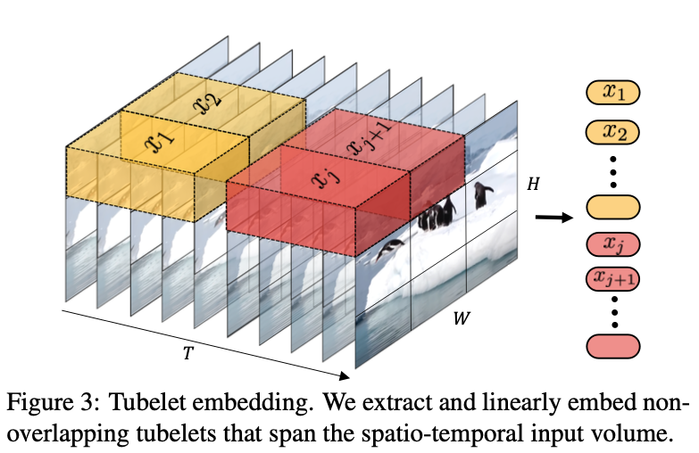
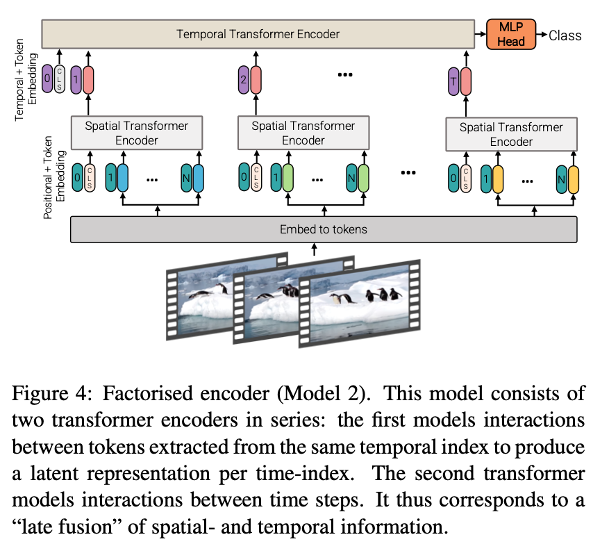

> 论文标题：ViViT: A Video Vision Transformer  
> 发表时间：2021  
> 研究组织：Google Research  
> 本文标签：Transformer、视频目标检测、ICCV

# 速读概览：

## 1.针对什么问题？
  ViT的出现证明了基于多头自注意力的Transformer架构在建模长依赖关系方面的效果，比当下主要使用的卷积操作好。本文受其启发，开发了几种用于视频分类的基于Transformer的模型。

## 2.采用什么方法？
  从输入视频中提取时空token序列来计算自注意力。为了高效处理视频中的大量时空token，提出了几种沿空间和时间维度分解模型的方法，以提高效率和可扩展性。

## 3.达到什么效果？
  在Kinetics 400 和 600、Epic Kitchens、Something-Something v2 和 Moments in Time 等多个视频分类基准上取得了最先进的结果，优于基于深度 3D 卷积网络的先前方法。

## 4.存在什么不足？

# 论文精读

## 0.摘要
* 本文提出了基于纯transformer的视频分类模型，借鉴了此类模型在图像分类中的成功。我们的模型从输入视频中提取时空标记，然后由一系列transformer层编码。为了处理视频中遇到的长令牌序列，我们提出了我们模型的几个有效变体，它们考虑了输入的空间和时间维度。尽管基于transformer的方法被认为只在大型训练数据集可用时起作用，但我们展示了如何在训练期间有效地规范模型，并利用预训练的图像模型能够在相对较小的数据集上进行训练。我们进行了彻底的消融研究，并在包括 Kinetics 400 和 600、Epic Kitchens、Something-Something v2 和 Moments in Time 在内的多个视频分类基准上取得了最先进的结果，优于基于深度 3D 卷积网络的先前方法。

## 1.Introduction
* 自 AlexNet 以来，基于深度卷积神经网络的方法已经在许多视觉问题标准数据集中推进了最先进的技术。 同时，序列到序列建模（例如自然语言处理）中最突出的架构选择是transformer，它不使用卷积，而是基于多头自注意力。 此操作在建模长期依赖关系方面特别有效，并允许模型参与输入序列中的所有元素。 这与对应的“感受野”的有限性且随网络深度线性增长的卷积形成鲜明对比。
* NLP 中基于注意力的模型的成功最近激发了计算机视觉中将transformer集成到 CNN 中的方法，以及一些完全替代卷积的尝试。
* 然而，直到最近 Vision Transformer (ViT)的出现，基于纯transformer的架构在图像分类方面的性能才优于其卷积对应物。Dosovitskiy等人严格遵循原始的transformer的架构，并注意到它的主要好处是在大规模上观察到的——由于Transformer缺乏卷积的一些归纳偏差（例如平移等方差），它们似乎需要更多的数据或更强大的正则化。
* 受到ViT的启发以及基于注意力的架构是视频中建模长范围上下文关系的直觉型选择这一事实，我们开发了几种用于视频分类的基于Transformer的模型。目前，性能最高的模型是基于深度3D卷积结构的，实际上是图像分类CNN的一种自然的拓展。最近，这些模型通过将自注意力纳入其后续层来增强，以更好地捕捉长期依赖关系。
* 如下图所示，我们提出了用于视频分类的纯Transformer方法。在这个架构上实施的主要操作是自注意力，它是在我们从输入视频中提取出来的时空token序列上计算得到的。为了高效处理视频中可能会出现的大量时空token，我们提出了几种沿空间和时间维度分解我们的模型的方法，以提高效率和可扩展性。此外，为了在较小的数据集上有效地训练我们的模型，我们展示了如何在训练期间规范我们的模型并利用预训练的图像模型。
  
* 我们还注意到，卷积模型已经由社区开发了几年，因此有许多与此类模型相关的“最佳实践”。 由于纯Transformer模型呈现不同的特性，我们需要确定此类架构的最佳设计选择。 我们对标记化策略、模型架构和正则化方法进行了彻底的消融分析。 根据这一分析，我们在多个标准视频分类基准上取得了最先进的结果，包括 Kinetics 400 和 600 、Epic Kitchens 100 、Something-Something v2 和 Moments in Time。

## 2.Related work
* 视频理解的架构反映了图像识别的进步。早期的视频研究使用手工制作的特征编码外观和行动信息。AlexNet 在 ImageNet 上的成功最初导致将 2D 图像卷积网络 (CNN) 重新用于视频作为“双流”网络。这些模型在最后融合它们之前独立处理 RGB 帧和光流图像。更大的视频分类数据集（如 Kinetics ）的可用性随后促进了时空 3D CNN 的训练，这些 CNN 具有更多的参数，因此需要更大的训练数据集。
* 由于 3D 卷积网络比它们的图像对应物需要更多的计算，许多架构在空间和时间维度上分解卷积和/或使用分组卷积。 我们还利用视频的空间和时间维度的分解来提高效率。
* 同时，在NLP领域，Vaswani等人通过使用仅包含自注意力，layer normalisation和MLP操作的Transformer网络替换卷积和循环网络实现了SOTA的结果。当前NLP领域的SOTA架构依然是基于Transformer的，并已扩展到网络规模的数据集。
* 许多Transformer的变体被提出，以在处理较长序列时降低自注意力的计算成本并提高参数效率。尽管自注意力已在计算机视觉中得到广泛应用，但与之相反，它通常被合并为网络末端或后期阶段的一个层，或者在 ResNet 架构中增加残差块。
* 尽管之前的工作尝试在视觉架构中替代卷积，但直到最近Dosovitiskydengren才通过它们的ViT架构展示了纯Transformer架构（与它们在NLP领域中的使用相似）也能够实现针对图像分类的SOTA结果。作者也说明了这样的模型只能在大规模下起作用，因为transformer缺乏卷积网络具有的推导偏置（比如平移等变），因此需要比常规的ImageNet ILSRVC数据集更大的数据集来训练。
* ViT 激发了社区的大量后续工作，我们注意到有许多并行方法可以将其扩展到计算机视觉中的其他任务并提高其数据效率。 特别是，[4（Is space-time attention all you need for video understanding?）, 45（Video transformer network）] 还提出了基于Transformer的视频模型。
* 在本文中，我们开发了用于视频分类的纯Transformer架构。我们提出了我们模型的一些变体，包括那些通过分解输入视频的空间和时间维度而更有效的变体。 我们还展示了如何使用额外的正则化和预训练模型来解决视频数据集不如 ViT 最初训练的图像数据集大的事实。 此外，我们在五个流行的数据集上优于最先进的数据集。

## 3.Video Vision Transformers

### 3.1 Overview of Vision Transformers（ViT）
* ViT以最小的改变使Transformer架构能够处理二维图像。特别的，ViT提取了N个非重叠的图像块，${x_i \in R^{h \times \omega}}$，执行线性投影，然后将它们光栅化为 1D 的tokens ${z_i ∈ R^d}$。 输入到下述Transformer 编码器的tokens序列是  
  $${z = [z_{cls}, Ex_1, Ex_2, ..., E_{x_N}] \tag{1}}$$
  其中，E的投影与2D卷积相当。一个可选的学习到的分类token${z_{cls}}$放置在序列的前边，它在encoder的最后一层的表示作为分类层使用的最终表示。另外，一个可学习的位置嵌入，${p \in R^{N\times d}}$，被添加到tokens中用于保存位置信息，因为transformer中后续的self-attention操作是置换不变的。然后tokens通过由一系列 L 个transformer层组成的编码器。 每层 l 包括多头自注意、层归一化 (LN) 和 MLP 块，如下所示：
  $${y^l = MSA(LN(z^l)) + z^l \tag{2}}$$
  $${z^{l+1} = MLP(LN(y^l)) + y^l \tag{3}}$$
* MLP包含两个由 GELU 非线性分隔的线性投影组成，并且token的维数 d 在所有层中保持固定。 最后，线性分类器用于基于${z^L_{cls} ∈ R^d}$对编码输入进行分类，如果它被预先添加到输入中，否则所有标记的全局平均池化$z^L$。
* 由于ViT的基础——transformer，是一个灵活的架构，能够在任意输入的tokens序列上操作，我们将详细描述tokenising的策略。

### 3.2 Embedding video clips
* 我们考虑两个简单的方法来将视频${V \in R^{T \times H \times W \times C}}$映射到tokens序列${\hat{z} \in R^{n_t \times n_h \times n_w \times d}}$。然后我们添加位置嵌入，reshape成${R^{N \times d}}$来得到z，transformer的输入。
  
#### Uniform frame sampling
* 对输入视频进行标记的一种直接方法是从输入视频剪辑中均匀采样 nt 帧，使用与 ViT 相同的方法独立嵌入每个 2D 帧，并将所有这些标记连接在一起。具体来说，如果从每一帧中提取$n_h·n_w$个非重叠图像块，则总共$n_t·n_h·n_w$个令牌将通过transformer编码器转发。 直观地说，这个过程可以看作是简单地构建一个大的 2D 图像，以便在 ViT 之后进行标记。 我们注意到这是(Is space-time attention all you need for video understanding?)的并行工作所采用的输入嵌入方法。

#### Tubelet embedding

* 如图3所示，另一种可选的方式是从输入视频中提取非重叠的时空tubes，然后线性投影到$R^d$。这个方法是 ViT 嵌入到 3D 的扩展，对应于 3D 卷积。对于一个维度为$t\times h \times \omega$的tubelet，$n_t = \lfloor \frac{T}{t} \rfloor$，$n_h = \lfloor \frac{H}{h} \rfloor$，$n_w = \lfloor \frac{W}{w} \rfloor$，tokens是分别从时间、高度和宽度维度上提取到的。因此，较小的tubelet尺寸会产生更多的tokens，从而增加计算量。 直观地说，这种方法在标记化过程中融合了时空信息，这与“统一帧采样”相反，其中来自不同帧的时间信息由transformer融合。

### 3.3 Transformer Models for Video
* 我们提出了几种基于Transformer的架构。我们从 ViT 的直接扩展开始，它对所有时空标记之间的成对交互进行建模，然后开发更有效的变体，在transformer架构上将输入视频的空间和时间维度分解为不同的级别。
  
#### Model 1:Spatio-temporal attention
* 该模型通过Transformer编码器简单地转发从视频 z0 中提取的所有时空tokens。 我们注意到，(Is space-time attention all you need for video understanding?)也在他们的“联合时空”模型中同时探索了这一点。 与感受野随层数线性增长的 CNN 架构相比，每个transformer层都对所有时空标记之间的所有成对交互进行建模，因此它对来自第一层的视频中的远程交互进行建模。

* 然而，由于它对所有成对交互建模，多头自注意力（MSA）的复杂度与tokens的数量成二次关系。这种复杂性与视频相关，因为tokens的数量随着输入帧的数量线性增加，并激励下一步开发更高效的架构。

#### Model 2:Factorised encoder

* 如图4所示，这个模型由两个分开的transformer encoder组成。第一个是spatial encoder，只建模从同一时间序列上提取到的tokens之间的交互。每个时间序列的表示$h_i \in R^d$是在$L_s$层之后得到的:如果它是输入的前置，那么它是一个编码的分类token$z_{cls}^{L_s}$，否则是spatial encoder输出的tokens的全局平均池化$z^{L_s}$。
* frame level的表示$h_i$连接成$H \in R^{n_t \times d}$，然后通过由 $L_t$ transformer层组成的temporal encoder转发，以模拟来自不同时间索引的tokens之间的交互。 然后最终对该编码器的输出token进行分类。
* 这种架构对应于时间信息的“后期融合”，初始空间编码器与用于图像分类的空间编码器相同。 因此，它类似于 CNN 架构，它们首先提取每帧特征，然后在对它们进行分类之前将它们聚合成最终表示。尽管这个模型的transformer层比model 1多（因此具有更多的参数），它需要更少的FLOPs，因为两个分开的transformer块的复杂度是${O((n_h \cdot n_w)^2 + n_t^2)}$，相对于${O((n_t \cdot n_h \cdot n_w)^2)}$。

#### Model 3:Factorised self-attention
* 这个模型与Model 1包含相同数量的transformer层。然而，我们不是在第 l 层计算所有tokens对$z^l$的多头自注意力，而是将操作分解为首先仅在空间上计算自注意力（在从同一时间索引中提取的所有令牌中），然后在时间上（在从相同的空间索引中提取的所有标记）。
* 因此，transformer 中的每个 self-attention 块都对时空交互进行了建模，但通过对两组较小元素的操作进行因式分解，比模型 1 更有效，从而实现与模型 2 相同的计算复杂度。我们注意到，在输入维度上分解注意力也在其他论文中进行了探索。
* 这个操作可以通过将tokens z 从$R^{1 \times n_t \cdot n_h \cdot n_w \cdot d}$ reshape 到 $n_t \times n_h \cdot n_w \cdot d$（表示为$z_s$）再计算空间自注意力来高效实现。类似的，时间自注意力的输入$ z_t $被重塑为$ R^{n_h \cdot n_w \times n_t \times d}$。 在这里，我们假设主要维度是“批维度”。 我们的因式自注意力被定义为
  $${y_s^l = MSA(LN(z_s^l)) + z_s^l \tag{4}}$$
  $${y_t^l = MSA(LN(y_s^l)) + y_s^l \tag{5}}$$
  $${z_{l+1} = MLP(LN(y_t^l)) + y_t^l \tag{6}}$$
* 我们观察到，如果模型参数按照第 2 节中的描述进行初始化，则空间-然后-时间-自我注意或时间-然后-空间-自注意的顺序没有区别。但是请注意，与模型 1 相比，参数的数量有所增加，因为有一个额外的自注意力层（参见公式 7）。 我们在这个模型中不使用分类标记，以避免在空间和时间维度之间重塑输入标记时产生歧义。

#### Model 4:Factorised dot-product attention
* 最后，我们开发了一个与模型2和模型3有相同计算复杂度的模型，同时保持了与未分解的模型1相同的参数量。时间和空间维度上的分解在spirit上与模型3相似，但我们分解了多头点积注意力操作。
* 具体来说，我们使用不同的头部，分别在时间和空间维度上为每个token计算了注意力权重。
* 首先，我们注意到每个头部的注意力操作被定义为
$${Attention(Q, K, V) = Softmax(\frac{QK^T}{\sqrt{d_k}})V \tag{7}}$$
在自注意力中，queries ${Q=XW_q}$，keys ${K=XW_k}$，和values ${V=XW_v}$都是输入X ${X, Q, K, V \in R^{N\times d}}$的线性投影。注意在未分解的情况（模型1），空间和时间维度被合并为${N = n_t \cdot n_h \cdot n_w}$。
* 这里的主要想法是通过构造$K_s , V_s \in R^{n_h ·n_w\times d}$和${K_t , V_t \in R^{n_t \times d}}$来修改每个query的keys和values以仅关注来自相同空间和时间索引的token，即对应于这些维度的keys和values。
* 然后，对自注意力头部的一半，我们通过计算${Y_s = Attention(Q, K_s, V_s)}$从空间维度关注token，其余的我们通过计算${Y_t = Attention(Q, K_t, V_t)}$关注时间维度。
* 假设我们只改变了每个query的邻近自注意力，注意力操作的维度和未分解的情况一样，即${Y_s, Y_t \in R^{N \times d}}$。然后我们通过连接把多头的输出结合起来，然后使用一个线性投影，${Y=Concat(Y_s, Y_t)W_o}$。

### 3.4 Initialisation by leveraging pretrained models
* ViT被证明只在大规模数据集上训练才有效，因为transformer缺乏卷积网络的归纳偏置。然而，即使是像Kinetics这样的大型视频数据集，它的标记样本依然比图像的对应物少了几个数量级。因此，从零开始训练大型模型到高精度是极具挑战性的。为了回避这个问题，并实现更有效的训练，我们从预训练的图像模型初始化我们的视频模型。

#### Positional embeddings
* 一个positional embedding $p$被添加到每个输入token中。然而我们的视频模型具有比预训练图像模型多 $n_t$ 倍的token。因此，我们通过从${R^{n_w\cdot n_h\times d}}$到${R^{n_t\cdot n_h\cdot n_w \times d}}$临时“重复”它们来初始化positional embedding。 因此，在初始化时，具有相同空间索引的所有标记都具有相同的embedding，然后对其进行微调。

#### Embedding weights, E
* 在使用tubelet embedding 标记方法时，embedding filter E是一个3D的tensor，与预训练模型${E_{image}}$的2D tensor相比。从 2D filter初始化 3D 卷积filter以进行视频分类的一种常用方法是通过沿时间维度复制过滤器并将它们平均来“膨胀”它们
$${E = \frac{1}{t}[E_{image}, ..., E_{image}, ..., E_{image}] \tag{8}}$$
* 我们考虑了一个额外的策略，我们将其称为“中心帧初始化”，其中 E 沿所有时间位置用零初始化，除了中心${\lfloor \frac{t}{2} \rfloor}$
$${E = [0, ..., E_{image}, ..., 0] \tag{9}}$$
* 因此，3D 卷积filter在初始化时的行为类似于“统一帧采样”，同时还使模型能够随着训练的进行学习从多个帧中聚合时间信息。

#### Transformer weights for Model 3
* Model 3中的Transformer块与预训练的ViT模型不同，它包括两个MSA模块。在这种情况下，我们从预训练模块中初始化空间MSA模块，并初始化所有的时间MSA的权重为0，这样的话，公式5在初始化的时候表现的就像残差连接一样。

## 4.Empirical evaluation
### 4.1 Experimental Setup
### 4.2 Ablation Study
### 4.3 Comparison to SOTA

## 5.Conclusion and Future work

* 我们提出了四个用于视频分类的纯Transformer模型，具有不同的准确性和效率配置文件，在五个流行的数据集上实现了最先进的结果。 此外，我们已经展示了如何有效地规范这种高容量模型以在较小的数据集上进行训练，并彻底消除我们的主要设计选择。 未来的工作是消除我们对图像预训练模型的依赖，并将我们的模型扩展到更复杂的视频理解任务。