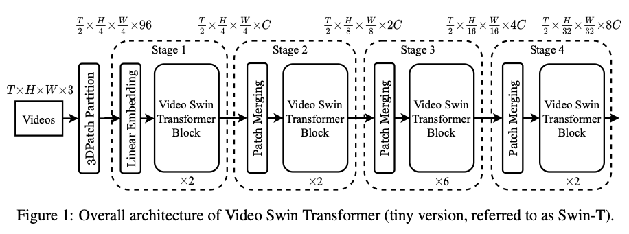
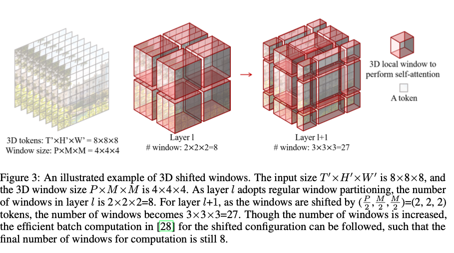

>论文标题：Video Swin Transformer  
发表时间：2021  
研究组织：MSRA    
本文标签：视频目标识别

# 速读概览：
## 1.针对什么问题？ 
  过去常使用在卷积模型上增加时间维度，即3D卷积的方式处理视频，这样的方式既不经济也不易于优化。ViT在图像上的巨大成功促使人们研究基于 Transformer 的架构以用于基于视频的识别任务。
    
## 2.采用什么方法？
  通过对 Swin Transformer 进行时空改编来实现，遵循原始Swin Transformer的层次化结构，将局部注意力计算的范围从仅空间域扩展到时空域。
    
## 3.达到什么效果？  
  在广泛的视频识别基线上实现了SOTA的精度，包括行为识别（84.9 top-1 accuracy on Kinetics-400 and 86.1 top-1 accuracy on Kinetics-600 with ∼20× less pre-training data and ∼3× smaller model size）和时间建模(69.6 top-1 accuracy on Something-Something v2)。

## 4.存在什么不足？
  Video Swin Transformer对于长序列的依赖关系是通过固定size的token获得的。序列长度越长计算量越大。不能自适应的针对场景的变化作出改变。（Video Swin Transformer面向的场景是完整的视频输入，不是针对实时处理）

# 论文精读
## 0.摘要
* 视觉领域正经历着从CNNs到Transformers的模型转换，pure Transformer架构已经在主流的视频识别基线上取得顶尖的精度。这些视频模型都构建于Transformer层之上，在空间和时间维度上全局连接patches。相反，我们在本文中提倡在视频 Transformer 中使用局部性的归纳偏置，与以前的方法相比，即使使用时空分解，也可以在全局范围内计算自注意力，从而实现更好的速度-准确度权衡。本文提出的视频架构的局部性是通过改编为图像领域设计的swin transformer实现的，利用了预训练图像模型的力量。我们的方法在广泛的视频识别基线上实现了SOTA的精度，包括行为识别（84.9 top-1 accuracy on Kinetics-400 and 86.1 top-1 accuracy on Kinetics-600 with ∼20× less pre-training data and ∼3× smaller model size）和时间建模(69.6 top-1 accuracy on Something-Something v2)。代码和模型位于：https://github.com/SwinTransformer/ Video-Swin-Transformer。

## 1.Introduction
* 基于卷积的backbone架构已经在CV领域主导视觉模型很久了。然而，目前正在对用于图像分类的主干架构进行建模转变，从 CNN 到 Transformer。这个趋势是从使用标准的Transformer encoder在非重叠的图像patches上全局建模空间关系的ViT的诞生开始的。ViT在图像上的巨大成功促使人们研究基于 Transformer 的架构以用于基于视频的识别任务。
* 以前对于卷积模型，视频的骨干架构是从图像的骨干架构改编而来的，只需通过时间轴扩展建模即可。例如，3D卷积就是 2D 卷积的直接扩展，用于在operator级别进行联合空间和时间建模。由于联合时空建模既不经济也不易于优化，因此提出了空间和时域的分解以实现更好的速度-精度权衡。在基于 Transformer 的视频识别的最初尝试中，还采用了分解方法，通过分解encoder或分解自注意力。 这已被证明可以大大减小模型大小，而不会显着降低性能。
* 本文我们提出了一个针对视频识别的pure-transformer的backbone架构，它的效率可以超过分解模型。它通过利用视频固有的时空局部性来实现这一点，其中时空距离上彼此更近的像素更有可能相关。 由于这个特性，全局时空自注意力可以通过局部计算的自注意力来很好地逼近，从而显着节省计算量和模型大小。
* 我们通过对 Swin Transformer 进行时空改编来实现这种方法，该方法最近被引入作为图像理解的通用视觉骨干。Swin Transformer 结合了空间局部性以及层次结构和平移不变性的归纳偏置。我们的模型叫做Video Swin Transformer，严格遵循了原始Swin Transformer的层次化结构，但将局部注意力计算的范围从仅空间域扩展到时空域。由于局部注意力是在非重叠窗口上计算的，原始Swin Transformer的shifted window机制也被重新制定以处理时空输入。
* 由于我们的架构是根据Swin Transformer改变的，它能够很容易地使用在大规模图像数据集上预训练的强大模型进行初始化。使用一个在ImageNet-21K上预训练的模型，我们有趣地发现主干架构的学习率需要比随机初始化的头部更小（例如 0.1 倍）。结果，backbone在拟合新的视频输入时会慢慢忘记预训练的参数和数据，从而实现更好的泛化。 这一观察结果为进一步研究如何更好地利用预训练的权重提供了一个方向。
* The proposed approach shows strong performance on the video recognition tasks of action recognition on Kinetics-400/Kinetics-600 and temporal modeling on Something-Something v2 (abbreviated as SSv2). For video action recognition, its 84.9% top-1 accuracy on Kinetics-400 and 86.1% top- 1 accuracy on Kinetics-600 slightly surpasses the previous state-of-the-art results (ViViT) by +0.1/+0.3 points, with a smaller model size (200.0M params for Swin-L vs. 647.5M params for ViViT-H) and a smaller pre-training dataset (ImageNet-21K vs. JFT-300M). For temporal modeling on SSv2, it obtains 69.6% top-1 accuracy, an improvement of +0.9 points over previous state-of-the-art.

## 2.Related works
### CNN and variants
* 在CV领域，卷积网络已经成为backbone架构的标准很长一段时间了。对于 3D 建模，C3D 是一项开创性的工作，它设计了一个具有 3D 卷积的 11 层深度网络。
* I3D 的工作表明，将 Inception V1 中的 2D 卷积膨胀到 3D 卷积，并通过 ImageNet 预训练权重进行初始化，在大规模动力学数据集上取得了良好的效果。 
* 在 P3D 、S3D 和 R(2+1)D 中，发现解开空间和时间卷积比原始 3D 卷积更好地实现速度-精度折衷。 
* 基于卷积的方法的潜力受到卷积操作的小感受野的限制。 通过自注意机制，可以用更少的参数和更低的计算成本来拓宽感受野，从而使视觉 Transformer 在视频识别上的性能更好。

### Self-attention/Transformers to complement CNNs
* NLNet是第一个在视觉识别任务中用自注意力来建模pixel level的长范围依赖的工作。
* GCNet观察到 NLNet 的准确性提高主要归功于其全局上下文建模，因此它将 NL 块简化为一个轻量级的全局上下文块，该块在性能上与 NLNet 相匹配，但参数更少，计算量更少。
* 相反，DNL 试图通过一种解耦设计来缓解这种退化问题，该设计允许学习不同像素的不同上下文，同时保留共享的全局上下文。 所有这些方法都为 CNN 提供了一个补充组件，用于对远程依赖进行建模。 
* 在我们的工作中，我们展示了基于pure-Transformer的方法更充分地捕捉了自我注意的力量，从而带来了卓越的性能。

### Vision Transformers
* 自从ViT出现之后，CV领域的backbone的架构就发生了从CNNs到Transformers的转变。这项开创性的工作导致了旨在提高其效用的后续研究。 
* DeiT 集成了几种训练策略，使 ViT 也可以有效地使用较小的 ImageNet-1K 数据集。 
* Swin Transformer 进一步引入了局部性、层次性和平移不变性的归纳偏置，使其能够作为各种图像识别任务的通用backbone。

* 图像Transformer的巨大成功促使人们研究基于 Transformer 的架构以用于基于视频的识别任务。
* VTN（Video transformer network）提出在预训练的ViT的顶部添加一个时间注意力encoder，这在视频动作识别方面产生了良好的性能。
* TimeSformer（Is space-time attention all you need for video understanding?）研究了五个不同的时空注意力的变体，并提出了一种分解的时空注意，因为它具有强大的速度-准确性权衡。 
* ViViT 为预训练的 ViT 模型探索了空间和时间注意力的四种分解设计，并提出了一种类似于 VTN 的架构，可以在 Kinetics 数据集上实现最先进的性能。
* MViT是一种从头开始训练的用于视频识别的多尺度视觉转换器，它通过集中时空建模的注意力来减少计算量，从而在 SSv2 上获得最先进的结果。 
* 所有这些研究都基于全局自注意力模块。 在本文中，我们首先研究时空局部性，然后通过经验证明具有时空局部性偏置的 Video Swin Transformer 在各种视频识别任务中的表现优于所有其他视觉 Transformer。

## 3.Video Swin Transformer
### 3.1 Overall Architecture
 
* Video Swin Transformer的结构总览如图1所示，这是它的tiny version（Swin-T）。输入视频的size被定义成${T\times H \times W \times 3}$，包含T帧，每个包含$H\times W \times 3$个pixel。在Video Swin Transformer中，我们将每个size为$2\times 4 \times 4 \times 3$的patch视为一个token。因此，3D patch分割层获得${\frac{T}{2} \times \frac{H}{4} \times \frac{W}{4}}$3D tokens，每个patch/token由 96 维特征组成。 然后应用线性嵌入层将每个token的特征投影到由 C 表示的任意维度。
* 遵循之前的工作，我们没有沿着时间维度下采样。这使得我们可以严格遵循原始的Swin Transformer的层级式结构，它由四个阶段组成，并在每个阶段的pathch合并层中执行 2 倍空间下采样。patch合并层连接每组 2×2 空间相邻patches的特征，并应用线性层将连接的特征投影到其维度的一半。 例如，第二阶段的线性层将每个token的4C维特征投影到2C维。
* 这个结构的主要组成元件是Video Swin Transformer块，它是通过将标准 Transformer 层中的多头自注意力 (MSA) 模块替换为基于 3D Shifted Window的多头自注意力模块而构建的，并保持其他组件不变。
* 具体来说，一个video swin transformer由一个基于 3D Shifted Window的 MSA 模块和一个前馈网络组成，特别是一个 2 层 MLP，其间具有 GELU 非线性。
* Layer Normalization应用在每个MSA模块和FFN之前，一个残差连接被应用在每个模块之后。

### 3.2 3D Shifted Window based MSA Module
* 与图像相比，视频需要更多数量的输入tokens来表示他们，因为视频额外具有一个时间维度。一个全局的自注意力模块对视频任务来说是不合适的，因为它会导致巨大的计算量和内存消耗。此处，我们跟随Swin Transformer，在注意力模块中引入了一个局部归纳偏置，被证明对视频识别是有效的。

#### Multi-head self-attention on non-overlapping 3D windows
* 每个非重叠 2D 窗口上的MSA机制已被证明对图像识别既有效又高效。我们直接拓展这个设计来处理视频输入。给定一个由${T' \times H' \times W'}$个3D tokens组成的视频和一个尺寸为$P\times M \times M$的3D window，window被布置成以非重叠方式均匀划分视频输入。 也就是说，输入标记被划分为${\lceil \frac{T'}{P} \rceil \times  \lceil \frac{H'}{M} \rceil  \times  \lceil \frac{W'}{M} \rceil}$不重叠的 3D 窗口。 例如，如图 3 所示，对于 8×8×8 的输入大小和 4×4×4 的窗口大小，第 l 层的窗口数将是 2×2×2=8。 并且在每个 3D 窗口内执行多头自注意力。
 

#### 3D Shifted Windows
* 尽管MSA机制被应用在每个非重叠3D窗口内，不同窗口之间依然缺乏联系，这将限制结构的表示能力。因此，为了在保持高效计算基于非重叠窗口的自注意力的同时引入跨窗口的连接，我们拓展了Swin Transformer中的Shifted 2D window机制为3D window。
* 假设输入的3D tokens的数量是${T' \times H' \times W'}$，每个3D window的尺寸是${P \times M \times M}$，对于两个连续的层，第一个层中的自注意力模块使用常规的窗口分割策略，这样我们就得到了${\lceil \frac{T'}{P} \rceil \times  \lceil \frac{H'}{M} \rceil  \times  \lceil \frac{W'}{M} \rceil}$个非重叠3D窗口。对于第二层中的自注意力模块，窗口分区配置沿时间、高度和宽度轴移动${(\frac{P}{2}, \frac{M}{2}, \frac{M}{2})}$个tokens，与前一层的自注意模块的token相比。
* 我们通过图3中的例子来解释。输入的size是$8 \times 8 \times 8$，窗口size是$4 \times 4 \times 4$。因为layer l使用常规的窗口分隔，layer l的windows数量$2 \times 2 \times 2=8$。对于layer l+1，由于windows被移动成${(\frac{P}{2}, \frac{M}{2}, \frac{M}{2})=(2, 2, 2)}$个tokens，windows的数量变成$3 \times 3 \times 3=27$。尽管窗口的数量增加了，可以遵循Swin Transformer中针对移位配置的有效批量计算，使得计算的最终窗口数仍然是 8。
* 使用移动窗口分区方法，两个连续的Video Swin Transformer块可以用如下方法计算
$${\hat{z^l} = 3DW-MSA(LN(\hat{z^{l-1}})) + z^{l-1}}$$
$${z^l = FFN(LN(\hat{z^{l}})) + z^{l}}$$
$${\hat{z^{l+1}} = 3DSW-MSA(LN(\hat{z^{l}})) + z^{l}}$$
$${z^{l+1} = FFN(LN(\hat{z^{l+1}})) + \hat{z^{l+1}} \tag{1}}$$
* 其中，和分别代表3D(S)W-MSA模块和块l的FFN模块的输出特征；3DW-MSA 和 3DSW-MSA 分别表示使用常规和移位窗口分区配置的基于 3D 窗口的多头自注意。
* 与Swin Transformer中的图像识别类似，3D移动窗口设计引入了之前层中的临近非重叠3D窗口之间的联系。稍后将证明这对几个视频识别任务是有效的，例如 Kinetics 400/600 上的动作识别和 SSv2 上的时间建模。

#### 3D Relative Position Bias
* 许多先前的工作已经表明，在自注意力计算中包含每个头部的相对位置偏差可能是有利的。 因此，我们按照 Swin Transformer 为每个头部引入 3D 相对位置偏差${B \in R^{P^2} \times M^2 \times M^2}$
$${Attention(Q, K, V) = SoftMax(QK^T/\sqrt{d}+B)V \tag{2}}$$
* 其中，${Q, K, V \in R^{PM^2\times d}}$是query， key和value矩阵，d是query和key特征的维度，是一个3D window里面的tokens数量。
* 由于沿每个轴的相对位置位于 [-P + 1, P - 1]（时间）或 [-M + 1, M - 1]（高度或宽度）的范围内，因此我们参数化了一个较小尺寸的偏置矩阵${\hat{B} \in R^{(2P−1)\times(2M−1)\times(2M−1)}}$，B中的值取自$\hat{B}$。

### 3.3 Architecture Variants
* 我们引入了四种不同的Video Swin Transformer的版本。这些模型辩题的结构超参数是：
  * Swin-T: C = 96, layer numbers = {2, 2, 6, 2}
  * Swin-S: C = 96, layer numbers ={2, 2, 18, 2}
  * Swin-B: C = 128, layer numbers ={2, 2, 18, 2}
  * Swin-L: C = 192, layer numbers ={2, 2, 18, 2}
* 其中C代表第一阶段的隐藏层的通道数量。这四个版本分别是base model的size和计算复杂度的${0.25\times, 0.5\times, 1\times, 2\times}$。window的size默认设置为${P=8}$和${M=7}$。每个头部的query的维度是d=32， 每个MLP的扩展层被设置为$\alpha = 4$。

### 3.4 Initialization from Pre-trained Model
* 由于我们的结构是根据Swin Transformer改编的，我们的模型可以使用在大规模数据集上预训练的模型来初始化。与原始的Swin Transformer相比，Video Swin Transformer 中只有两个构建块具有不同的形状，第一阶段的线性嵌入层和 Video Swin Transformer 块中的相对位置偏差。
* 对我们的模型来说，输入标记被膨胀到时间维度 2，因此线性嵌入层的形状从原始 Swin 中的 48×C 变为 96×C。 在这里，我们直接将预训练模型中的权重复制两次，然后将整个矩阵乘以 0.5，以保持输出的均值和方差不变。 与原始 Swin 中的 (2M-1, 2M-1) 相比，相对位置偏差矩阵的形状为 (2P - 1, 2M - 1, 2M - 1)。 为了使每一帧内的相对位置偏差相同，我们将预训练模型中的矩阵复制 2P - 1 次以获得 (2P - 1, 2M - 1, 2M - 1) 的形状用于初始化。

## 5.Conclusion
* 我们提出了一个应用于视频识别的基于时空局部归纳偏置的pure-transformer架构。这个模型是根据针对图像识别的Swin Transformer改写的，因此他可以利用强大的预训练图像模型的力量。本文提出的方法在三个广泛使用的基线上实现了SOTA的表现（Kinetics-400， Kinetics-600， Something- Something v2）。