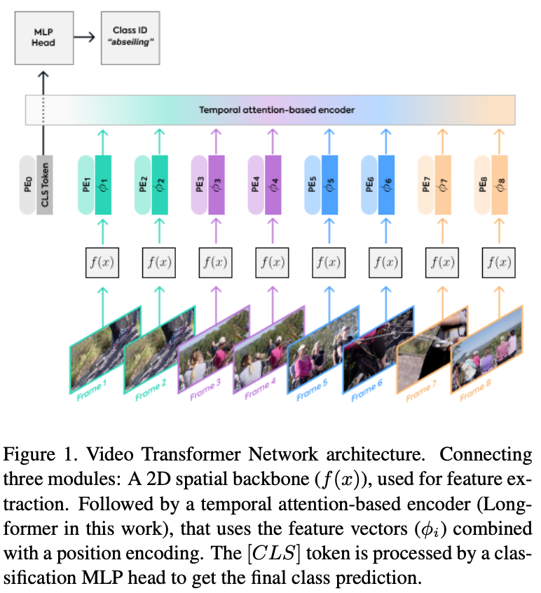

>论文标题：Video Transformer Network  
发表时间：2021  
研究组织：Theator    
本文标签：视频目标识别、IEEE/CVF

# 速读概览：
## 1.针对什么问题？ 
  
    
## 2.采用什么方法？
  
    
## 3.达到什么效果？  
  
## 4.存在什么不足？

# 论文精读
## 0.摘要
* 本文提出了VTN，这是针对视频识别的基于Transformer的框架。受视觉Transformer近期发展的启发，我们放弃了依赖 3D ConvNets 的视频动作识别的标准方法，并引入了一种通过关注整个视频序列信息对动作进行分类的方法。我们的方法是通用的，并且建立在任何给定的 2D 空间网络之上。在wall runtime方面，与其他最先进的方法相比，它在推理期间的训练速度提高了 16.1 倍，运行速度提高了 5.1 倍，同时保持了具有竞争力的准确性。它通过单个端到端通道实现整个视频分析，同时需要的 GFLOP 减少 1.5 倍。 我们报告了 Kinetics-400 和 Moments in Time 基准的竞争结果，并介绍了 VTN 属性的消融研究以及准确性和推理速度之间的权衡。我们希望我们的方法将作为一个新的基线，并在视频识别领域开始一条新的研究路线。代码和模型可在https://github.com/bomri/SlowFast/blob/ master/projects/vtn/README.md查看。

## 1.Introduction
* Attention matters。近十年来，ConvNets 一直统治着计算机视觉领域。在视觉识别任务中使用ConvNets产生了很多SOTA的结果，如图像分类、目标检测、语义分割、目标实例分割、面部识别和视频动作识别等方面。但是，最近，随着基于Transformer的模型在许多此类任务中显示出可喜的结果，这种统治开始破裂。
* 视频识别任务严重依赖于ConvNets。为了处理时间维度，fundamental方法是使用3D ConvNets。与直接从input clip level添加时间维度的其他研究相比，我们的目标是远离 3D 网络。我们使用SOTA的2D架构来学习空间特征表示，并通过在结果特征之上使用注意力机制添加时间信息在数据流后面。我们的方式输入只有RGB视频帧，没有任何bells and whistles（如optical flow，streams lateral connections，multi-scale inference，multi-view inference， longer clips fine-tuning等），实现了与其他SOTA方法相媲美的结果。
* 视频识别是Transformer的perfect candidate。与语言建模类似，其输入的单词或字符表示为一系列tokens，视频表示为一系列图像（帧）。然而这种相似在处理长序列时也是一种限制。像长文档一样，长视频也很难处理。 即使是 10 秒的视频，例如 Kinetics-400 基准中的视频，在最近的研究中也被处理为短的约 2 秒的剪辑。
* 但是这种基于剪辑的推理如何在更长的视频（即电影、体育赛事或外科手术）上发挥作用？仅使用几秒钟的片段就可以掌握几小时甚至几分钟的视频中的信息似乎违反直觉。 然而，当前的网络并非旨在在整个视频中共享长期信息。
* VTN的时间处理组件是基于Longformer的。这类基于Transformer的模型能够处理包含上千个tokens的长序列。Longformer提出的注意力机制使得超越短片处理并保持全局注意力成为可能，它关注输入序列中的所有标记
* 在长序列处理之外，我们也探索了机器学习中的一个重要的trade-off——速度和精度。我们的框架在训练和推理时都展示了这种权衡的优越平衡。在训练过程中，尽管每个epoch的wall runtime与其他网络要么相同要么更好，但是我们的方法需要更少的训练数据集就能达到其最大性能；我们的方法是端到端的，与其他SOTA网络相比，这导致了训练过程中16倍以上的加速。在推理时候，我们的方法能够在保持相似的精度的同时解决多视角和完整视频分析的问题。相比之下，其他网络的性能在一次分析完整视频时显着下降。In terms of GFLOPS x Views, their inference cost is considerably higher than those of VTN, which concludes to a 1.5× fewer GFLOPS and a 5.1× faster validation wall runtime.

* 如图1所示，我们的架构结构元件是模块化的。首先，2D spatial components可以被任何给定的网络期待。attention-based的模块可以堆叠更多层、更多head，或者可以设置为可以处理长序列的不同 Transformers 模型。 最后，可以修改分类head以促进不同的基于视频的任务，例如时间动作定位。

## 2.Related work
### Spatial-temporal networks
* 

## 6.Conclusion
* 我们为视频识别任务提出了一个基于模块化Transformer的框架。 我们的方法引入了一种有效的方法来大规模评估视频，包括计算资源和wall runtime。 它允许在测试期间进行完整的视频处理，使其更适合处理长视频。 尽管当前的视频分类基准对于测试长期视频处理能力并不理想，但希望在未来，当此类数据集可用时，与 3D ConvNets 相比，VTN 等模型将显示出更大的改进。