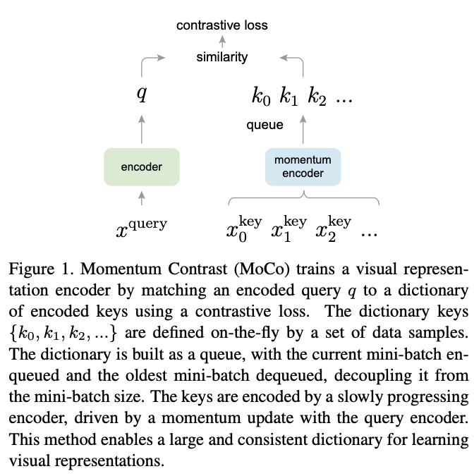

>论文标题：Momentum Contrast for Unsupervised Visual Representation Learning  
发表时间：2020  
研究组织：FAIR    
本文标签：视觉目标识别、CVPR
论文讲解：https://www.bilibili.com/video/BV1C3411s7t9/?spm_id_from=333.788

# 速读概览：
## 1.针对什么问题？ 
    
## 2.采用什么方法？  
    
## 3.达到什么效果？  
    
## 4.存在什么不足？

# 论文精读
## 0.摘要
* 我们提出了一种无监督视觉表示学习的动量对比方法。从把对比学习作为字典查找的角度来看，我们构建了一个带有队列和移动平均编码器的动态字典。 这使得能够即时构建一个大型且一致的字典，以促进对比无监督学习。 MoCo 在 ImageNet 分类的common linear protocol提供有竞争力的结果。 更重要的是，MoCo 学习的表示可以很好地转移到下游任务。 在 PASCAL VOC、COCO 和其他数据集上的 7 个检测/分割任务中，MoCo 可以胜过其有监督的预训练对手，有时甚至大大超过它。 这表明在许多视觉任务中，无监督和有监督的表示学习之间的差距已基本缩小。

## 1.Introduction
* 正如GPT和BERT展示出来的那样，非监督表示学习在NLP领域取得了高度成功。但是有监督学习依然在CV领域占据主导，非监督学习远远落在后面。原因可能源于它们各自信号空间的差异。 语言任务具有用于构建标记化字典的离散信号空间（单词、子单词单元等），无监督学习可以在此基础上进行。 相比之下，计算机视觉进一步关注字典构建，因为原始信号处于连续的高维空间中，并且不是为人类交流而构建的（与单词不同）。
* 最近的几项研究在使用与对比损失相关的方法的无监督视觉表示学习方面提出了有希望的结果。尽管受到各种动机的驱动，这些方法可以被认为是构建动态字典。 字典中的“keys”（tokens）是从数据（例如图像或patches）中采样的，并由编码器网络表示。 无监督学习训练编码器执行字典查找：编码的“query”应该与其匹配的key相似，而与其他的key不同。 学习被表述为最小化对比损失。
* 从这个观点来看，我们假设构造字典有两个要求：1.large；2.consistent as they evolve during training。直观地说，更大的字典可能更好地对底层连续的高维视觉空间进行采样，而字典中的key应该由相同或相似的编码器表示，以便它们与query的比较是一致的。 然而，使用对比损失的现有方法可能在这两个方面之一受到限制（稍后在下文中讨论）。
* 我们提出 Momentum Contrast (MoCo) 作为一种为具有对比损失的无监督学习构建大型且一致的字典的方法（如下图所示）。 

* 我们将字典维护为数据样本队列：当前小批量的编码表示入队，最旧的表示出队。 队列将字典大小与小批量大小解耦，允许它很大。 此外，由于字典键来自前面的几个小批量，因此提出了一个缓慢进展的键编码器，实现为query编码器的基于动量的移动平均值，以保持一致性。
* MoCO是一种用于对比学习构造动态字典的机制，通过与多种pretext task一起使用。本文中 ，我们遵循一种简单的instance discrimination task（个体判别）的思路：如果query是同一图像的编码views（例如，不同的crop），则query与key匹配。 使用这个pretext task，MoCo 在 ImageNet 数据集中的common protocol of linear classification显示了有竞争力的结果。
* 非监督学习的一个主要目的是预训练能够通过微调迁移到下游任务的表示（特征）。我们展示了与检测或分割相关的7个下游任务，MoCo无监督预训练可以超过其 ImageNet 有监督对应物，在某些情况下，差距不小。 在这些实验中，我们探索了在 ImageNet 或 10 亿张 Instagram 图像集上预训练的 MoCo，证明 MoCo 可以在更真实的世界、10 亿张图像规模和相对未经处理的场景中很好地工作。 这些结果表明，MoCo 在很大程度上缩小了许多计算机视觉任务中无监督和有监督表示学习之间的差距，并且可以在多个应用中作为 ImageNet 有监督预训练的替代方案。

## 2.Related work
* 无监督/自监督学习方法通常包括两方面：pretext tasks 和 loss functions。术语“pretext”意味着要解决的任务不是真正感兴趣的，而只是为了学习良好数据表示的真正目的而解决。 损失函数通常可以独立于pretext tasks进行研究。 MoCo 专注于损失函数方面。 接下来我们就这两个方面讨论相关研究。
### Loss functions
* loss function通常定义为衡量模型的预测和固定的目标的差异，如通过L1或L2损失重构输入的像素（如auto-encoders），或通过交叉熵loss或margin-based将输入分类成预定义的类别（eight positions。color bins）。以下描述的其余选择也都是可能的。
* contrastive losses衡量的是表示空间中样本对的相似性。与将输入匹配到固定目标不同，在contrastive losses公式中，目标可以在训练期间动态变化，并且可以根据网络计算的数据表示来定义。 对比学习是最近几项关于无监督学习的工作的核心，我们稍后会详细说明（第 3.1 节）。
* Adversarial losses（对抗性）衡量的是概率分布之间的差异。这一个在无监督数据生成中非常成功的技术。生成对抗网络和噪声对比估计（NCE）之间存在关系。

### Pretext tasks
* 现在已经提出了很多种pretext tasks。如在某些损坏下恢复输入，例如去噪自动编码器、上下文自动编码器或跨通道自动编码器（着色）。 一些pretext tasks通过转换单个（“示例”）图像 、patch排序 、跟踪或分割视频中的对象或聚类来形成伪标签特征。

### Contrastive learning vs. pretext tasks
* 各种pretext tasks可以基于某种形式的对比损失函数。 实例判别方法与基于示例的任务和 NCE 有关。 对比预测编码 (CPC) 中的pretext tasks是上下文自动编码的一种形式，而在对比多视图编码 (CMC)中，它与着色有关。

## 3.Method
### 3.1 Contrastive Learning as Dictionary Look-up
* 对比学习及其近期的发展，可以看作是训练一个用于字典查找任务的编码器。
* 假设有一个编好码的query q和一系列编好码的样本${k_0,k_1,k_2,...}$（字典的keys）。假设字典里有一个和q匹配的key(用${k_+}$表示)。一个Contrastive loss是一个函数，如果q与其positive key ${k_+}$相似而和所有其他keys不相似（可以看作是q的negative keys），则其值比较低。通过点积衡量相似性，InfoNCE是contrastive loss的一种形式，在本文中的定义如下
$${L_q = -log \frac{exp(q\cdot k + /\tau)}{\sum^K_{i=0}exp(q\cdot k_i/\tau)} \tag{1}}$$
* 其中${\tau}$是每个(Unsupervised feature learning via non-parametric instance dis- crimination)的温度超参数（控制分布）。 总和超过 1 个正样本和 K 个负样本。 直观地说，这种损失是（K+1）类基于 softmax 的分类器的对数损失，该分类器试图将 q 分类为 k+。 对比损失函数也可以基于其他形式，例如margin-based的损失和 NCE 损失的变体。
* contrastive loss作为无监督目标函数，用于训练表示query和key的编码器网络。 一般来说，query表示是${q = f_q(x^q)}$，其中${f_q}$是编码器网络，${x^q}$是query样本（同样，${k = f_k(x^k)）}$。 它们的实例化取决于特定的pretext task。 输入 ${x^q}$ 和 ${x^k}$ 可以是图像、patches或由一组patches组成的上下文。 网络${f_q}$和${f_k}$可以相同，部分共享或不同。

### 3.2 Momentum Contrast
* 从上述观点来看，contrastive learning是一种在图像这样的高维连续输入上构造离散的字典。字典是动态的，因为keys是随机采样的，并且key编码器在训练期间会演变。 我们的假设是，好的特征可以通过一个包含大量负样本的大型字典来学习，而字典keys的编码器尽管在进化，但仍尽可能保持一致。 基于此动机，我们将呈现动量对比，如下所述。

#### Dictionary as a queue
* 我们方法的核心就是保持字典作为数据样本的队列。这使我们可以重用之前小批量中的编码key。 队列的引入将字典大小与小批量大小分离。 我们的字典大小可以比典型的 mini-batch 大得多，并且可以灵活独立地设置为超参数。
* 字典中的样本被逐步替换。 当前的 mini-batch 被排入字典，队列中最旧的 mini-batch 被删除。 字典总是代表所有数据的一个采样子集，而维护这个字典的额外计算是可控的。 此外，删除最旧的 mini-batch 可能是有益的，因为它的编码key是最过时的，因此与最新的最不一致。

#### Momentum update
* 使用队列可以让字典变大，但它也使得通过反向传播更新key编码器变得难以处理（梯度应该传播到队列中的所有样本）。A näıve solution是从query编码器$f_q$复制key编码器${f_k}$，忽略这个梯度。 但是这个解决方案在实验中产生了很差的结果（第 4.1 节）。 我们假设这种失败是由快速变化的编码器引起的，这降低了key表示的一致性。 我们提出动量更新来解决这个问题。
* 形式上，将${f_k}$的参数表示成${\theta_k}$，将${f_q}$的参数表示成${\theta_q}$，通过下式更新${\theta_k}$:
$${\theta_k \leftarrow m \theta_k + (1-m)\theta_q \tag{2}}$$
* 这里的${m \in [0, 1)}$是动量系数。只有参数${\theta_q}$通过反向传播更新。公式(2)中的动量更新使得${\theta_k}$的演化比${\theta_q}$更平滑。结果，尽管队列中的keys是通过不同的编码器编码的（在不同的小批量中），但这些编码器的差异很小。实验中，相对较大的动量（例如，m = 0.999，我们的默认值）比较小的值（例如，m = 0.9）效果更好，这表明缓慢变化的key编码器是利用队列的核心。

#### Relations to previous mechanisms
* MoCo是一个使用contrastive losses的常用机制。我们将其与两个现在通用机制进行对比。它们在字典大小和一致性方面表现出不同的属性。
* 利用反向传播端到端的更新是一个natural的机制。它将当前的小批量中的样本作为字典，因此这些keys是一起被编码的（使用相同的编码器参数）。但是字典的大小与小批量的大小绑定，受GPU内存的限制。它也受到大型小批量优化的挑战。 一些最近的方法基于由local positions驱动的pretext tasks，其字典大小可以通过多个positions变大。 但是这些pretext tasks可能需要特殊的网络设计，例如修补输入或自定义感受野大小，这可能会使这些网络转移到下游任务变得复杂。
* 另一个机制是memory bank方法。一个memory bank是由数据集中所有样本的表示组成的。每个小批量的字典是从memory bank中随机采样的，没有反向传播，所以他能支持大的字典。但是memory bank中的样本的表示在最后一次看到时已更新，因此采样的keys本质上是关于在过去 epoch 中多个不同步骤的编码器，因此不太一致。 在Unsupervised feature learning via non-parametric instance discrimination中的记忆库上采用了动量更新。 它的动量更新是基于同一样本的表示，而不是编码器。 这种动量更新与我们的方法无关，因为 MoCo 不会跟踪每个样本。 此外，我们的方法更节省内存，并且可以在十亿规模的数据上进行训练，这对于memory bank来说是难以处理的。
表4对这三种机制进行了实证比较。

### 3.3 Pretext task
* contrastive learning可以驱动许多pretext tasks。由于本文并非集中于设计新的pretext tasks，我们跟随instance discrimination任务使用一个简单的任务。如果query和key来自同一图像，我们将它们视为正对，否则视为负样本对。我们在随机数据增强下取同一图像的两个随机“views”以形成正对。 queries和keys分别由它们的编码器 fq 和 fk 编码。 编码器可以是任何卷积神经网络。
* 对于当前的小批量，我们编码queries和他们对应的keys以组成正样本对。负样本对来自队列。

#### Technical details
* 我们使用ResNet作为编码器，其最后一个全连接层（在全局平均池化之后）有一个固定维度的输出。输出向量是通过L2-norm标准化。这是query或者key的表示。公式(1)中的温度$\tau$设置为0.07。数据增强设置遵循：从随机resized的图像中获取 224×224 像素的crop，然后进行随机颜色抖动、随机水平翻转和随机灰度转换，所有这些都通过 PyTorch torchvision包实现。

#### Shuffling BN
* 我们的编码器$f_q$和$f_k$都具有批量归一化（BN），就像在标准 ResNet 中一样。 在实验中，我们发现使用 BN 会阻止模型学习良好的表示，正如 [35] 中类似报道的那样（避免使用 BN）。 该模型似乎“欺骗”了pretext tasks，并且很容易找到一个低损失的解决方案。 这可能是因为样本之间的批内通信（由 BN 引起）泄漏了信息。
* 我们通过shuffled BN来解决这个问题。 我们使用多个 GPU 进行训练，并为每个 GPU 独立地对样本执行 BN（如通常做法那样）。 对于key编码器$f_k$，我们将当前小批量中的样本顺序打乱，然后将其分配给 GPU（并在编码后打乱）； 查询编码器$f_q$的小批量的样本顺序没有改变。 这确保了用于计算query的批处理统计信息及其正的key来自两个不同的子集。 这有效地解决了作弊问题，并使培训受益于 BN。
* 我们在我们的方法及其端到端消融对应物中都使用了shuffled BN。 它与对应的memory bank无关，它不会受到这个问题的影响，因为正的keys来自过去不同的小批量。

## 4. Experiments

### 4.1 Linear Classification Protocol

### 4.2 Transferring Features

## 5.Discussion and Conclusion
* 我们的方法展示了非监督学习在一系列CV任务和数据集上的积极结果。一些开放性的问题值得讨论。MoCo 从 IN-1M 到 IG-1B 的改进一直很明显，但相对较小，这表明可能无法充分利用更大规模的数据。 我们希望高级pretext task能够改善这一点。 除了简单的实例判别任务之外，还可以将 MoCo 用于掩码自动编码等pretext task，如在语言和视觉中。 我们希望 MoCo 对其他涉及对比学习的pretext task有帮助。